# smabo — システム設計ドキュメント

- **対象**: smabo（スマホロボット）システム全体（smabo-app / smabo-web / smabo-brain / smabo-esp32 / smabo-brain-ros）
- **通信プロトコル**: rosbridge v2.0 互換 WebSocket JSON。中継サーバ **smabo-brain** を中心としたハブ&スポーク構成
- **設定系**: config / mode は smabo-web ↔ smabo-esp32 の REST 直通（smabo-brain を経由しない）
- **更新日**: 2026-06-25

> 本ドキュメントは、smabo システム全体の構成（[システム全体構成](#システム全体構成) / [コンポーネント概要](#コンポーネント概要)）と、
> 各コンポーネントのうち最も実装詳細の多い **smabo-esp32（ファームウェア）の詳細**（§1〜§8）をまとめます。

---

## 目次

- [システム全体構成](#システム全体構成)
  - [コンポーネント構成](#コンポーネント構成)
  - [通信トポロジ](#通信トポロジ)
  - [通信モデル](#通信モデル)
  - [送信元 prefix 規約](#送信元-prefix-規約)
  - [主要トピックとデータフロー](#主要トピックとデータフロー)
  - [WebSocket エンドポイントとルーティング](#websocket-エンドポイントとルーティング)
  - [各クライアントの送受信トピック（WebSocket 全網羅）](#各クライアントの送受信トピックwebsocket-全網羅)
  - [WebSocket 通信シーケンス（app を含む全経路）](#websocket-通信シーケンスapp-を含む全経路)
  - [メッセージ定義（app / web）](#メッセージ定義app-web)
- [コンポーネント概要](#コンポーネント概要)
- [画像処理（物体検出と追従）](#画像処理物体検出と追従)
  - [データフロー](#データフロー)
  - [処理モード](#処理モード)
  - [コンポーネントと配置](#コンポーネントと配置)
  - [制御メッセージ（/vision/config）](#制御メッセージvisionconfig)
  - [起動時初期値とメッセージ型の選定](#起動時初期値とメッセージ型の選定)
  - [メッセージ定義（vision）](#メッセージ定義vision)
  - [policy（pixel→方向→各指令）](#policypixel方向各指令)
- **smabo-esp32（ファームウェア）詳細**
  1. [モジュール構成](#1-モジュール構成)
  2. [クラス図](#2-クラス図)
  3. [非同期タスク構成](#3-非同期タスク構成)
  4. [シーケンス図](#4-シーケンス図)
  5. [WebSocket メッセージ仕様](#5-websocket-メッセージ仕様)
  6. [設定項目一覧](#6-設定項目一覧)
  7. [設定変更の反映ルール](#7-設定変更の反映ルール)
  8. [ハードウェア構成メモ](#8-ハードウェア構成メモ)

---

## システム全体構成

smabo は、中継サーバ **smabo-brain** を中心に各コンポーネントが WebSocket クライアントとして
ぶら下がる**ハブ&スポーク構成**です。各コンポーネントは smabo-brain の宛先だけを知っていればよく、
相互の直接接続は持ちません（設定系の REST 直通を除く）。

### コンポーネント構成

| コンポーネント | 役割 | 実装 | smabo-brain への接続 |
|---|---|---|---|
| smabo-app | smabo の「顔（目）」とスマホセンサ（IMU / GPS / カメラ / ウェイクワード検出＋音声録音） | Flutter（スマートフォン） | WS `/` |
| smabo-web | 制御 UI・テレメトリ可視化・設定 | React / TypeScript（ブラウザ） | WS `/ui`（＋ ESP32 へ設定を REST 直） |
| smabo-brain | 中継ハブ＋マイコンでできない上位処理（オドメトリ積分等） | Python / aiohttp（PC / SBC） | **サーバ**（待受 `:9090`） |
| smabo-esp32 | アクチュエータ制御・センサ取得 | MicroPython（ESP32 系） | WS `/esp32` |
| smabo-brain-ros | ROS 2 連携（rosbridge_suite / Nav2 / MoveIt2） | ROS 2（SBC） | rosbridge（WS `:9090`） |

### 通信トポロジ

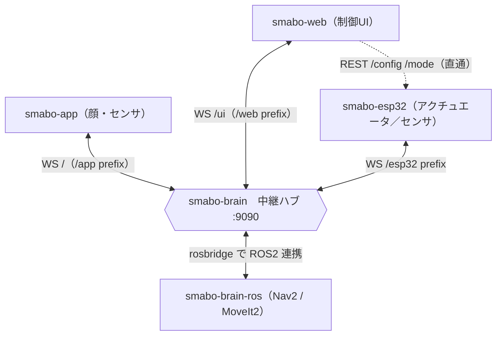

### 通信モデル

| 項目 | 内容 |
|---|---|
| プロトコル | RFC 6455 WebSocket、UTF-8 JSON（rosbridge v2.0 互換）、1 メッセージ = 1 フレーム |
| 待受 | smabo-brain が `:9090` でサーバ。接続元ごとにパスを分ける（app=`/`、web=`/ui`、esp32=`/esp32`） |
| 設定系 | config / mode は smabo-web ↔ smabo-esp32 の **REST 直通**（smabo-brain を経由しない） |
| ROS 2 連携 | smabo-brain-ros 構成では rosbridge_server（`:9090`）が WS ↔ ROS 2 を相互変換 |
| 認証 | なし（信頼済み LAN 内利用前提） |

### 送信元 prefix 規約

各クライアントは publish するトピックに**送信元 prefix** を付けて送ります
（smabo-app → `/app`、smabo-web → `/web`、smabo-esp32 → `/esp32`）。
smabo-brain はこの prefix を**剥がしてから** canonical なトピック名で宛先へ再配信します
（例: esp32 が送る `/esp32/wheel_vel` → 積分後 `/odom`、web が送る `/web/cmd_vel` → `/cmd_vel`）。
受信側は常に prefix 無しの canonical 名で受け取ります。
`set_config` / `get_config` / `call_service` など publish 以外の op には prefix は付きません。

### 主要トピックとデータフロー

| トピック | 型 | 送信元 → 宛先 | 内容 |
|---|---|---|---|
| `/cmd_vel` | geometry_msgs/Twist | smabo-web / Nav2 → smabo-esp32 | 走行速度指令 |
| `/wheel_vel` → `/odom` | （esp32 独自）→ nav_msgs/Odometry | esp32 → brain で積分 → web / Nav2 | ホイール速度 → オドメトリ |
| `/servo/command` | trajectory_msgs/JointTrajectory | smabo-web / MoveIt2 → smabo-esp32 | サーボ軌道指令 |
| `/joint_states` | sensor_msgs/JointState | smabo-esp32 → web / MoveIt2 | 関節角度 |
| `/scan` | sensor_msgs/LaserScan | smabo-esp32（LD06）→ brain → Nav2 | ライダ |
| `/imu/data`・`/gps/fix` | 各標準型 | smabo-app → smabo-web | スマホセンサ |
| カメラ映像（WebRTC, H.264/VP8） | — | smabo-app → smabo-brain（web へはプレビュー時のみ中継） | カメラ |
| `/look_at`・`/expression`・`/speech/say` | — | smabo-web → smabo-app | 顔（目）・発話の制御 |
| `/speech/audio` | audio_common_msgs/AudioData（base64 WAV） | smabo-app → smabo-brain | wake 後に録音した発話音声（brain が STT） |
| `/speech/recognized` | std_msgs/String | smabo-brain → smabo-web | 音声認識結果（brain が STT した文字列） |

### WebSocket エンドポイントとルーティング

smabo-brain は接続元ごとにパスを分けてサーバ（`:9090`）として待ち受け、受け取った publish を
**送信元 prefix を剥がして** canonical 名で適切な宛先へ中継します。

| エンドポイント | 接続元 | smabo-brain の処理 |
|---|---|---|
| `/` | smabo-app | app の publish（`/app` prefix）を剥がして **smabo-web（UI）へ中継**。ただし `/webrtc/*`（offer/ICE）と `/speech/audio` は **smabo-brain が消費**し（前者は WebRTC ピア、後者は STT）、web へは中継しない |
| `/ui` | smabo-web | publish（`/web` prefix）を剥がし、`/speech/say`・`/expression`・`/look_at` は **smabo-app へ**、`/vision/config`・`/webrtc/*` は **smabo-brain が消費**、それ以外は **smabo-esp32 へ**。publish 以外の op（`set_config` / `get_config` / `set_mode` 等）は smabo-esp32 へ |
| `/esp32` | smabo-esp32 | publish（`/esp32` prefix）を剥がし、`/wheel_vel` は積分して `/odom` を **UI へ**、それ以外は **UI へ**。esp32 が push する `set_config` は brain のオドメトリ同期にのみ使用 |

> 「web → app」へ流れるのは `/speech/say`・`/expression`・`/look_at` の3つだけです
> （`brain.topics.APP_TOPICS`）。`/vision/config` と `/webrtc/*`（プレビュー/シグナリング）は
> smabo-brain が消費し、残りの smabo-web の publish が smabo-esp32 宛になります。

### 各クライアントの送受信トピック（WebSocket 全網羅）

**smabo-app**（パス `/`、publish には `/app` prefix を付与）

| 方向 | トピック | 型 |
|---|---|---|
| 送信（app → brain → web） | `/imu/data` | sensor_msgs/Imu |
| 送信 | `/gps/fix` | sensor_msgs/NavSatFix |
| 送信（app → brain、STT 用） | `/speech/audio`（wake 後の録音音声、base64 WAV） | audio_common_msgs/AudioData |
| 送信（WebRTC、app → brain） | カメラ映像 + `/webrtc/offer`・`/webrtc/app_ice`（シグナリング） | — |
| 受信（WebRTC、brain → app） | `/webrtc/answer` | — |
| 受信（web → brain → app） | `/look_at` | geometry_msgs/PoseStamped |
| 受信 | `/expression` | std_msgs/Int32 |
| 受信 | `/speech/say` | std_msgs/String |

**smabo-web**（パス `/ui`、publish には `/web` prefix を付与）

| 方向 | トピック | 相手 |
|---|---|---|
| 送信 | `/cmd_vel`・`/servo/command`・`/ping`・（Nav2 用 `/initialpose`・`/goal_pose`） | → smabo-esp32 |
| 送信 | `/look_at`・`/expression`・`/speech/say` | → smabo-app |
| 送信（非 publish op） | `get_config`・`set_config`・`set_mode` | → smabo-esp32（※設定は通常 REST 直通を使用） |
| 送信（WebRTC プレビュー） | `/webrtc/preview`（ON/OFF）・`/webrtc/web_answer`・`/webrtc/web_ice` | → smabo-brain |
| 受信（app 由来） | `/imu/data`・`/gps/fix` | ← smabo-app |
| 受信（brain 由来） | `/speech/recognized`（brain が STT した文字列） | ← smabo-brain |
| 受信（WebRTC 中継・プレビュー時のみ） | カメラ映像 + `/webrtc/web_offer` | ← smabo-brain |
| 受信（esp32 由来） | `/odom`（`/wheel_vel` を積分）・`/joint_states`・`/scan`・`/pong`・`notice`・`error` | ← smabo-esp32 |

**smabo-esp32**（パス `/esp32`、publish には `/esp32` prefix を付与。メッセージ詳細は §5）

| 方向 | トピック | 型 |
|---|---|---|
| 送信 | `/wheel_vel`（→ brain で `/odom` に積分） | left / right / dt |
| 送信 | `/joint_states` | sensor_msgs/JointState |
| 送信 | `/scan`（LD06、`modes.lidar` 時） | sensor_msgs/LaserScan |
| 送信 | `/pong`（`/ping` のエコー）・`set_config`・`notice`・`error` | std_msgs/String 他 |
| 受信 | `/cmd_vel` | geometry_msgs/Twist |
| 受信 | `/servo/command` | trajectory_msgs/JointTrajectory |
| 受信 | `/ping` | std_msgs/String |

### WebSocket 通信シーケンス（app を含む全経路）

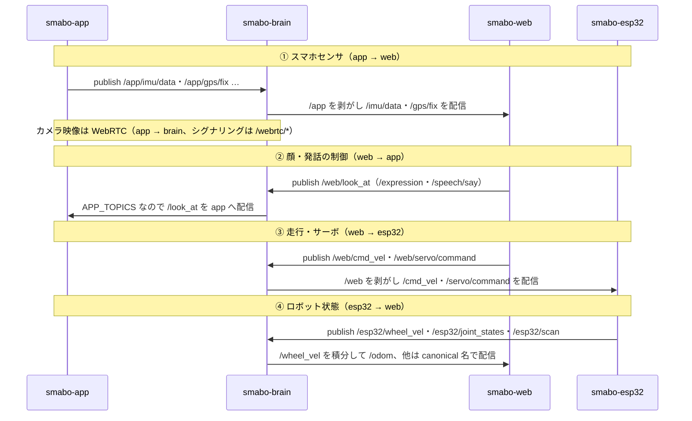

### メッセージ定義（app / web）

rosbridge v2.0 互換の JSON です（`{"op":"publish","topic":...,"msg": <下記>}` の `msg` 部分）。
すべての `header` は `{"stamp":{"sec":<int>,"nanosec":<int>}, "frame_id":<string>}` 形式です。
smabo-esp32 が扱う `/cmd_vel`・`/servo/command`・`/joint_states`・`/wheel_vel` の定義は §5 を参照してください。

**`/imu/data` — sensor_msgs/Imu**（smabo-app → smabo-web）

```json
{
  "header": {"stamp": {"sec": 0, "nanosec": 0}, "frame_id": "imu_link"},
  "orientation": {"x": 0.0, "y": 0.0, "z": 0.0, "w": 1.0},
  "orientation_covariance": [0,0,0, 0,0,0, 0,0,0],
  "angular_velocity": {"x": 0.0, "y": 0.0, "z": 0.0},
  "angular_velocity_covariance": [0,0,0, 0,0,0, 0,0,0],
  "linear_acceleration": {"x": 0.0, "y": 0.0, "z": 9.81},
  "linear_acceleration_covariance": [0,0,0, 0,0,0, 0,0,0]
}
```

**`/gps/fix` — sensor_msgs/NavSatFix**（smabo-app → smabo-web）

```json
{
  "header": {"stamp": {"sec": 0, "nanosec": 0}, "frame_id": "gps"},
  "status": {"status": 0, "service": 1},
  "latitude": 35.681,
  "longitude": 139.767,
  "altitude": 40.0,
  "position_covariance": [c,0,0, 0,c,0, 0,0,c],
  "position_covariance_type": 1
}
```

> `position_covariance` の対角 `c` は水平精度の二乗（`horizontalAccuracy²`）。
> `status.status`=0（FIX）/ `service`=1（GPS）、`position_covariance_type`=1（APPROXIMATED）。

**カメラ映像 — WebRTC**（smabo-app → smabo-brain）

カメラ映像は WebRTC で smabo-app から smabo-brain へ送られます。映像メディア本体は
P2P（ローカル WiFi のホスト候補のみ、STUN/TURN なし）で流れ、`/camera/image/compressed`
のような WebSocket トピックは使用しません。シグナリング（SDP / ICE 交換）だけが brain の
WebSocket を経由します。

| トピック | 向き | 内容 |
|---|---|---|
| `/webrtc/offer` | app → brain | オファー SDP（`{"data": "<JSON: sdp/type>"}`） |
| `/webrtc/answer` | brain → app | アンサー SDP（brain の ICE 候補を SDP に同梱） |
| `/webrtc/app_ice` | app → brain | app の ICE 候補 |

> smabo-brain は受信した映像からフレームを取り出して画像処理（§「画像処理」参照）に通し、
> smabo-web がプレビューを ON にしている間だけ、同じ映像を `/webrtc/web_offer` で web へ中継します。

**`/look_at` — geometry_msgs/PoseStamped**（smabo-web → smabo-app、視線追従の目標）

```json
{
  "header": {"stamp": {"sec": 0, "nanosec": 0}, "frame_id": "base_link"},
  "pose": {
    "position":    {"x": 1.0, "y": -0.3, "z": 0.2},
    "orientation": {"x": 0.0, "y": 0.0, "z": 0.0, "w": 1.0}
  }
}
```

> `position` を方向ベクトルとして解釈します（REP-103: x=前 / y=左 / z=上）。
> smabo-app は `gazeX = -y/x`・`gazeY = -z/x` で画面上の視線方向へ変換します（`pose` 無しの bare `Pose` も受理）。

**`/expression` — std_msgs/Int32**（smabo-web → smabo-app、表情ID）

```json
{"data": 3}
```

**`/speech/say` — std_msgs/String**（smabo-web → smabo-app、読み上げテキスト）
**`/speech/recognized` — std_msgs/String**（smabo-brain → smabo-web、認識テキスト）

```json
{"data": "こんにちは"}
```

**`/speech/audio` — audio_common_msgs/AudioData**（smabo-app → smabo-brain、wake 後に録音した発話音声）

```json
{"data": "<base64 エンコードした 16kHz モノラル WAV>"}
```

> `data` は `uint8[]`（rosbridge では base64 文字列）。中身は自己記述的な WAV（ヘッダに
> フォーマット / サンプルレート / チャンネルを持つ）なので追加フィールドは不要です。

> **音声認識の流れ**：smabo-app は**ウェイクワード検出だけ**を担当します。ウェイクワードを
> 検出すると発話を録音し（16kHz モノラル、無音が一定時間続いたら停止）、WAV を base64 化して
> `/speech/audio`（`audio_common_msgs/AudioData`）で smabo-brain に送ります。smabo-brain は受信音声を STT エンジン
> （既定 vosk、`--stt-engine whisper` で faster-whisper も選択可）で文字起こしし、結果を
> `/speech/recognized` として配信します（smabo-web で確認できます）。
> ウェイクワード検出には Android の音声認識を用いるため、待ち受け中は `error_speech_timeout`
> が周期的に出ますが正常で、smabo-app 側がバックオフ付きで穏やかに待ち受けを再開します。

**`/odom` — nav_msgs/Odometry**（smabo-brain が `/wheel_vel` を積分して生成 → smabo-web / Nav2）

```json
{
  "header": {"stamp": {"sec": 0, "nanosec": 0}, "frame_id": "odom"},
  "child_frame_id": "base_link",
  "pose":  {"pose":  {"position": {"x": 0.0, "y": 0.0, "z": 0.0},
                      "orientation": {"x": 0.0, "y": 0.0, "z": 0.0, "w": 1.0}},
            "covariance": ["…6×6 行優先 36 要素…"]},
  "twist": {"twist": {"linear":  {"x": 0.0, "y": 0.0, "z": 0.0},
                      "angular": {"x": 0.0, "y": 0.0, "z": 0.0}},
            "covariance": ["…6×6 行優先 36 要素…"]}
}
```

> `covariance`（各 36 要素）は smabo-brain が `encoder.covariance.*` から付与します。

**`/scan` — sensor_msgs/LaserScan**（smabo-esp32 の LD06 → smabo-brain → Nav2）

```json
{
  "header": {"stamp": {"sec": 0, "nanosec": 0}, "frame_id": "laser"},
  "angle_min": 0.0,
  "angle_max": 6.2657,
  "angle_increment": 0.01745,
  "time_increment": 0.0,
  "scan_time": 0.1,
  "range_min": 0.05,
  "range_max": 12.0,
  "ranges": ["…距離(m) の配列。0.0 は無反射…"],
  "intensities": []
}
```

**`/ping` / `/pong` — std_msgs/String**（疎通確認。web → esp32 が `/ping`、esp32 → web が `/pong` でエコー）

```json
{"data": "<往復照合用トークン>"}
```

> **rosbridge モード（smabo-brain-ros）**では、上記の中継・prefix 剥がしを rosbridge_server ＋
> relay ノードが担います。各クライアントは publish の前に `advertise`、受信の前に `subscribe` が
> 必要です（詳細は smabo-brain-ros の README を参照）。

---

## コンポーネント概要

### smabo-app

smabo の「顔（目）」を表示し、スマートフォンの IMU / GPS / カメラをセンサとして提供します。
音声はウェイクワード検出と録音だけを担当し（STT は smabo-brain）、ウェイクワード後の録音音声を
`/speech/audio` で送ります。WS `/` で smabo-brain に接続し、`/app` prefix でセンサを publish、
`/look_at`・`/expression`・`/speech/say` を受けて目や発話を制御します。

### smabo-web

ブラウザ上の制御 UI（React / TypeScript）。Face / Sensors / Drive / Servo / Config / Log タブに加え、
ROS 2 連携時は Navigation / Motion Plan タブ（roslib + 3D ビューア）で Nav2 / MoveIt2 を操作します。
WS `/ui` で smabo-brain に接続（`/web` prefix）。config / mode は ESP32 へ **REST 直通**で設定します。

### smabo-brain

全コンポーネントが接続する中継ハブ（aiohttp）。送信元 prefix を剥がして canonical 名で再配信し、
マイコンではできない上位処理（**オドメトリ積分** `/wheel_vel` → `/odom`、カメラ映像の画像処理、
`/speech/audio` の**音声認識（STT）** → `/speech/recognized` など）を担います。STT エンジンは
既定 vosk、`--stt-engine whisper` で faster-whisper も選択できます（`brain.stt`、未導入なら無効）。
純ロジック（`brain.odometry`・`brain.topics`）は transport から分離されており、
smabo-brain-ros が import して再利用します。

### smabo-brain-ros

smabo-brain の ROS 2 ラッパー兼 ROS 2 ランタイム。rosbridge_suite（WS ↔ ROS 2）＋ Nav2（ナビゲーション）
＋ MoveIt2（動作計画）＋ odom_node ＋ 画像処理（`brain.vision` 再利用）＋ 音声認識
（`speech_recognizer_node`：`/speech/audio`→STT→`/speech/recognized`、`brain.stt` 再利用）を提供します。
外部（web / app / esp32）は rosbridge 経由で ROS グラフに接続し、smabo-brain の純ロジックを再利用します。

> **カメラ映像は rosbridge をバイパス**します。rosbridge は JSON over WebSocket のため、映像を
> `/camera/image/compressed`（base64 JSON）として通すとリアルタイム性が落ちます。そこで
> smabo-brain-ros は **WebRTC 終端ノード**（`webrtc_camera_node`、`brain.webrtc_hub` を再利用）を
> 持ち、smabo-app からの WebRTC 映像を終端してフレームを取り出し、**ネイティブ ROS の
> `sensor_msgs/Image`（`/camera/image_raw`）として DDS に publish** します。これを
> `image_processor_node` 等が購読するため、ROS グラフ内は高速なネイティブ転送になります。
> WebRTC のシグナリング（`/webrtc/*`、小さい JSON）は rosbridge 経由で問題ありません。

### smabo-esp32（概要）

ESP32 上の MicroPython ファームウェア。サーボ（PCA9685）・DC モータ（TB6612）・エンコーダ・
LD06 ライダを制御 / 取得します。WS `/esp32` で smabo-brain に接続。**詳細は §1 以降**を参照してください。

---

## 画像処理（物体検出と追従）

smabo-app のカメラ映像（**WebRTC**）を smabo-brain（および smabo-brain-ros）が受け取り、
`capture_fps`（`/vision/config`）の頻度でフレームを取り出して物体の**画像内位置**を算出し、
`vision_msgs/Detection2DArray` 互換で配信します。
その検出結果から、**目（`/look_at`）・首サーボ（`/servo/command`）・走行（`/cmd_vel`）**の
各 behavior が「対象を向く／追従する」動きを生成します。検出（知覚）と振る舞い（behavior）を
分離し、同じ検出結果を複数アクチュエータで再利用できる構成です。

> 純ロジック（検出・幾何変換・各 policy）は `brain.vision` に集約し、smabo-brain（WS）と
> smabo-brain-ros（ROS2）が import して再利用します（`brain.odometry` と同じ分離方針）。

### データフロー

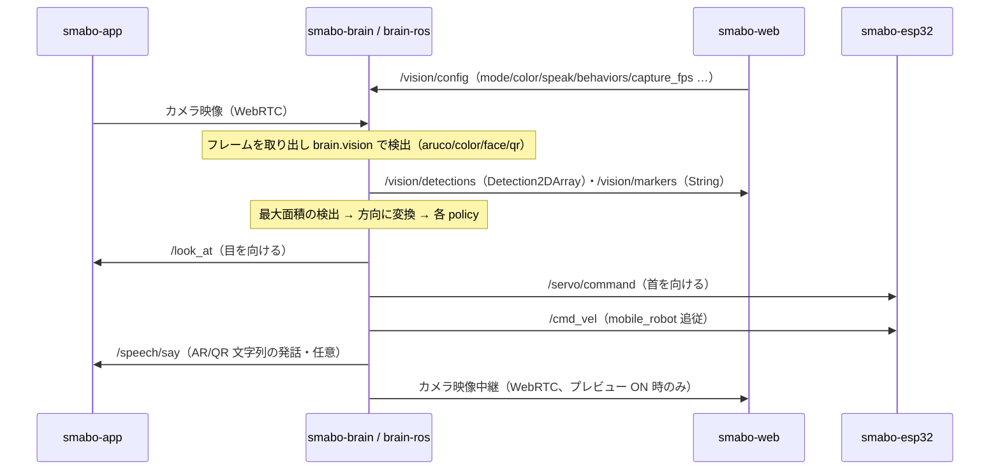

### 処理モード

| モード | 内容 | 文字列配信 |
|---|---|---|
| `off` | 無効 | — |
| `aruco` | AR マーカー検出（位置＋ID）。辞書は `aruco_dict`（`"ALL"` で全辞書走査） | マーカー番号 → `/vision/markers` |
| `color` | 指定色の物体の中心（HSV しきい値）。色はカラーパレットの任意 RGB（`color_rgb`）または名前付きプリセット | — |
| `face` | 顔検出（OpenCV Haar） | — |
| `qr` | QR コード（位置＋内容） | 内容 → `/vision/markers` |

> `speak=true` のとき、`aruco` の番号 / `qr` の内容を `/speech/say` に流して smabo-app が発話します。
> 同じ文字列の連投は brain 側で抑制（変化時のみ送出）し、smabo-app 側にも
> 「同一文字列を連続受信したら無視する」設定を用意します。

### コンポーネントと配置

| 役割 | smabo-brain（WS） | smabo-brain-ros（ROS2） |
|---|---|---|
| 検出 | カメラ受信 → `brain.vision` → `/vision/detections`・`/vision/markers` を配信 | `image_processor_node`（CompressedImage → Detection2DArray ＋ String） |
| gaze policy | detections → `/look_at` | `gaze_policy_node` |
| neck policy | detections → `/servo/command` | `neck_policy_node` |
| drive policy | detections → `/cmd_vel`（mobile_robot 追従） | `drive_policy_node` |
| 制御 | `/vision/config` を intercept | `image_processor_node` が subscribe |

> CV は重いので brain では**別スレッド（executor）で実行**して中継ループを止めません。処理は**間引き**（例 10 fps）。

### 制御メッセージ（/vision/config）

smabo-web → smabo-brain（rosbridge モードでは relay 経由）。`std_msgs/String` の `data` に設定 JSON（文字列）を入れます。**部分指定**でよく、brain は現在値に **deep-merge**（`target_joints` / `behaviors` / `drive` はキー単位でマージ、スカラは置換）して保持します。更新後は brain が**正規化済みスナップショットを全 UI に再配信**し、新規接続 UI には接続直後に現在値を1通送って同期します。

```json
{
  "enabled": true,
  "mode": "color",
  "color": "red",
  "color_rgb": "#1e90ff",
  "color_hue_tol": 12,
  "color_s_min": 70,
  "color_v_min": 60,
  "min_area_frac": 0.0008,
  "aruco_dict": "DICT_4X4_50",
  "speak": false,
  "hfov_deg": 60.0,
  "target_marker_id": null,
  "target_joints": {"pan": "head_pan", "gain": 1.0},
  "behaviors": {"look_at": true, "servo": false, "drive": false},
  "drive": {"target_area_frac": 0.10, "k_ang": 1.5, "k_lin": 2.0,
            "max_ang": 1.0, "max_lin": 0.20, "deadzone": 0.02}
}
```

| キー | 説明 |
|---|---|
| `enabled` / `mode` | 有効無効 / 検出モード（off / aruco / color / face / qr） |
| `color` | 色モードの**名前付きプリセット**（red / orange / … / purple）。`color_rgb` が未設定のときの既定 |
| `color_rgb` | 色モードの**任意の対象色**（カラーパレットから取得した `#RRGGBB` または `[r,g,b]`）。設定時は `color` より優先 |
| `color_hue_tol` | `color_rgb` の色相許容幅（OpenCV H 0–179 の±半幅。大きいほど広く拾う） |
| `color_s_min` / `color_v_min` | 色モードの彩度・明度の下限（0–255）。下げるほど淡い/暗い色も拾う（誤検出増） |
| `min_area_frac` | 検出の最小サイズ（フレーム面積に対する割合）。これ未満の検出を全モードで除外（微小ノイズ・ALL の誤検出抑制） |
| `aruco_dict` | AR モードの辞書（例 `DICT_4X4_50`）。印刷したマーカーと一致が必要。`"ALL"` で代表的な全辞書を走査（少し重く・誤検出増）。検出器はキャッシュ |
| `speak` | 検出文字列を `/speech/say` に流すか |
| `hfov_deg` | カメラ水平画角（pixel → 角度の変換に使用） |
| `target_marker_id` | 追従を優先する AR ID（null＝最大面積） |
| `target_joints` | 首 policy が動かす関節・符号・ゲイン（任意設定） |
| `behaviors` | look_at / servo / drive の個別有効化 |
| `drive` | 追従の目標サイズ率・ゲイン・上限速度 |

### 起動時初期値とメッセージ型の選定

**起動時初期値**：smabo-brain は起動時に画像処理設定の初期値を読み込めます。

- `--vision-config <path.json>`（または環境変数 `SMABO_VISION_CONFIG`）で JSON ファイルを指定。中身は上の `/vision/config` の `data` と同形（**部分指定可**、欠けたキーは組み込み既定で補完）。
- 未指定なら組み込み既定（`mode=off`・検出無効・`behaviors.look_at=true`・首は `head_pan` のみ・tilt なし）で起動。
- 起動後は `/vision/config` で実行中に部分上書き。「**起動時初期値＋実行時上書き**」が brain 単体（WS）でも smabo-brain-ros（ROS）でも成立します。

**型の選定（なぜ String + JSON か）**：検出結果のような**データプレーンは標準型**（`vision_msgs/Detection2DArray`・`geometry_msgs/PoseStamped`）で相互運用性を確保する一方、設定のような**コントロールプレーンは `std_msgs/String`＋JSON** にしています。設定は mode/color/target_joints/behaviors/drive と異種・入れ子・将来追加が多く、これに合う標準 ROS メッセージ型が無いこと、1トピックに集約でき型変更なしでフィールド追加できること、rosbridge/Web から扱いやすいことが理由です。

> ROS 的には設定はノードパラメータが本来の場所なので、**smabo-brain-ros 側では `image_processor_node` の ROS 2 パラメータとしても公開**し、`ros2 param` で操作できるようにします（Web↔brain は String/JSON、ROS 側はパラメータ、の二段構え）。両者の初期値・上書きは `brain.vision.merge_config`（純ロジック）で同一に適用します。

### メッセージ定義（vision）

**`/vision/detections` — vision_msgs/Detection2DArray**（smabo-brain → web。smabo-brain-ros は ROS2 型）

```json
{
  "header": {"stamp": {"sec": 0, "nanosec": 0}, "frame_id": "camera"},
  "source_img_width": 640, "source_img_height": 480,
  "detections": [{
    "header": {"stamp": {"sec": 0, "nanosec": 0}, "frame_id": "camera"},
    "bbox": {"center": {"position": {"x": 320.0, "y": 180.0}, "theta": 0.0},
             "size_x": 96.0, "size_y": 96.0},
    "results": [{"hypothesis": {"class_id": "face", "score": 0.92}}]
  }]
}
```

> `class_id` は AR=マーカー番号、color=色名、face=`"face"`、qr=内容。`center.position` は**画素**座標。
> `source_img_width/height` は標準外の補助フィールド（消費側が画素→正規化する手掛かり）。

**`/vision/markers` — std_msgs/String**（AR 番号 / QR 内容。複数はカンマ区切り）

```json
{"data": "3,7"}
```

### policy（pixel→方向→各指令）

最大面積（または指定 AR ID）の検出を対象に、画素位置と画角から**ロボット座標系の方向ベクトル**
`(x=前, y=左, z=上)` を求め（`bbox_to_direction`）、各 behavior に変換します。

- **gaze → `/look_at`（PoseStamped）**：`position` に方向ベクトルをそのまま入れる
- **neck → `/servo/command`**：`pan = atan2(y, x)`、`tilt = atan2(z, hypot(x, y))`（config の関節・符号・ゲイン）
- **drive → `/cmd_vel`**：`angular.z = -k · u_n`（対象を水平中央へ）、`linear.x = k · (目標面積率 − 現面積率)`（bbox の見かけサイズを距離の代理に前後）。正面でないときは前進抑制、対象ロスト時は停止。

> 手動操作との競合：vision 有効時のみ各 policy が出力します。gaze は smabo-web の Face タブの手動 GazePad と同じ `/look_at`（app の follow モード）を共有するため、**vision の gaze が有効な間は Face タブの GazePad を無効化**して排他にします（「Vision が gaze を制御中」と表示）。neck / drive も同様に vision 有効時はその出力が優先されます。

---

> **以下 §1〜§8 は smabo-esp32（ファームウェア）の詳細**です。
> ESP32 は中継サーバ smabo-brain へ WebSocket **クライアント**として接続し
> （`ws://<brain-host>:<port>/esp32`）、アクチュエータ制御とセンサ取得を担います。
> 制御指令は smabo-web → smabo-brain 経由で届き、ホイール速度等は smabo-brain へ送ります。

## 1. モジュール構成

```
smabo-esp32/
├── main.py              # 起動エントリ・asyncio イベントループ
├── config.py            # 永続設定（RAM + config.json、デバウンス保存）・DEFAULTS
├── wifi_manager.py      # WiFi 接続・自動再接続
├── ws_client.py         # RFC 6455 WebSocket クライアント（smabo-brain へ接続・自動再接続、外部ライブラリ不要）
├── robot.py             # オーケストレータ（rosbridge プロトコル・モード管理）
├── pca9685.py           # PCA9685 PWM ドライバ（サーボ用 I2C）
├── servo_controller.py  # JointGroup（全サーボ共通）
├── random_motion.py     # グループ単位のランダム動作（タイミンググループ管理）
├── dc_motors.py         # TB6612 差動駆動（cmd_vel 受信・デッドマン停止）
├── encoder.py           # GPIO 割り込みによるエンコーダカウント
├── wheel_publisher.py   # エンコーダ → ホイール速度（/wheel_vel）送信。オドメトリ積分は smabo-brain 側
├── config.json          # 実機の差分設定（DEFAULTS へ deep-merge。WiFi / brain 接続先 等。git 管理外）
└── configs/             # ボード別 config.json テンプレート（後述 §8）
    ├── config.esp32-classic.json     # ESP32（無印）DevKit 38pin
    ├── config.esp32s3-devkitc1.json  # ESP32-S3-DevKitC-1 / DevKitM-1 系
    └── config.xiao-esp32s3.json      # Seeed XIAO ESP32-S3
```

> `config.json` は `config.py` の `DEFAULTS` に対する**差分のみ**を保持します（起動時に deep-merge）。
> ボードを変えるときは `configs/` の該当ファイルをデバイス直下に `config.json` としてコピーします。

---

## 2. クラス図

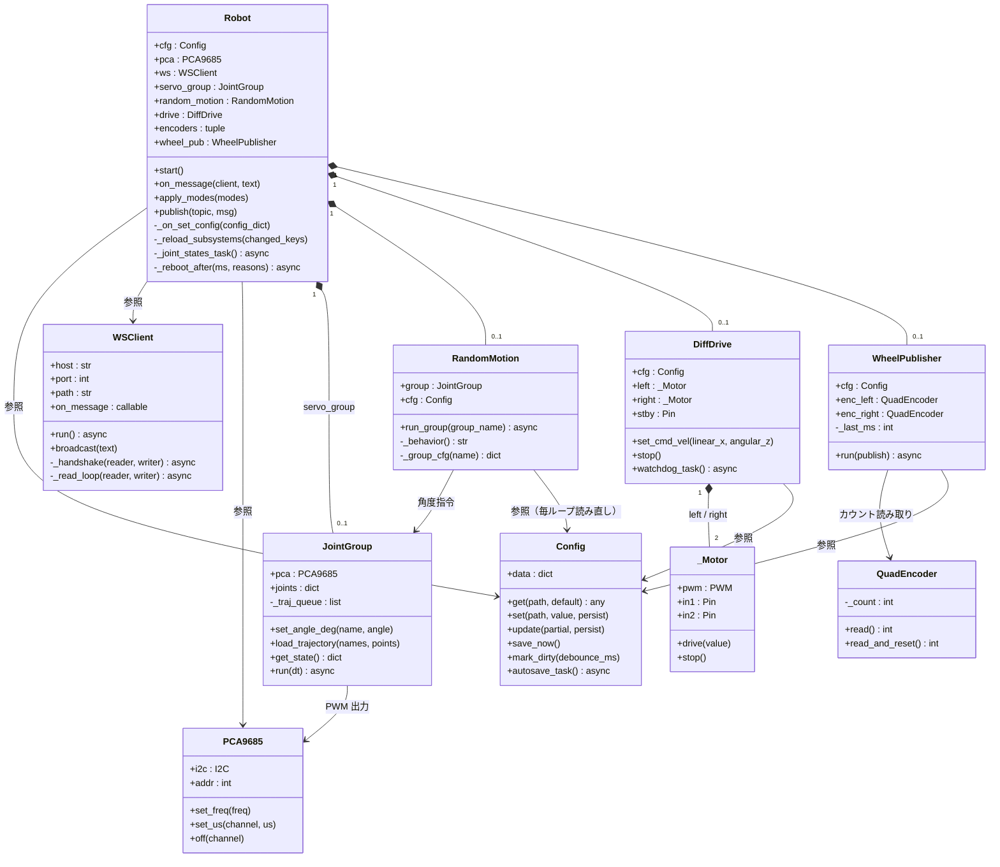

> **共通化ポイント**: 首・ハンド・アームを含む全サーボを `servo_group`（`JointGroup` の単一インスタンス）で管理します。
> ランダム動作のグループ分けは `RandomMotion` が担い、`JointGroup` 自体はグループを意識しません。
>
> **オドメトリの分担**: ESP32 はエンコーダから算出したホイール速度（`/wheel_vel`）を送るだけで、
> x/y/θ への積分と `nav_msgs/Odometry` の生成は smabo-brain 側で行います（IMU/GPS と融合できるようにするため）。

---

## 3. 非同期タスク構成

起動後に asyncio 上で動作するタスクの一覧です。
`Robot._tasks` で名前管理され、モード変更時に個別にキャンセル・再生成されます。

| タスク名 | コルーチン | 役割 | 起動条件 |
|---|---|---|---|
| `servo_follower` | `JointGroup.run()` | サーボ角度の速度制限追従・軌道キュー処理 | `modes.servos = true` |
| `random_<name>` | `RandomMotion.run_group(name)` | グループ単位のランダムタイマー（グループ数分起動） | `modes.servos = true` |
| `joint_states` | `Robot._joint_states_task()` | `/joint_states` 送信（MoveIt2連携用） | `modes.servos = true` |
| `drive_wd` | `DiffDrive.watchdog_task()` | cmd_vel デッドマン監視 | `dc_drive` or `encoder_drive` |
| `odom` | `WheelPublisher.run()` | エンコーダ読み取り + `/wheel_vel` 送信 | `modes.encoder_drive = true` |
| `autosave` | `Config.autosave_task()` | 設定デバウンス保存 | 常時 |
| `wifi_ka` | `wifi_manager.keepalive_task()` | WiFi 再接続監視 | 常時 |

> `random_<name>` のタスク名はグループ名から自動生成されます（例: `random_neck`, `random_hands`）。
> グループ数を変更すると `servos` モードが再起動され、新しいグループ数に合わせてタスクが再生成されます。

---

## 4. シーケンス図

> 以降の図で `WSClient` は ESP32 内の WebSocket クライアント層（`ws_client.py`）です。
> ESP32 と外部（`smabo-web` / `SBC` 等）の通信はすべて中継サーバ **smabo-brain** を経由します。
> 図中で外部アクターから `WSClient` への矢印は、実際には smabo-brain によって中継されたものです。
>
> **送信元 prefix 規約**: 各クライアントは publish するトピックに送信元 prefix を付けます
> （ESP32 → `/esp32`、smabo-web → `/web`、smabo-app → `/app`）。smabo-brain はこの prefix を
> **剥がしてから** canonical なトピック名で宛先へ再配信します。したがって ESP32 が物理的に送出する
> トピックは `/esp32/wheel_vel`・`/esp32/joint_states` ですが、クライアントは `/wheel_vel`・`/joint_states`
> として受け取ります。逆に ESP32 が受信する `/cmd_vel`・`/servo/command` は、smabo-web が送った
> `/web/cmd_vel`・`/web/servo/command` から brain が prefix を剥がしたものです。
> 図中の `/cmd_vel` 等は**剥がされた後の canonical 名**で表記しています。

### 4-1. 起動シーケンス

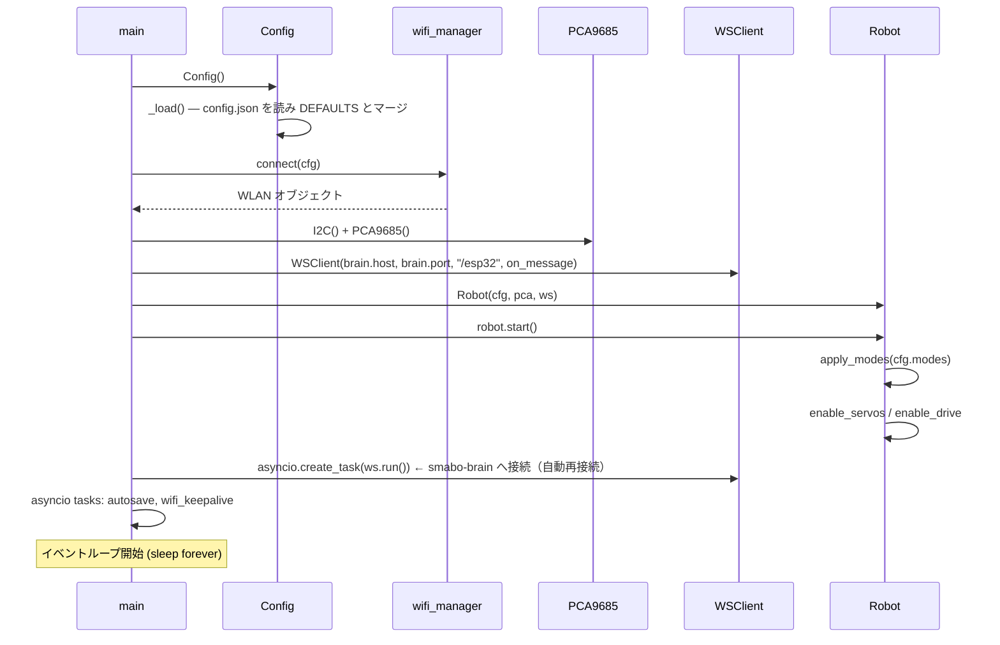

---

### 4-2. WebSocket 接続確立（ESP32 → smabo-brain）

ESP32 はクライアントとして smabo-brain へ接続しに行きます（接続が切れたら自動再接続）。

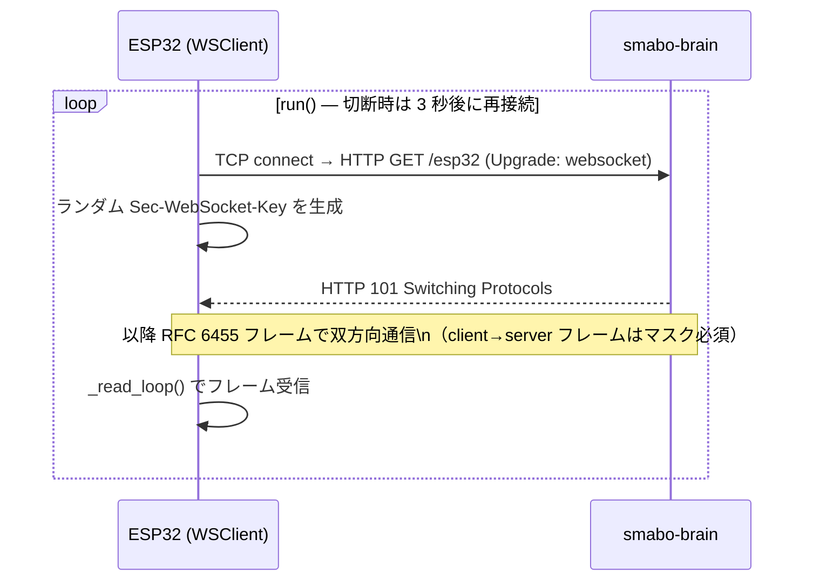

---

### 4-3. 走行制御 (cmd_vel)

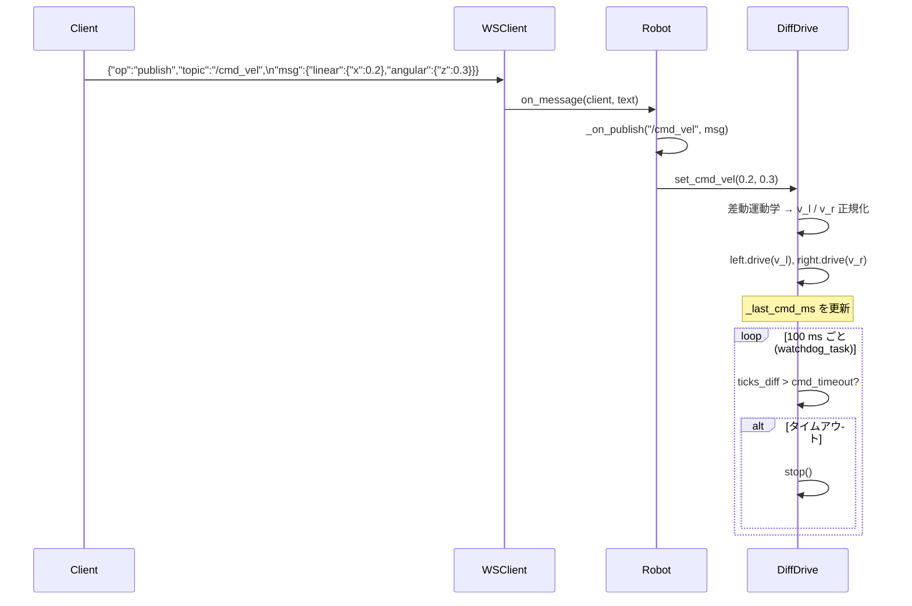

---

### 4-4. サーボ手動制御 — 単一点 (JointTrajectory 1 点)


---

### 4-5. サーボ軌道制御 — 複数点 (MoveIt2 / time-parameterised)

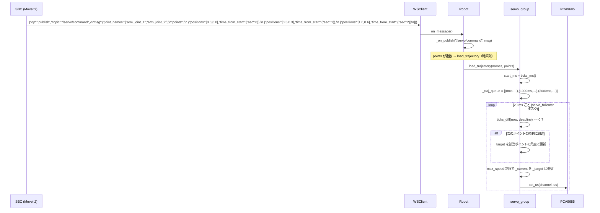

> `time_from_start` は `load_trajectory()` 呼び出し時刻からの相対時間です。
> 各ポイントへの移動は `max_speed` (deg/s) の上限内でなめらかに追従します。

---

### 4-6. ナビゲーション連携（Nav2 + cmd_vel / odom）

ESP32 はホイール速度（`/wheel_vel`）のみを送り、smabo-brain がそれを積分して
`nav_msgs/Odometry`（`/odom`）を生成・配信します。covariance も smabo-brain が付与します。

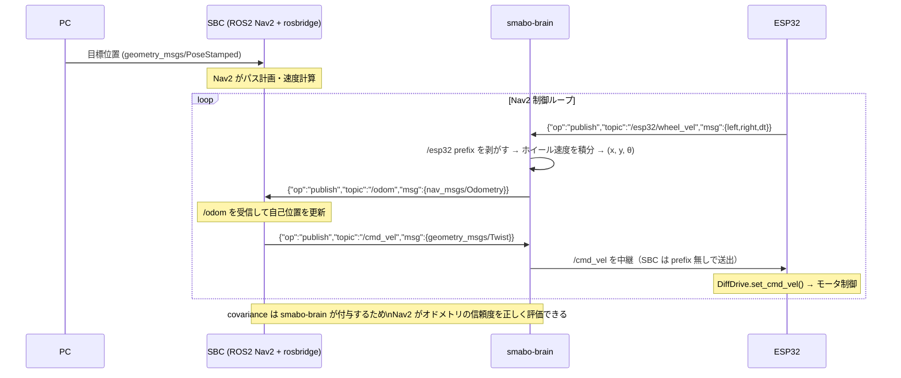

---

### 4-7. ランダム動作（グループ独立タイマー）

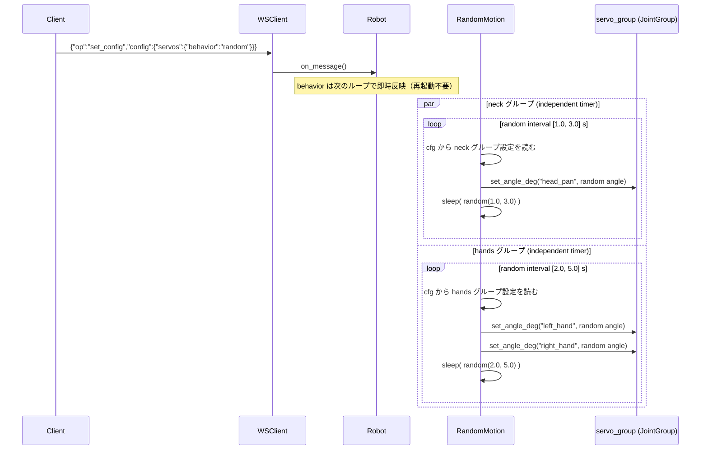

> グループ内のサーボは**同じ瞬間**に動き出しますが、目標角度はそれぞれ独立したランダム値です。
> グループ間のタイマーは完全に独立しており、自然にずれていきます。

---

### 4-8. 設定変更（ソフト設定 — サブシステム再起動のみ）

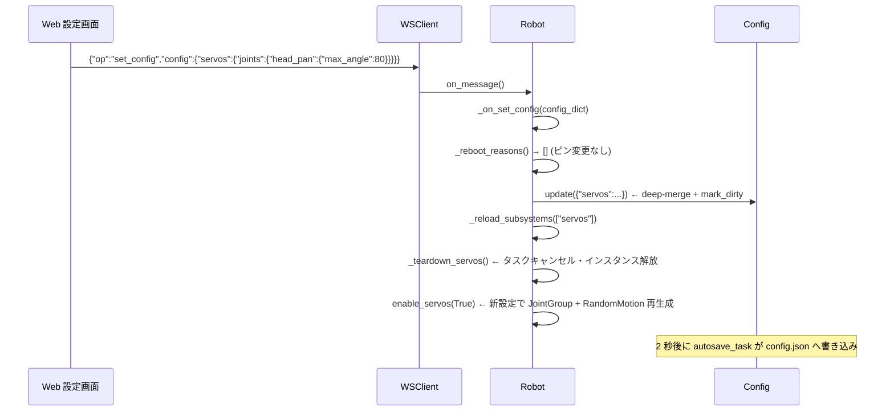

---

### 4-9. 設定変更（ハード設定 — ピン変更 → 強制再起動）

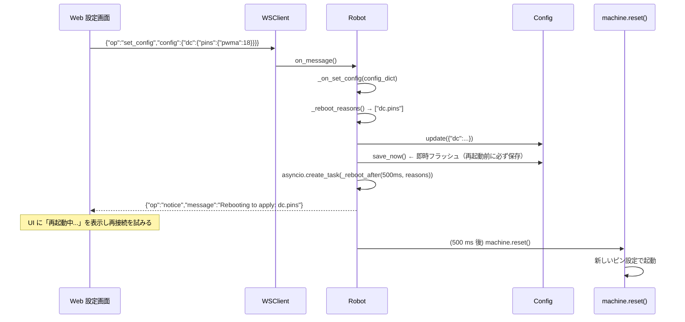

---

### 4-10. モード切り替え

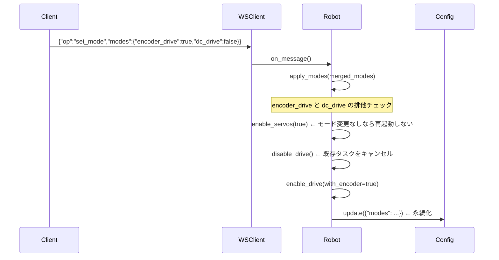

---

### 4-11. /joint_states 送信ループ

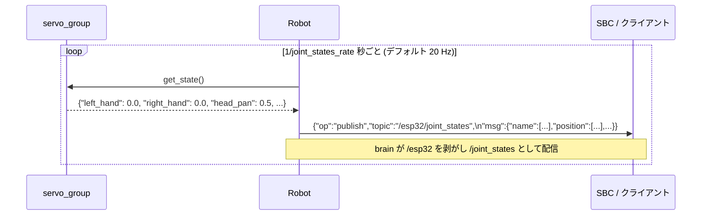

> `servos.joint_states_rate = 0` で無効化できます。`modes.servos = false` のときは送信しません。

---

### 4-12. ホイール速度送信ループ（/wheel_vel）

ESP32 はエンコーダのホイール速度を送るだけで、x/y/θ への積分は smabo-brain が行います。

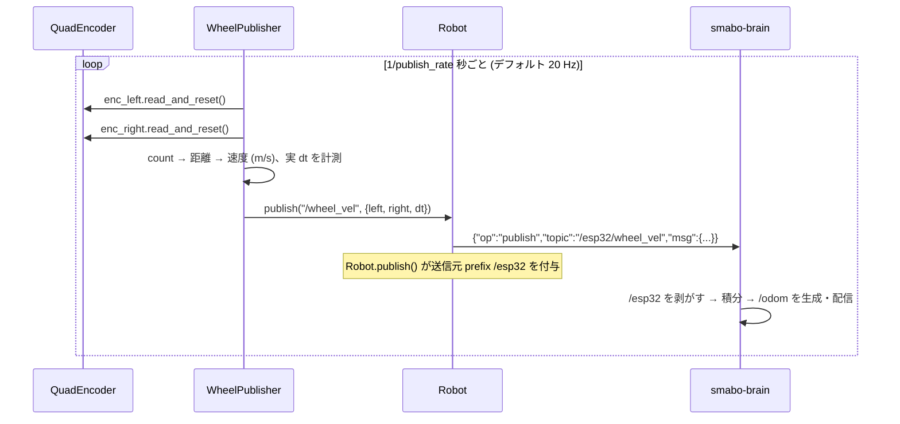

---

### 4-13. 設定の読み出し

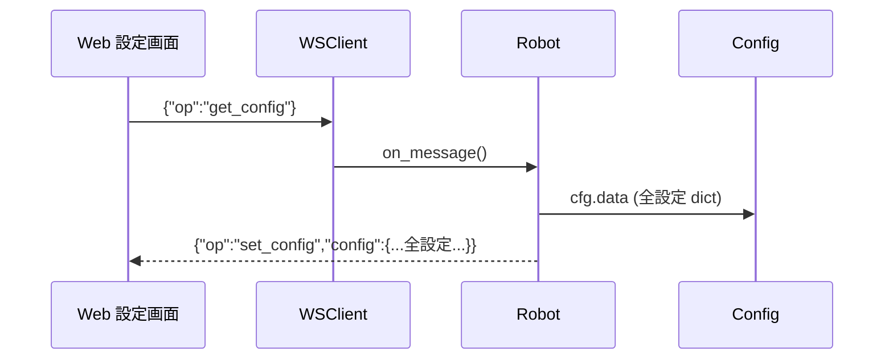

---

## 5. WebSocket メッセージ仕様

### 接続情報

| 項目 | 値 |
|---|---|
| プロトコル | RFC 6455 WebSocket (テキストフレーム) |
| 接続形態 | ESP32 が **クライアント**として smabo-brain へ接続 |
| 接続先 | `ws://<brain-host>:<port>/esp32`（`config.brain.host` / `config.brain.port`、既定 `9090`） |
| フォーマット | UTF-8 JSON、1 メッセージ = 1 フレーム |
| 認証 | なし（信頼済み LAN 内利用前提） |

> 以下「クライアント → ESP32」「ESP32 → クライアント」は、いずれも smabo-brain を介した
> 論理的な送受信です（物理的な接続先は常に smabo-brain）。
>
> **送信元 prefix**: ESP32 が送出する publish は `Robot.publish()` で `/esp32` prefix が付きます
> （物理フレームは `/esp32/wheel_vel` 等）。smabo-brain がこの prefix を剥がし、canonical 名
> （`/wheel_vel`・`/joint_states`、`/wheel_vel` は積分後 `/odom`）でクライアントへ配信します。
> ESP32 が受信する `/cmd_vel`・`/servo/command` は、smabo-web 等が `/web` prefix 付きで送ったものを
> brain が剥がした後の canonical 名です。`set_config` / `get_config` / `notice` / `error` などの
> publish 以外の op には prefix は付きません。
> 5-1・5-2 の例は **canonical 名（剥がした後）** を基本に記載し、ESP32 送信側のみ物理 prefix を併記します。

---

### 5-1. クライアント → ESP32（受信）

#### `publish` — ロボット操作

| フィールド | 型 | 説明 |
|---|---|---|
| `op` | string | `"publish"` 固定 |
| `topic` | string | ROS トピック名 |
| `msg` | object | トピック型に対応した JSON |

---

**走行制御** `geometry_msgs/Twist`

```json
{
  "op": "publish",
  "topic": "/cmd_vel",
  "msg": {
    "linear":  {"x": 0.2,  "y": 0.0, "z": 0.0},
    "angular": {"x": 0.0,  "y": 0.0, "z": 0.3}
  }
}
```

| フィールド | 単位 | 範囲 |
|---|---|---|
| `linear.x` | m/s | `[-max_linear, +max_linear]` |
| `angular.z` | rad/s | `[-max_angular, +max_angular]` |

> `cmd_timeout` 秒以内にメッセージが届かない場合、モータは自動停止します。

---

**サーボ手動制御** `trajectory_msgs/JointTrajectory`

```json
{
  "op": "publish",
  "topic": "/servo/command",
  "msg": {
    "joint_names": ["head_pan", "arm_joint_1"],
    "points": [
      {
        "positions": [0.5, -0.2],
        "velocities": [],
        "time_from_start": {"sec": 1, "nanosec": 0}
      }
    ]
  }
}
```

| トピック | ルーティング先 |
|---|---|
| `/servo/command` | `servo_group` |

> - `joint_names` で対象サーボを指定。`servos.joints` に登録されていない名前は無視されます
> - `positions` の単位は **ラジアン**（ROS 標準）
> - 1点・複数点どちらも `load_trajectory()` で統一処理されます
> - 各点は `time_from_start` を絶対時刻に変換してキューに積み、`run()` ループで到達時刻になったら `_target` を更新します
> - 1点で `time_from_start=0` の場合は次の `run()` tick（≤20ms）で即時適用されます
> - `max_speed` 制限でなめらかに追従します（`0` = 即時移動）
> - `behavior` が `"random"` の場合でも手動コマンドは受け付けます（次のランダム発火で上書きされます）
> - `max_speed` (deg/s) による速度制限追従で移動します（`0` = 即時）

---

#### `set_mode` — モード切り替え

```json
{
  "op": "set_mode",
  "modes": {
    "servos":        true,
    "dc_drive":      false,
    "encoder_drive": true
  }
}
```

> `modes` は部分指定可。未指定のモードは現在値を維持します。
> `dc_drive` と `encoder_drive` は同時 `true` にできません（`encoder_drive` が優先）。

---

#### `set_config` — 設定変更

```json
{
  "op": "set_config",
  "config": {
    "servos": {
      "behavior": "random",
      "random_groups": [
        {"name": "neck",  "joints": ["head_pan"], "interval": [1.0, 3.0]},
        {"name": "hands", "joints": ["left_hand", "right_hand"], "interval": [2.0, 5.0]}
      ]
    }
  }
}
```

> - 送信した部分のみ deep-merge されます（省略したキーは変更なし）
> - `servos.behavior` / `random_groups[*].interval` は次のループで即時反映（再起動不要）
> - `servos.joints` や `random_groups` のグループ追加・削除は `servos` モードが自動再起動されます
> - ピン・バス系変更時は自動的に `machine.reset()` が実行されます（後述）

---

#### `get_config` — 設定読み出し

```json
{"op": "get_config"}
```

→ ESP32 から `set_config` 形式で全設定が返ります。

---

#### `subscribe` / `advertise` / `unsubscribe`

rosbridge_suite との互換性のために受け付けます（内部動作への影響なし）。
ESP32 の送信（物理フレームは `/esp32/joint_states` / `/esp32/wheel_vel`）は `subscribe` なしでも smabo-brain へ送られます。

---

### 5-2. ESP32 → クライアント（送信）

#### `publish` — 関節状態 `sensor_msgs/JointState`

```json
{
  "op": "publish",
  "topic": "/esp32/joint_states",
  "msg": {
    "header": {"stamp": {"sec": 1234, "nanosec": 0}, "frame_id": ""},
    "name":     ["left_hand", "right_hand", "head_pan",
                 "arm_joint_1", "arm_joint_2", "arm_joint_3", "arm_joint_4"],
    "position": [0.0, 0.0, 0.5, 0.0, 0.0, 0.0, 0.0],
    "velocity": [0.0, 0.0, 0.0, 0.0, 0.0, 0.0, 0.0],
    "effort":   [0.0, 0.0, 0.0, 0.0, 0.0, 0.0, 0.0]
  }
}
```

> ESP32 は `/esp32/joint_states` として送出し、smabo-brain が `/esp32` を剥がして `/joint_states` で配信します。
> `position` の単位は **ラジアン**（ROS 標準）。デフォルト **20 Hz** で送信。
> `servos.joint_states_rate` で変更可（`0` で無効）。`modes.servos = true` のときのみ送信。

---

#### `publish` — ホイール速度 `/wheel_vel`

ESP32 はエンコーダから求めた左右ホイール速度（m/s）と実測の積分間隔 `dt`（s）を送ります。
これを受けた smabo-brain が x/y/θ を積分し、`nav_msgs/Odometry`（`/odom`）を生成して配信します。
（オドメトリの積分を上位側に置くことで、IMU/GPS との融合が可能になります）

```json
{
  "op": "publish",
  "topic": "/esp32/wheel_vel",
  "msg": {
    "left":  0.182,
    "right": 0.205,
    "dt":    0.050
  }
}
```

| フィールド | 単位 | 説明 |
|---|---|---|
| `left` | m/s | 左ホイールの周速度 |
| `right` | m/s | 右ホイールの周速度 |
| `dt` | s | 前回送信からの実測経過時間（brain 側の積分に使用） |

> ESP32 は `/esp32/wheel_vel` として送出し、smabo-brain が `/esp32` を剥がして積分後 `/odom` で配信します。
> デフォルト **20 Hz** で送信（`encoder.publish_rate` で変更可・即時反映）。
> `encoder_drive` モードが無効のときは送信しません。
> `nav_msgs/Odometry` 形式・covariance（`encoder.covariance.*` 由来）の生成は smabo-brain 側で行います。

---

#### `set_config` — get_config レスポンス

```json
{"op": "set_config", "config": { "...全設定..." }}
```

---

#### `notice` — 再起動通知

```json
{
  "op": "notice",
  "message": "Rebooting to apply pin/hw changes: dc.pins"
}
```

> このメッセージ受信後 約 500 ms で ESP32 が再起動します。
> Web 側は再接続ループを開始してください（再起動所要時間は約 3–5 秒）。

---

#### `error` — エラー通知

```json
{"op": "error", "message": "説明文"}
```

---

## 6. 設定項目一覧

### WiFi

| キー | 型 | デフォルト | 説明 |
|---|---|---|---|
| `wifi.ssid` | string | `"your-ssid"` | 接続先 SSID |
| `wifi.password` | string | `"your-password"` | パスワード |
| `wifi.hostname` | string | `"esp32-robot"` | mDNS ホスト名 |

> WiFi 設定は初回のみ `config.json` を直接書き込んで設定することを推奨します。
> WebSocket 経由での変更は再起動後に接続できなくなるリスクがあります。

### 接続先 brain（WebSocket）

ESP32 はここで指定した smabo-brain へクライアントとして接続します（パスは `/esp32` 固定）。

| キー | 型 | デフォルト | 説明 |
|---|---|---|---|
| `brain.host` | string | `"192.168.1.100"` | smabo-brain のホスト / IP（**実環境に合わせて要設定**） |
| `brain.port` | int | `9090` | smabo-brain の待ち受けポート |

### I2C / PCA9685

| キー | 型 | デフォルト | 説明 |
|---|---|---|---|
| `i2c.sda` | int | `21` | SDA ピン番号 |
| `i2c.scl` | int | `22` | SCL ピン番号 |
| `i2c.freq` | int | `400000` | クロック周波数 (Hz) |
| `pca9685.address` | int | `0x40` | I2C アドレス |
| `pca9685.freq` | int | `50` | PWM 周波数 (Hz)。サーボ標準は 50 Hz |

### モード

| キー | 型 | デフォルト | 説明 |
|---|---|---|---|
| `modes.servos` | bool | `true` | サーボ制御（首・ハンド・アームを含む全サーボ） |
| `modes.dc_drive` | bool | `false` | DCモータ走行有効 |
| `modes.encoder_drive` | bool | `false` | エンコーダ付き走行有効 |

### サーボ共通スペック

各サーボ設定（`servos.joints.*`）が持つフィールドです。

| フィールド | 型 | 説明 |
|---|---|---|
| `channel` | int | PCA9685 チャンネル番号 (0–15) |
| `min_angle` | float | 最小角度 (deg) |
| `max_angle` | float | 最大角度 (deg) |
| `min_us` | int | 最小パルス幅 (µs)。デフォルト `500` |
| `max_us` | int | 最大パルス幅 (µs)。デフォルト `2500` |
| `init_angle` | float | 起動時の初期角度 (deg) |
| `max_speed` | float | 最大角速度 (deg/s)。`0` = 即時移動 |

### サーボ（`servos`）

首・ハンド・アームを含む全サーボを一括管理します。

| キー | 型 | デフォルト | 説明 |
|---|---|---|---|
| `servos.behavior` | string | `"manual"` | `"manual"` / `"random"` |
| `servos.joints` | dict | 下記参照 | 全サーボ定義。`joint名 → servo spec` |
| `servos.random_groups` | list | 下記参照 | ランダム動作のタイミンググループ定義 |
| `servos.joint_states_rate` | float | `20.0` | `/joint_states` 送信レート (Hz)。`0` で無効 |

**デフォルトの `servos.joints`**

| キー | デフォルト |
|---|---|
| `servos.joints.left_hand` | ch=0, 0–90°, max_speed=0（即時） |
| `servos.joints.right_hand` | ch=1, 0–90°, max_speed=0（即時） |
| `servos.joints.head_pan` | ch=2, ±90°, max_speed=120 |
| `servos.joints.arm_joint_1` | ch=3, ±90°, max_speed=90 |
| `servos.joints.arm_joint_2` | ch=4, ±90°, max_speed=90 |
| `servos.joints.arm_joint_3` | ch=5, ±90°, max_speed=90 |
| `servos.joints.arm_joint_4` | ch=6, ±90°, max_speed=90 |

> 首はパン（`head_pan`）のみがデフォルトです（チルトはデフォルトから削除）。
> 首チルトが必要な場合は `servos.joints.head_tilt` を追加してください。

> アームの軸数を変えるには `servos.joints` に `arm_joint_N` エントリを追加・削除します。`set_config` で変更後、`servos` モードが自動再起動されます。

**`servos.random_groups` — グループ定義**

| フィールド | 型 | 説明 |
|---|---|---|
| `name` | string | グループ識別名（タスク名 `random_<name>` に使用） |
| `joints` | list of string | このグループに属するサーボ名のリスト |
| `interval` | [float, float] | ランダム発火の待機時間範囲 (s)。`[最小, 最大]` |
| `saccade_prob` | float | 大きく素早い注視（サッカード）の確率 0–1（既定 0.18） |
| `drift` | float | ドリフト幅（可動域に対する割合・ガウス step、既定 0.07） |
| `center_pull` | float | 中立角への引き戻しの強さ 0–1（既定 0.12） |
| `drift_speed` | float | ドリフト速度（`max_speed` に対する割合、既定 0.4） |
| `long_pause_prob` | float | 時々の長い静止（settle）の確率 0–1（既定 0.22） |

> `saccade_prob` 以降は**生物的ランダム動作のチューニング**用（すべて任意・即時反映）。
> 省略時は既定値。サッカード時はフル `max_speed`、ドリフト時は `max_speed × drift_speed`。
> 動作モデル：通常は中立角へ引き戻しつつ微小ガウス step でゆらぎ（ドリフト）、
> 時々サッカードで大きく素早く動く。`max_speed`=0 のサーボはランダム時 120°/s で滑らかに動く。

**デフォルトのグループ構成**

```
neck  グループ: ["head_pan"]                — 1.0〜3.0 秒ごとに発火
hands グループ: ["left_hand","right_hand"] — 2.0〜5.0 秒ごとに同時発火
```

> グループに属さないサーボは手動コマンド（`/servo/command`）でのみ動きます。

### DCモータ

> デフォルトは**ESP32（無印）DevKit 38pin** 向け。左ヘッダの出力可能な連続パッド
> `32,33,25,26,27,14,12` に TB6612FNG 制御 7 本を**基板の印字順**で割り当てており、
> 剥く前の連結ジャンプワイヤを一直線に挿せます。ESP32-S3 / XIAO は `configs/` のプリセットを使用してください。

| キー | 型 | デフォルト | 説明 |
|---|---|---|---|
| `dc.pins.pwma` | int | `32` | 左モータ PWM |
| `dc.pins.ain2` | int | `33` | 左モータ IN2 |
| `dc.pins.ain1` | int | `25` | 左モータ IN1 |
| `dc.pins.stby` | int | `26` | TB6612 STBY ピン |
| `dc.pins.bin1` | int | `27` | 右モータ IN1 |
| `dc.pins.bin2` | int | `14` | 右モータ IN2 |
| `dc.pins.pwmb` | int | `12` | 右モータ PWM |
| `dc.pwm_freq` | int | `1000` | PWM 周波数 (Hz) |
| `dc.max_linear` | float | `0.30` | 最大直進速度 (m/s) |
| `dc.max_angular` | float | `1.50` | 最大旋回速度 (rad/s) |
| `dc.wheel_radius` | float | `0.030` | 車輪半径 (m) |
| `dc.wheel_separation` | float | `0.150` | 車輪間距離 (m) |
| `dc.invert_left` | bool | `false` | 左モータ回転方向反転 |
| `dc.invert_right` | bool | `false` | 右モータ回転方向反転 |
| `dc.cmd_timeout` | float | `0.5` | デッドマンタイムアウト (s) |

### エンコーダ / オドメトリ

| キー | 型 | デフォルト | 説明 |
|---|---|---|---|
| `encoder.left.a` | int | `34` | 左エンコーダ A 相ピン |
| `encoder.left.b` | int | `35` | 左エンコーダ B 相ピン |
| `encoder.right.a` | int | `36` | 右エンコーダ A 相ピン |
| `encoder.right.b` | int | `39` | 右エンコーダ B 相ピン |
| `encoder.cpr` | int | `1440` | 車輪 1 回転あたりのカウント数 |
| `encoder.publish_rate` | float | `20.0` | /wheel_vel 送信レート (Hz) |
| `encoder.odom_frame` | string | `"odom"` | odom の frame_id |
| `encoder.base_frame` | string | `"base_link"` | child_frame_id |
| `encoder.covariance.pose_xx` | float | `0.001` | x位置分散 (m²) |
| `encoder.covariance.pose_yy` | float | `0.001` | y位置分散 (m²) |
| `encoder.covariance.pose_aa` | float | `0.001` | yaw分散 (rad²) |
| `encoder.covariance.twist_vv` | float | `0.001` | 線速度分散 ((m/s)²) |
| `encoder.covariance.twist_ww` | float | `0.001` | 角速度分散 ((rad/s)²) |

---

## 7. 設定変更の反映ルール

`set_config` で送られた内容は以下のルールで処理されます。

### 即時反映（再起動不要・サブシステム再起動なし）

ループ内で毎回 Config から読み直すため、変更は次の処理サイクルで自動反映されます。

| 設定 | 反映タイミング |
|---|---|
| `servos.behavior` | 各ランダムグループの次のループ開始時 |
| `servos.random_groups[*].interval` | 現在の sleep 終了後（次の待機から新しい範囲が適用） |
| `servos.random_groups[*].joints` | 次のランダム発火タイミングで反映 |
| `servos.joint_states_rate` | 次の /joint_states 送信後 |
| `dc.cmd_timeout` | 次の watchdog チェック (100 ms 以内) |
| `encoder.publish_rate` | 次の /wheel_vel 送信後 |
| `encoder.covariance.*` | ESP32 側では不使用（smabo-brain が `get_config` 経由で取得し /odom に付与） |

### 即時反映（サブシステム再起動あり）

設定反映のためにサブシステムのタスクをキャンセルし、新設定でインスタンスを再生成します。
`servos` 再起動中はサーボが初期角度に戻ります（約 1 フレーム）。

| 変更キー | 再起動されるサブシステム | 具体的なトリガー例 |
|---|---|---|
| `servos.*` | `servo_follower`, `random_*` 全タスク, `joint_states` | サーボのチャンネル・角度範囲変更、グループ追加・削除、アーム軸の追加・削除 |
| `dc.*`（`pins` 以外） | `drive_wd`, `odom` | 速度上限・反転設定変更 |
| `encoder.*`（ピン以外） | `drive_wd`, `odom` | CPR 値変更 |

### 強制再起動（`machine.reset()`）

ピン割り当て・バスパラメータはペリフェラルの再初期化が必要なため、
設定を即時保存してから ESP32 をリセットします。

| 変更キー | 理由 |
|---|---|
| `i2c.*` | `machine.I2C` の再生成が必要 |
| `pca9685.*` | I2C バス上のデバイス再初期化 |
| `wifi.*` | `network.WLAN` の再接続（**下記注意参照**） |
| `dc.pins.*` | `machine.PWM` / `machine.Pin` の再生成 |
| `encoder.left.*` | `machine.Pin` + IRQ の再設定 |
| `encoder.right.*` | 同上 |

> **WiFi 設定変更の注意**: WebSocket は WiFi の上に乗っているため、SSID/Password を
> WebSocket 経由で変更すると再起動後に接続できなくなるリスクがあります。
> **WiFi 設定は初回のみ `config.json` を直接書き込んで設定し、以後は変更しない運用を推奨します。**
> 変更が必要な場合はシリアル(USB)経由で `config.json` を直接編集してください。

**再起動フロー:**
1. `config.json` に即時保存（`save_now()`）
2. `{"op":"notice","message":"Rebooting to apply: ..."}` を送信
3. 500 ms 後に `machine.reset()`
4. 起動後に新設定が自動的に読み込まれる

---

## 8. ハードウェア構成メモ

### PWM バスの分離

```
PCA9685 (I2C)  ←→  サーボ全軸（首・ハンド・アーム）  @ 50 Hz
ESP32 LEDC PWM ←→  DCモータドライバ（TB6612）        @ 1 kHz
```

> PCA9685 の PWM 周波数は 16ch 共通のため、サーボ(50 Hz)とモータ(1 kHz)を
> 同一デバイスに混在させると両立しません。

### エンコーダピンの注意

- GPIO **34–39** は入力専用・内部プルアップ無し → **外部プルアップ抵抗が必須**
- ソフトウェア IRQ カウントのため高速回転では取りこぼしが発生します
- 高精度が必要な場合は ESP32 PCNT バインディング入りカスタムファームウェアを推奨

### デフォルト PCA9685 チャンネル割り当て

| ch | `servos.joints` のキー名 | デフォルト用途 |
|---|---|---|
| 0 | `left_hand` | 左ハンド |
| 1 | `right_hand` | 右ハンド |
| 2 | `head_pan` | 首 パン |
| 3 | `arm_joint_1` | アーム 第1軸 |
| 4 | `arm_joint_2` | アーム 第2軸 |
| 5 | `arm_joint_3` | アーム 第3軸 |
| 6 | `arm_joint_4` | アーム 第4軸 |

### ボード別 DC ピンプリセット（`configs/`）

TB6612FNG の制御 7 本（`PWMA → AIN2 → AIN1 → STBY → BIN1 → BIN2 → PWMB`）と I2C を、
**ヘッダ上で隣り合うパッド**に割り当てたボード別テンプレートです。使うボードのファイルを
デバイス直下に `config.json` としてコピーするだけで、起動時に `DEFAULTS` へ deep-merge されます。
DC を使うには `"modes": {"dc_drive": true}` を追記して有効化します。

| ボード | ファイル | DC 7本 (PWMA→PWMB) | I2C (SCL / SDA) |
|---|---|---|---|
| ESP32（無印）DevKit 38pin | `config.esp32-classic.json` | 32, 33, 25, 26, 27, 14, 12 | 22 / 21 |
| ESP32-S3-DevKitC-1 / M-1 系 | `config.esp32s3-devkitc1.json` | 4, 5, 6, 7, 15, 16, 17 | 10 / 11 |
| Seeed XIAO ESP32-S3 | `config.xiao-esp32s3.json` | 1, 2, 3, 4, 5, 6, 43 (D0–D6) | 9(D10) / 8(D9) |

> 無印 ESP32 のデフォルト（`config.py` の `DEFAULTS`）は `config.esp32-classic.json` と同じピン並びです。
> GPIO 34–39 は入力専用のためモータ出力には使いません。互換クローンは印字順が異なる場合があるので、
> 基板のシルク印刷と必ず照合してください。
