# ESP32 Robot Firmware — 設計ドキュメント

- **対象ファームウェア**: MicroPython (ESP32 / ESP32-S3 / XIAO ESP32-S3)
- **通信プロトコル**: rosbridge v2.0 互換 WebSocket JSON
- **接続形態**: ESP32 は中継サーバ **smabo-brain** へ WebSocket **クライアント**として接続（`ws://<brain-host>:<port>/esp32`）。制御指令は smabo-web → smabo-brain 経由で届き、ホイール速度等は smabo-brain へ送る。
- **更新日**: 2026-06-15

---

## 目次

1. [モジュール構成](#1-モジュール構成)
2. [クラス図](#2-クラス図)
3. [非同期タスク構成](#3-非同期タスク構成)
4. [シーケンス図](#4-シーケンス図)
   - 4-1. 起動
   - 4-2. WebSocket 接続確立
   - 4-3. 走行制御 (cmd_vel)
   - 4-4. サーボ手動制御（単一点）
   - 4-5. サーボ軌道制御（複数点・MoveIt2）
   - 4-6. ナビゲーション連携（Nav2）
   - 4-7. ランダム動作
   - 4-8. ソフト設定変更
   - 4-9. ハード設定変更（ピン変更・再起動）
   - 4-10. モード切り替え
   - 4-11. /joint_states 送信ループ
   - 4-12. ホイール速度送信ループ（/wheel_vel）
   - 4-13. 設定の読み出し
5. [WebSocket メッセージ仕様](#5-websocket-メッセージ仕様)
6. [設定項目一覧](#6-設定項目一覧)
7. [設定変更の反映ルール](#7-設定変更の反映ルール)
8. [ハードウェア構成メモ](#8-ハードウェア構成メモ)

---

## 1. モジュール構成

```
smabo-esp32/
├── main.py              # 起動エントリ・asyncio イベントループ
├── config.py            # 永続設定（RAM + config.json、デバウンス保存）・DEFAULTS
├── wifi_manager.py      # WiFi 接続・自動再接続
├── ws_client.py         # RFC 6455 WebSocket クライアント（smabo-brain へ接続・自動再接続、外部ライブラリ不要）
├── robot.py             # オーケストレータ（rosbridge プロトコル・モード管理）
├── pca9685.py           # PCA9685 PWM ドライバ（サーボ用 I2C）
├── servo_controller.py  # JointGroup（全サーボ共通）
├── random_motion.py     # グループ単位のランダム動作（タイミンググループ管理）
├── dc_motors.py         # TB6612 差動駆動（cmd_vel 受信・デッドマン停止）
├── encoder.py           # GPIO 割り込みによるエンコーダカウント
├── wheel_publisher.py   # エンコーダ → ホイール速度（/wheel_vel）送信。オドメトリ積分は smabo-brain 側
├── config.json          # 実機の差分設定（DEFAULTS へ deep-merge。WiFi / brain 接続先 等。git 管理外）
└── configs/             # ボード別 config.json テンプレート（後述 §8）
    ├── config.esp32-classic.json     # ESP32（無印）DevKit 38pin
    ├── config.esp32s3-devkitc1.json  # ESP32-S3-DevKitC-1 / DevKitM-1 系
    └── config.xiao-esp32s3.json      # Seeed XIAO ESP32-S3
```

> `config.json` は `config.py` の `DEFAULTS` に対する**差分のみ**を保持します（起動時に deep-merge）。
> ボードを変えるときは `configs/` の該当ファイルをデバイス直下に `config.json` としてコピーします。

---

## 2. クラス図


> **共通化ポイント**: 首・ハンド・アームを含む全サーボを `servo_group`（`JointGroup` の単一インスタンス）で管理します。
> ランダム動作のグループ分けは `RandomMotion` が担い、`JointGroup` 自体はグループを意識しません。
>
> **オドメトリの分担**: ESP32 はエンコーダから算出したホイール速度（`/wheel_vel`）を送るだけで、
> x/y/θ への積分と `nav_msgs/Odometry` の生成は smabo-brain 側で行います（IMU/GPS と融合できるようにするため）。

---

## 3. 非同期タスク構成

起動後に asyncio 上で動作するタスクの一覧です。
`Robot._tasks` で名前管理され、モード変更時に個別にキャンセル・再生成されます。

| タスク名 | コルーチン | 役割 | 起動条件 |
|---|---|---|---|
| `servo_follower` | `JointGroup.run()` | サーボ角度の速度制限追従・軌道キュー処理 | `modes.servos = true` |
| `random_<name>` | `RandomMotion.run_group(name)` | グループ単位のランダムタイマー（グループ数分起動） | `modes.servos = true` |
| `joint_states` | `Robot._joint_states_task()` | `/joint_states` 送信（MoveIt2連携用） | `modes.servos = true` |
| `drive_wd` | `DiffDrive.watchdog_task()` | cmd_vel デッドマン監視 | `dc_drive` or `encoder_drive` |
| `odom` | `WheelPublisher.run()` | エンコーダ読み取り + `/wheel_vel` 送信 | `modes.encoder_drive = true` |
| `autosave` | `Config.autosave_task()` | 設定デバウンス保存 | 常時 |
| `wifi_ka` | `wifi_manager.keepalive_task()` | WiFi 再接続監視 | 常時 |

> `random_<name>` のタスク名はグループ名から自動生成されます（例: `random_neck`, `random_hands`）。
> グループ数を変更すると `servos` モードが再起動され、新しいグループ数に合わせてタスクが再生成されます。

---

## 4. シーケンス図

> 以降の図で `WSClient` は ESP32 内の WebSocket クライアント層（`ws_client.py`）です。
> ESP32 と外部（`smabo-web` / `SBC` 等）の通信はすべて中継サーバ **smabo-brain** を経由します。
> 図中で外部アクターから `WSClient` への矢印は、実際には smabo-brain によって中継されたものです。
>
> **送信元 prefix 規約**: 各クライアントは publish するトピックに送信元 prefix を付けます
> （ESP32 → `/esp32`、smabo-web → `/web`、smabo-app → `/app`）。smabo-brain はこの prefix を
> **剥がしてから** canonical なトピック名で宛先へ再配信します。したがって ESP32 が物理的に送出する
> トピックは `/esp32/wheel_vel`・`/esp32/joint_states` ですが、クライアントは `/wheel_vel`・`/joint_states`
> として受け取ります。逆に ESP32 が受信する `/cmd_vel`・`/servo/command` は、smabo-web が送った
> `/web/cmd_vel`・`/web/servo/command` から brain が prefix を剥がしたものです。
> 図中の `/cmd_vel` 等は**剥がされた後の canonical 名**で表記しています。

### 4-1. 起動シーケンス

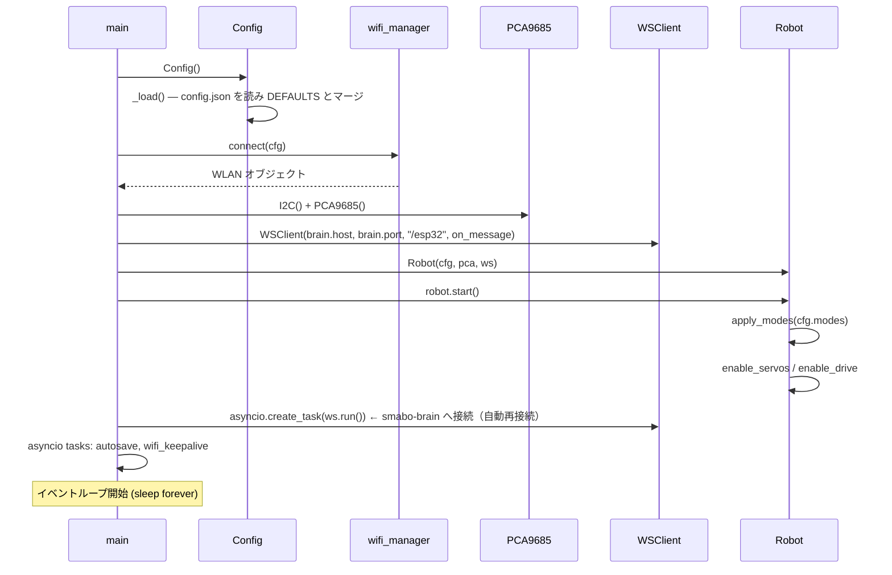

---

### 4-2. WebSocket 接続確立（ESP32 → smabo-brain）

ESP32 はクライアントとして smabo-brain へ接続しに行きます（接続が切れたら自動再接続）。

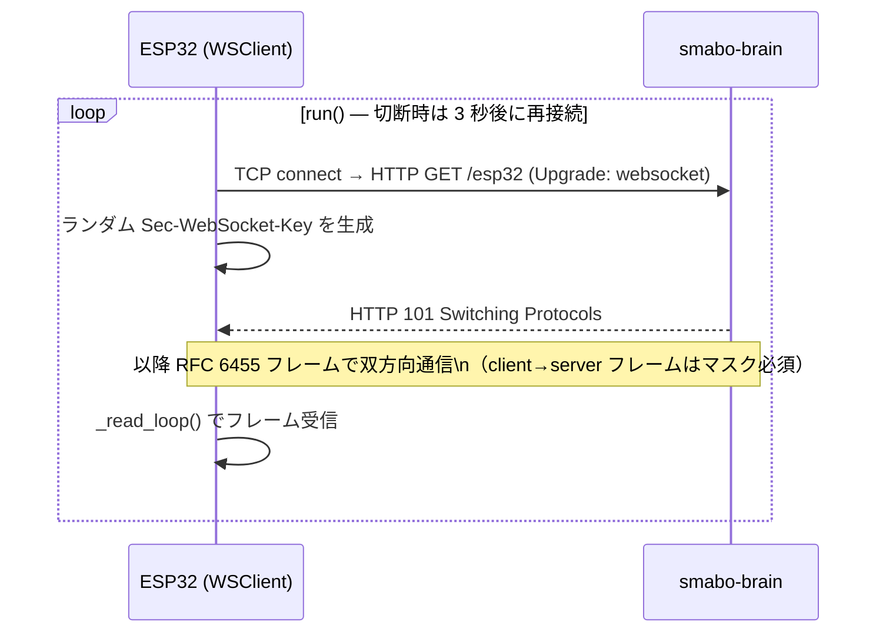

---

### 4-3. 走行制御 (cmd_vel)

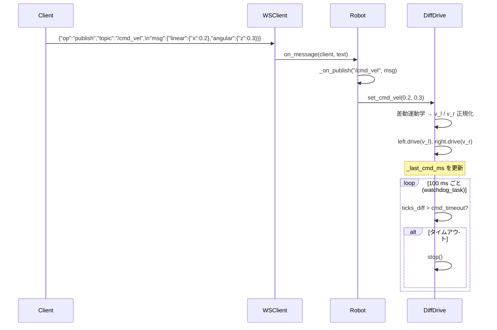

---

### 4-4. サーボ手動制御 — 単一点 (JointTrajectory 1 点)

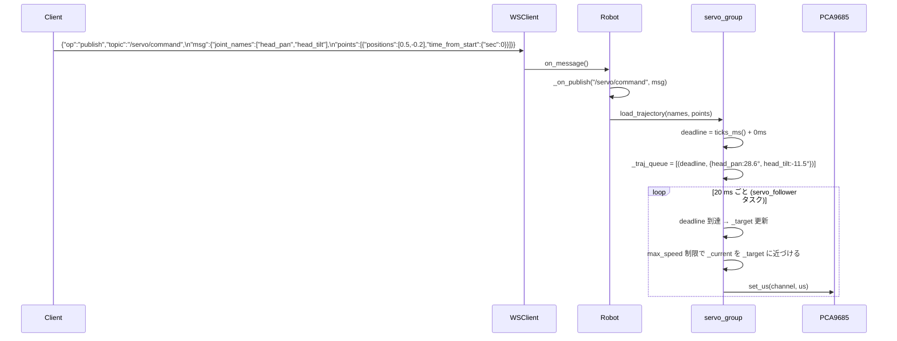


---

### 4-5. サーボ軌道制御 — 複数点 (MoveIt2 / time-parameterised)

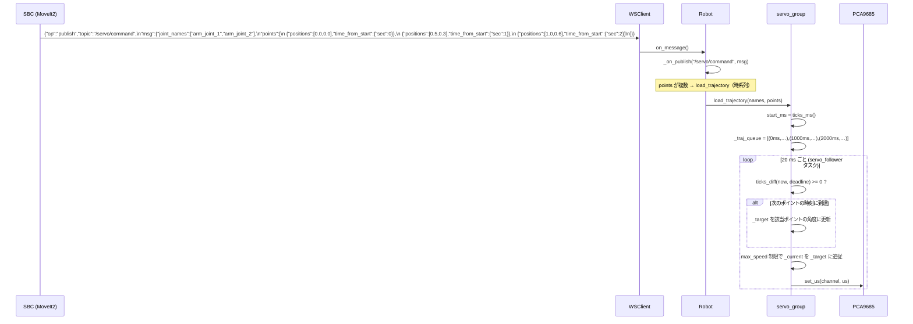

> `time_from_start` は `load_trajectory()` 呼び出し時刻からの相対時間です。
> 各ポイントへの移動は `max_speed` (deg/s) の上限内でなめらかに追従します。

---

### 4-6. ナビゲーション連携（Nav2 + cmd_vel / odom）

ESP32 はホイール速度（`/wheel_vel`）のみを送り、smabo-brain がそれを積分して
`nav_msgs/Odometry`（`/odom`）を生成・配信します。covariance も smabo-brain が付与します。

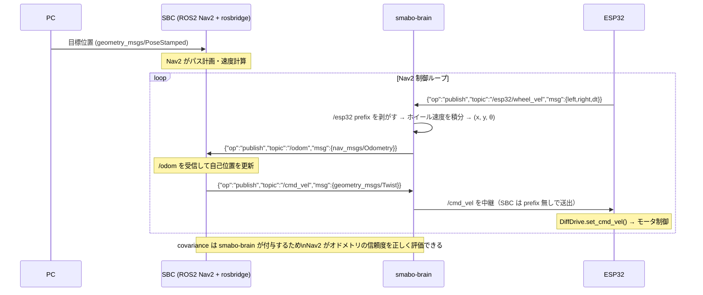

---

### 4-7. ランダム動作（グループ独立タイマー）

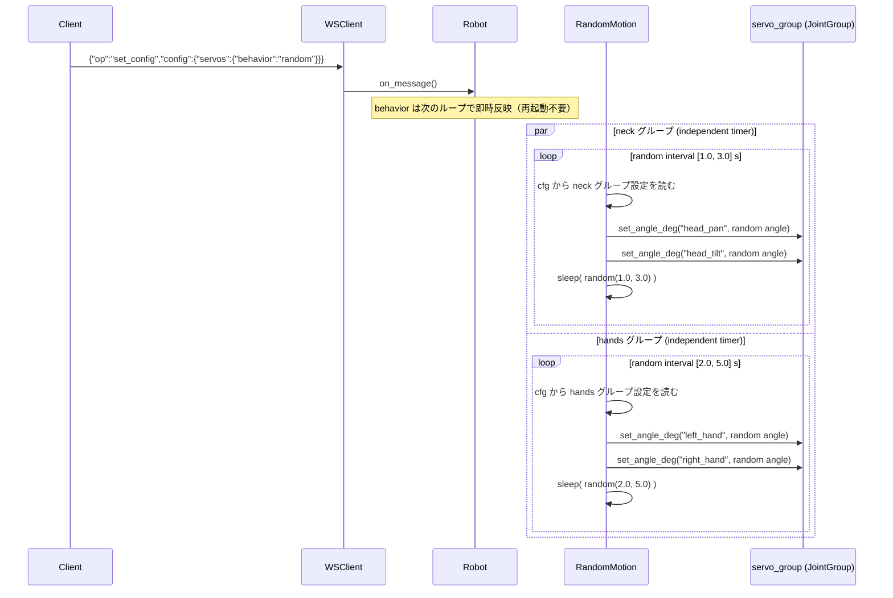

> グループ内のサーボは**同じ瞬間**に動き出しますが、目標角度はそれぞれ独立したランダム値です。
> グループ間のタイマーは完全に独立しており、自然にずれていきます。

---

### 4-8. 設定変更（ソフト設定 — サブシステム再起動のみ）

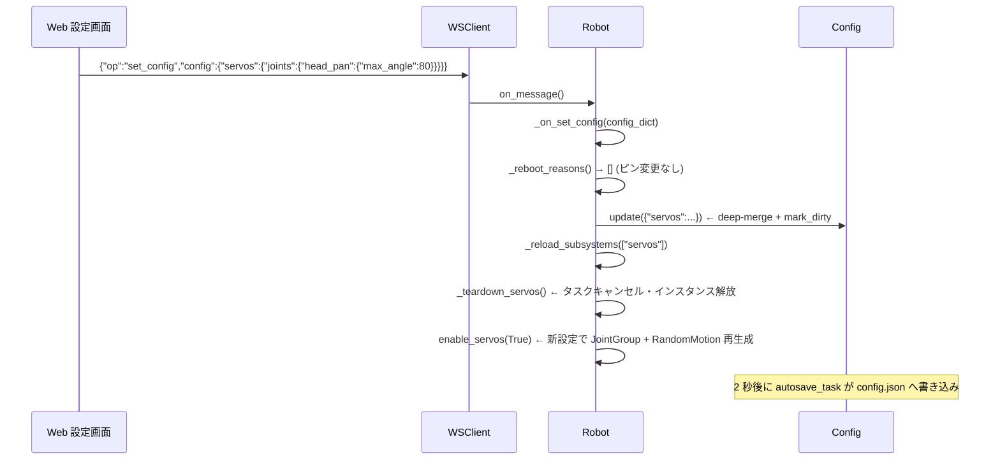

---

### 4-9. 設定変更（ハード設定 — ピン変更 → 強制再起動）

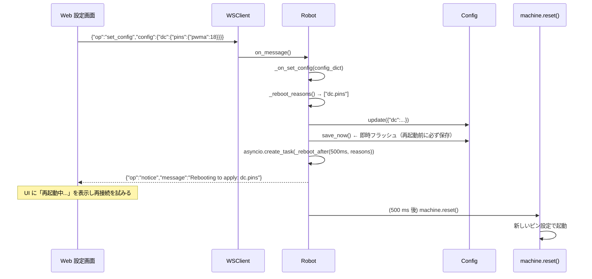

---

### 4-10. モード切り替え

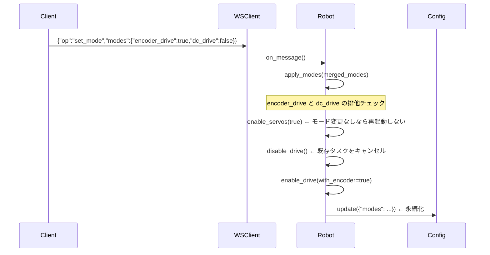

---

### 4-11. /joint_states 送信ループ

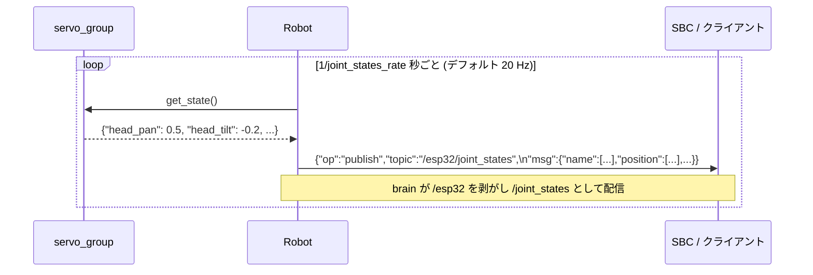

> `servos.joint_states_rate = 0` で無効化できます。`modes.servos = false` のときは送信しません。

---

### 4-12. ホイール速度送信ループ（/wheel_vel）

ESP32 はエンコーダのホイール速度を送るだけで、x/y/θ への積分は smabo-brain が行います。

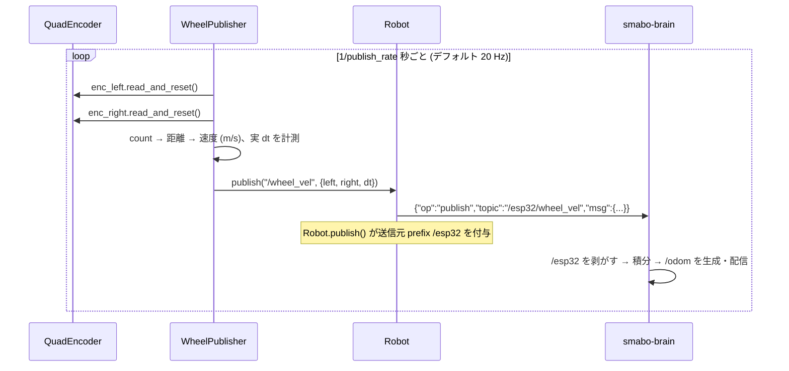

---

### 4-13. 設定の読み出し

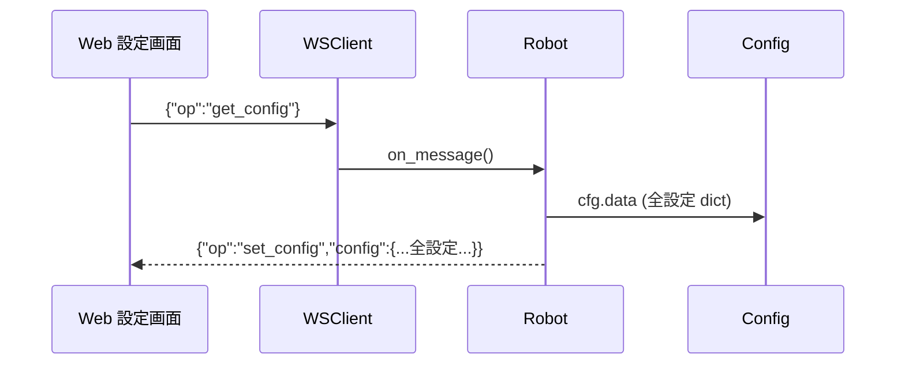

---

## 5. WebSocket メッセージ仕様

### 接続情報

| 項目 | 値 |
|---|---|
| プロトコル | RFC 6455 WebSocket (テキストフレーム) |
| 接続形態 | ESP32 が **クライアント**として smabo-brain へ接続 |
| 接続先 | `ws://<brain-host>:<port>/esp32`（`config.brain.host` / `config.brain.port`、既定 `9090`） |
| フォーマット | UTF-8 JSON、1 メッセージ = 1 フレーム |
| 認証 | なし（信頼済み LAN 内利用前提） |

> 以下「クライアント → ESP32」「ESP32 → クライアント」は、いずれも smabo-brain を介した
> 論理的な送受信です（物理的な接続先は常に smabo-brain）。
>
> **送信元 prefix**: ESP32 が送出する publish は `Robot.publish()` で `/esp32` prefix が付きます
> （物理フレームは `/esp32/wheel_vel` 等）。smabo-brain がこの prefix を剥がし、canonical 名
> （`/wheel_vel`・`/joint_states`、`/wheel_vel` は積分後 `/odom`）でクライアントへ配信します。
> ESP32 が受信する `/cmd_vel`・`/servo/command` は、smabo-web 等が `/web` prefix 付きで送ったものを
> brain が剥がした後の canonical 名です。`set_config` / `get_config` / `notice` / `error` などの
> publish 以外の op には prefix は付きません。
> 5-1・5-2 の例は **canonical 名（剥がした後）** を基本に記載し、ESP32 送信側のみ物理 prefix を併記します。

---

### 5-1. クライアント → ESP32（受信）

#### `publish` — ロボット操作

| フィールド | 型 | 説明 |
|---|---|---|
| `op` | string | `"publish"` 固定 |
| `topic` | string | ROS トピック名 |
| `msg` | object | トピック型に対応した JSON |

---

**走行制御** `geometry_msgs/Twist`

```json
{
  "op": "publish",
  "topic": "/cmd_vel",
  "msg": {
    "linear":  {"x": 0.2,  "y": 0.0, "z": 0.0},
    "angular": {"x": 0.0,  "y": 0.0, "z": 0.3}
  }
}
```

| フィールド | 単位 | 範囲 |
|---|---|---|
| `linear.x` | m/s | `[-max_linear, +max_linear]` |
| `angular.z` | rad/s | `[-max_angular, +max_angular]` |

> `cmd_timeout` 秒以内にメッセージが届かない場合、モータは自動停止します。

---

**サーボ手動制御** `trajectory_msgs/JointTrajectory`

```json
{
  "op": "publish",
  "topic": "/servo/command",
  "msg": {
    "joint_names": ["head_pan", "head_tilt"],
    "points": [
      {
        "positions": [0.5, -0.2],
        "velocities": [],
        "time_from_start": {"sec": 1, "nanosec": 0}
      }
    ]
  }
}
```

| トピック | ルーティング先 |
|---|---|
| `/servo/command` | `servo_group` |

> - `joint_names` で対象サーボを指定。`servos.joints` に登録されていない名前は無視されます
> - `positions` の単位は **ラジアン**（ROS 標準）
> - 1点・複数点どちらも `load_trajectory()` で統一処理されます
> - 各点は `time_from_start` を絶対時刻に変換してキューに積み、`run()` ループで到達時刻になったら `_target` を更新します
> - 1点で `time_from_start=0` の場合は次の `run()` tick（≤20ms）で即時適用されます
> - `max_speed` 制限でなめらかに追従します（`0` = 即時移動）
> - `behavior` が `"random"` の場合でも手動コマンドは受け付けます（次のランダム発火で上書きされます）
> - `max_speed` (deg/s) による速度制限追従で移動します（`0` = 即時）

---

#### `set_mode` — モード切り替え

```json
{
  "op": "set_mode",
  "modes": {
    "servos":        true,
    "dc_drive":      false,
    "encoder_drive": true
  }
}
```

> `modes` は部分指定可。未指定のモードは現在値を維持します。
> `dc_drive` と `encoder_drive` は同時 `true` にできません（`encoder_drive` が優先）。

---

#### `set_config` — 設定変更

```json
{
  "op": "set_config",
  "config": {
    "servos": {
      "behavior": "random",
      "random_groups": [
        {"name": "neck",  "joints": ["head_pan", "head_tilt"], "interval": [1.0, 3.0]},
        {"name": "hands", "joints": ["left_hand", "right_hand"], "interval": [2.0, 5.0]}
      ]
    }
  }
}
```

> - 送信した部分のみ deep-merge されます（省略したキーは変更なし）
> - `servos.behavior` / `random_groups[*].interval` は次のループで即時反映（再起動不要）
> - `servos.joints` や `random_groups` のグループ追加・削除は `servos` モードが自動再起動されます
> - ピン・バス系変更時は自動的に `machine.reset()` が実行されます（後述）

---

#### `get_config` — 設定読み出し

```json
{"op": "get_config"}
```

→ ESP32 から `set_config` 形式で全設定が返ります。

---

#### `subscribe` / `advertise` / `unsubscribe`

rosbridge_suite との互換性のために受け付けます（内部動作への影響なし）。
ESP32 の送信（物理フレームは `/esp32/joint_states` / `/esp32/wheel_vel`）は `subscribe` なしでも smabo-brain へ送られます。

---

### 5-2. ESP32 → クライアント（送信）

#### `publish` — 関節状態 `sensor_msgs/JointState`

```json
{
  "op": "publish",
  "topic": "/esp32/joint_states",
  "msg": {
    "header": {"stamp": {"sec": 1234, "nanosec": 0}, "frame_id": ""},
    "name":     ["head_pan", "head_tilt", "left_hand", "right_hand",
                 "arm_joint_1", "arm_joint_2", "arm_joint_3", "arm_joint_4"],
    "position": [0.5, -0.2, 0.0, 0.0, 0.0, 0.0, 0.0, 0.0],
    "velocity": [0.0, 0.0, 0.0, 0.0, 0.0, 0.0, 0.0, 0.0],
    "effort":   [0.0, 0.0, 0.0, 0.0, 0.0, 0.0, 0.0, 0.0]
  }
}
```

> ESP32 は `/esp32/joint_states` として送出し、smabo-brain が `/esp32` を剥がして `/joint_states` で配信します。
> `position` の単位は **ラジアン**（ROS 標準）。デフォルト **20 Hz** で送信。
> `servos.joint_states_rate` で変更可（`0` で無効）。`modes.servos = true` のときのみ送信。

---

#### `publish` — ホイール速度 `/wheel_vel`

ESP32 はエンコーダから求めた左右ホイール速度（m/s）と実測の積分間隔 `dt`（s）を送ります。
これを受けた smabo-brain が x/y/θ を積分し、`nav_msgs/Odometry`（`/odom`）を生成して配信します。
（オドメトリの積分を上位側に置くことで、IMU/GPS との融合が可能になります）

```json
{
  "op": "publish",
  "topic": "/esp32/wheel_vel",
  "msg": {
    "left":  0.182,
    "right": 0.205,
    "dt":    0.050
  }
}
```

| フィールド | 単位 | 説明 |
|---|---|---|
| `left` | m/s | 左ホイールの周速度 |
| `right` | m/s | 右ホイールの周速度 |
| `dt` | s | 前回送信からの実測経過時間（brain 側の積分に使用） |

> ESP32 は `/esp32/wheel_vel` として送出し、smabo-brain が `/esp32` を剥がして積分後 `/odom` で配信します。
> デフォルト **20 Hz** で送信（`encoder.publish_rate` で変更可・即時反映）。
> `encoder_drive` モードが無効のときは送信しません。
> `nav_msgs/Odometry` 形式・covariance（`encoder.covariance.*` 由来）の生成は smabo-brain 側で行います。

---

#### `set_config` — get_config レスポンス

```json
{"op": "set_config", "config": { "...全設定..." }}
```

---

#### `notice` — 再起動通知

```json
{
  "op": "notice",
  "message": "Rebooting to apply pin/hw changes: dc.pins"
}
```

> このメッセージ受信後 約 500 ms で ESP32 が再起動します。
> Web 側は再接続ループを開始してください（再起動所要時間は約 3–5 秒）。

---

#### `error` — エラー通知

```json
{"op": "error", "message": "説明文"}
```

---

## 6. 設定項目一覧

### WiFi

| キー | 型 | デフォルト | 説明 |
|---|---|---|---|
| `wifi.ssid` | string | `"your-ssid"` | 接続先 SSID |
| `wifi.password` | string | `"your-password"` | パスワード |
| `wifi.hostname` | string | `"esp32-robot"` | mDNS ホスト名 |

> WiFi 設定は初回のみ `config.json` を直接書き込んで設定することを推奨します。
> WebSocket 経由での変更は再起動後に接続できなくなるリスクがあります。

### 接続先 brain（WebSocket）

ESP32 はここで指定した smabo-brain へクライアントとして接続します（パスは `/esp32` 固定）。

| キー | 型 | デフォルト | 説明 |
|---|---|---|---|
| `brain.host` | string | `"192.168.1.100"` | smabo-brain のホスト / IP（**実環境に合わせて要設定**） |
| `brain.port` | int | `9090` | smabo-brain の待ち受けポート |

### I2C / PCA9685

| キー | 型 | デフォルト | 説明 |
|---|---|---|---|
| `i2c.sda` | int | `21` | SDA ピン番号 |
| `i2c.scl` | int | `22` | SCL ピン番号 |
| `i2c.freq` | int | `400000` | クロック周波数 (Hz) |
| `pca9685.address` | int | `0x40` | I2C アドレス |
| `pca9685.freq` | int | `50` | PWM 周波数 (Hz)。サーボ標準は 50 Hz |

### モード

| キー | 型 | デフォルト | 説明 |
|---|---|---|---|
| `modes.servos` | bool | `true` | サーボ制御（首・ハンド・アームを含む全サーボ） |
| `modes.dc_drive` | bool | `false` | DCモータ走行有効 |
| `modes.encoder_drive` | bool | `false` | エンコーダ付き走行有効 |

### サーボ共通スペック

各サーボ設定（`servos.joints.*`）が持つフィールドです。

| フィールド | 型 | 説明 |
|---|---|---|
| `channel` | int | PCA9685 チャンネル番号 (0–15) |
| `min_angle` | float | 最小角度 (deg) |
| `max_angle` | float | 最大角度 (deg) |
| `min_us` | int | 最小パルス幅 (µs)。デフォルト `500` |
| `max_us` | int | 最大パルス幅 (µs)。デフォルト `2500` |
| `init_angle` | float | 起動時の初期角度 (deg) |
| `max_speed` | float | 最大角速度 (deg/s)。`0` = 即時移動 |

### サーボ（`servos`）

首・ハンド・アームを含む全サーボを一括管理します。

| キー | 型 | デフォルト | 説明 |
|---|---|---|---|
| `servos.behavior` | string | `"manual"` | `"manual"` / `"random"` |
| `servos.joints` | dict | 下記参照 | 全サーボ定義。`joint名 → servo spec` |
| `servos.random_groups` | list | 下記参照 | ランダム動作のタイミンググループ定義 |
| `servos.joint_states_rate` | float | `20.0` | `/joint_states` 送信レート (Hz)。`0` で無効 |

**デフォルトの `servos.joints`**

| キー | デフォルト |
|---|---|
| `servos.joints.head_pan` | ch=0, ±90°, max_speed=120 |
| `servos.joints.head_tilt` | ch=1, ±45°, max_speed=120 |
| `servos.joints.left_hand` | ch=2, 0–90°, max_speed=0（即時） |
| `servos.joints.right_hand` | ch=3, 0–90°, max_speed=0（即時） |
| `servos.joints.arm_joint_1` | ch=4, ±90°, max_speed=90 |
| `servos.joints.arm_joint_2` | ch=5, ±90°, max_speed=90 |
| `servos.joints.arm_joint_3` | ch=6, ±90°, max_speed=90 |
| `servos.joints.arm_joint_4` | ch=7, ±90°, max_speed=90 |

> アームの軸数を変えるには `servos.joints` に `arm_joint_N` エントリを追加・削除します。`set_config` で変更後、`servos` モードが自動再起動されます。

**`servos.random_groups` — グループ定義**

| フィールド | 型 | 説明 |
|---|---|---|
| `name` | string | グループ識別名（タスク名 `random_<name>` に使用） |
| `joints` | list of string | このグループに属するサーボ名のリスト |
| `interval` | [float, float] | ランダム発火の待機時間範囲 (s)。`[最小, 最大]` |
| `saccade_prob` | float | 大きく素早い注視（サッカード）の確率 0–1（既定 0.18） |
| `drift` | float | ドリフト幅（可動域に対する割合・ガウス step、既定 0.07） |
| `center_pull` | float | 中立角への引き戻しの強さ 0–1（既定 0.12） |
| `drift_speed` | float | ドリフト速度（`max_speed` に対する割合、既定 0.4） |
| `long_pause_prob` | float | 時々の長い静止（settle）の確率 0–1（既定 0.22） |

> `saccade_prob` 以降は**生物的ランダム動作のチューニング**用（すべて任意・即時反映）。
> 省略時は既定値。サッカード時はフル `max_speed`、ドリフト時は `max_speed × drift_speed`。
> 動作モデル：通常は中立角へ引き戻しつつ微小ガウス step でゆらぎ（ドリフト）、
> 時々サッカードで大きく素早く動く。`max_speed`=0 のサーボはランダム時 120°/s で滑らかに動く。

**デフォルトのグループ構成**

```
neck  グループ: ["head_pan", "head_tilt"]  — 1.0〜3.0 秒ごとに同時発火
hands グループ: ["left_hand","right_hand"] — 2.0〜5.0 秒ごとに同時発火
```

> グループに属さないサーボは手動コマンド（`/servo/command`）でのみ動きます。

### DCモータ

> デフォルトは**ESP32（無印）DevKit 38pin** 向け。左ヘッダの出力可能な連続パッド
> `32,33,25,26,27,14,12` に TB6612FNG 制御 7 本を**基板の印字順**で割り当てており、
> 剥く前の連結ジャンプワイヤを一直線に挿せます。ESP32-S3 / XIAO は `configs/` のプリセットを使用してください。

| キー | 型 | デフォルト | 説明 |
|---|---|---|---|
| `dc.pins.pwma` | int | `32` | 左モータ PWM |
| `dc.pins.ain2` | int | `33` | 左モータ IN2 |
| `dc.pins.ain1` | int | `25` | 左モータ IN1 |
| `dc.pins.stby` | int | `26` | TB6612 STBY ピン |
| `dc.pins.bin1` | int | `27` | 右モータ IN1 |
| `dc.pins.bin2` | int | `14` | 右モータ IN2 |
| `dc.pins.pwmb` | int | `12` | 右モータ PWM |
| `dc.pwm_freq` | int | `1000` | PWM 周波数 (Hz) |
| `dc.max_linear` | float | `0.30` | 最大直進速度 (m/s) |
| `dc.max_angular` | float | `1.50` | 最大旋回速度 (rad/s) |
| `dc.wheel_radius` | float | `0.030` | 車輪半径 (m) |
| `dc.wheel_separation` | float | `0.150` | 車輪間距離 (m) |
| `dc.invert_left` | bool | `false` | 左モータ回転方向反転 |
| `dc.invert_right` | bool | `false` | 右モータ回転方向反転 |
| `dc.cmd_timeout` | float | `0.5` | デッドマンタイムアウト (s) |

### エンコーダ / オドメトリ

| キー | 型 | デフォルト | 説明 |
|---|---|---|---|
| `encoder.left.a` | int | `34` | 左エンコーダ A 相ピン |
| `encoder.left.b` | int | `35` | 左エンコーダ B 相ピン |
| `encoder.right.a` | int | `36` | 右エンコーダ A 相ピン |
| `encoder.right.b` | int | `39` | 右エンコーダ B 相ピン |
| `encoder.cpr` | int | `1440` | 車輪 1 回転あたりのカウント数 |
| `encoder.publish_rate` | float | `20.0` | /wheel_vel 送信レート (Hz) |
| `encoder.odom_frame` | string | `"odom"` | odom の frame_id |
| `encoder.base_frame` | string | `"base_link"` | child_frame_id |
| `encoder.covariance.pose_xx` | float | `0.001` | x位置分散 (m²) |
| `encoder.covariance.pose_yy` | float | `0.001` | y位置分散 (m²) |
| `encoder.covariance.pose_aa` | float | `0.001` | yaw分散 (rad²) |
| `encoder.covariance.twist_vv` | float | `0.001` | 線速度分散 ((m/s)²) |
| `encoder.covariance.twist_ww` | float | `0.001` | 角速度分散 ((rad/s)²) |

---

## 7. 設定変更の反映ルール

`set_config` で送られた内容は以下のルールで処理されます。

### 即時反映（再起動不要・サブシステム再起動なし）

ループ内で毎回 Config から読み直すため、変更は次の処理サイクルで自動反映されます。

| 設定 | 反映タイミング |
|---|---|
| `servos.behavior` | 各ランダムグループの次のループ開始時 |
| `servos.random_groups[*].interval` | 現在の sleep 終了後（次の待機から新しい範囲が適用） |
| `servos.random_groups[*].joints` | 次のランダム発火タイミングで反映 |
| `servos.joint_states_rate` | 次の /joint_states 送信後 |
| `dc.cmd_timeout` | 次の watchdog チェック (100 ms 以内) |
| `encoder.publish_rate` | 次の /wheel_vel 送信後 |
| `encoder.covariance.*` | ESP32 側では不使用（smabo-brain が `get_config` 経由で取得し /odom に付与） |

### 即時反映（サブシステム再起動あり）

設定反映のためにサブシステムのタスクをキャンセルし、新設定でインスタンスを再生成します。
`servos` 再起動中はサーボが初期角度に戻ります（約 1 フレーム）。

| 変更キー | 再起動されるサブシステム | 具体的なトリガー例 |
|---|---|---|
| `servos.*` | `servo_follower`, `random_*` 全タスク, `joint_states` | サーボのチャンネル・角度範囲変更、グループ追加・削除、アーム軸の追加・削除 |
| `dc.*`（`pins` 以外） | `drive_wd`, `odom` | 速度上限・反転設定変更 |
| `encoder.*`（ピン以外） | `drive_wd`, `odom` | CPR 値変更 |

### 強制再起動（`machine.reset()`）

ピン割り当て・バスパラメータはペリフェラルの再初期化が必要なため、
設定を即時保存してから ESP32 をリセットします。

| 変更キー | 理由 |
|---|---|
| `i2c.*` | `machine.I2C` の再生成が必要 |
| `pca9685.*` | I2C バス上のデバイス再初期化 |
| `wifi.*` | `network.WLAN` の再接続（**下記注意参照**） |
| `dc.pins.*` | `machine.PWM` / `machine.Pin` の再生成 |
| `encoder.left.*` | `machine.Pin` + IRQ の再設定 |
| `encoder.right.*` | 同上 |

> **WiFi 設定変更の注意**: WebSocket は WiFi の上に乗っているため、SSID/Password を
> WebSocket 経由で変更すると再起動後に接続できなくなるリスクがあります。
> **WiFi 設定は初回のみ `config.json` を直接書き込んで設定し、以後は変更しない運用を推奨します。**
> 変更が必要な場合はシリアル(USB)経由で `config.json` を直接編集してください。

**再起動フロー:**
1. `config.json` に即時保存（`save_now()`）
2. `{"op":"notice","message":"Rebooting to apply: ..."}` を送信
3. 500 ms 後に `machine.reset()`
4. 起動後に新設定が自動的に読み込まれる

---

## 8. ハードウェア構成メモ

### PWM バスの分離

```
PCA9685 (I2C)  ←→  サーボ全軸（首・ハンド・アーム）  @ 50 Hz
ESP32 LEDC PWM ←→  DCモータドライバ（TB6612）        @ 1 kHz
```

> PCA9685 の PWM 周波数は 16ch 共通のため、サーボ(50 Hz)とモータ(1 kHz)を
> 同一デバイスに混在させると両立しません。

### エンコーダピンの注意

- GPIO **34–39** は入力専用・内部プルアップ無し → **外部プルアップ抵抗が必須**
- ソフトウェア IRQ カウントのため高速回転では取りこぼしが発生します
- 高精度が必要な場合は ESP32 PCNT バインディング入りカスタムファームウェアを推奨

### デフォルト PCA9685 チャンネル割り当て

| ch | `servos.joints` のキー名 | デフォルト用途 |
|---|---|---|
| 0 | `head_pan` | 首 パン |
| 1 | `head_tilt` | 首 チルト |
| 2 | `left_hand` | 左ハンド |
| 3 | `right_hand` | 右ハンド |
| 4 | `arm_joint_1` | アーム 第1軸 |
| 5 | `arm_joint_2` | アーム 第2軸 |
| 6 | `arm_joint_3` | アーム 第3軸 |
| 7 | `arm_joint_4` | アーム 第4軸 |

### ボード別 DC ピンプリセット（`configs/`）

TB6612FNG の制御 7 本（`PWMA → AIN2 → AIN1 → STBY → BIN1 → BIN2 → PWMB`）と I2C を、
**ヘッダ上で隣り合うパッド**に割り当てたボード別テンプレートです。使うボードのファイルを
デバイス直下に `config.json` としてコピーするだけで、起動時に `DEFAULTS` へ deep-merge されます。
DC を使うには `"modes": {"dc_drive": true}` を追記して有効化します。

| ボード | ファイル | DC 7本 (PWMA→PWMB) | I2C (SCL / SDA) |
|---|---|---|---|
| ESP32（無印）DevKit 38pin | `config.esp32-classic.json` | 32, 33, 25, 26, 27, 14, 12 | 22 / 21 |
| ESP32-S3-DevKitC-1 / M-1 系 | `config.esp32s3-devkitc1.json` | 4, 5, 6, 7, 15, 16, 17 | 10 / 11 |
| Seeed XIAO ESP32-S3 | `config.xiao-esp32s3.json` | 1, 2, 3, 4, 5, 6, 43 (D0–D6) | 9(D10) / 8(D9) |

> 無印 ESP32 のデフォルト（`config.py` の `DEFAULTS`）は `config.esp32-classic.json` と同じピン並びです。
> GPIO 34–39 は入力専用のためモータ出力には使いません。互換クローンは印字順が異なる場合があるので、
> 基板のシルク印刷と必ず照合してください。
