<!--
以下は、md -> html 生成の際の指示（html生成時に直接出力する箇所ではない。以降、コメントアウトしてある箇所は、html生成時の注意事項が記載してあるものとする）

- markdownにて記載した文章は、誤字・脱字を除き、一切省略せずに、全く同じ文章でhtmlに反映すること（改行のタイミングなども含む）
    - 追記、修正した方がいい文章があった場合は、必ずユーザーに確認した上で、了承を得られた場合のみmarkdown, htmlともに修正すること
- 誤字、脱字があった場合は、markdown,html両方とも修正すること
- 表記揺れがあった場合は、どちらに統一するかユーザー側に確認したのちに、markdown, htmlともに、指定された表記に統一されるように修正すること
- 処理内容などに言及する部分に関しては、間違いがないか（コードが存在する場合は）コードの内容と照らし合わせて確認すること。その際、不整合があった場合は、ユーザー側に確認した上で了承が得られたら、markdown,htmlともに修正すること
- その他不正確な内容が含まれている場合は、ユーザー側に確認した上で了承が得られたら、markdown,htmlともに修正すること
-->

# 目次 <!-- omit in toc -->

- [ロードマップ](#ロードマップ)
- [できること](#できること)
- [必要パーツ](#必要パーツ)
- [smabo-hardwareリポジトリのダウンロード](#smabo-hardwareリポジトリのダウンロード)
- [スマホ固定用パーツの修正](#スマホ固定用パーツの修正)
  - [スマホのサイズ計測](#スマホのサイズ計測)
  - [パーツの寸法修正](#パーツの寸法修正)
    - [左右固定用パーツ](#左右固定用パーツ)
    - [上下固定用パーツ](#上下固定用パーツ)
  - [パーツのエクスポート](#パーツのエクスポート)
- [パーツの印刷](#パーツの印刷)
- [組み立て手順](#組み立て手順)
  - [各種パーツの取り付け](#各種パーツの取り付け)
  - [スマホの取り付け](#スマホの取り付け)
- [完成系](#完成系)
- [次回](#次回)

# ロードマップ

本ページは、以下ロードマップ「ベースパーツの印刷」のガイドページです。

<!--
htmlに変換する際は、以下のsvgファイルの代わりに、roadmap.htmlに記載してあるロードマップを添付すること。ただし、本ページのノードをハイライトした状態にすること。また、roadmap.htmlに記載のロードマップの0.5倍のサイズとすること。
-->

# できること

本ページでは「ベースパーツの印刷」手順について解説します。

 

具体的には、以下の内容を実施します。

- 自分のスマホのサイズに合わせた3Dモデルの修正
- ベースパーツの3Dプリンタによる印刷

# 必要パーツ

本機能の実装に必要なパーツを以下に記載します。

| 部品名 | 商品URL | 備考 |
| --- | --- | --- |
| スマートフォン | - | お手持ちのスマートフォン |

# smabo-hardwareリポジトリのダウンロード

最初に、
- smaboで使用する「3Dパーツのstl, stepファイル」

が管理された、以下のsmabo-hardwareリポジトリをPCにダウンロードします。

https://github.com/smabo-smartphone-robot/smabo-hardware

!!! note
    smabo-hardwareリポジトリは、全てのパーツが格納されており、今後も使用するので、管理しやすい場所にDLしてください。

# スマホ固定用パーツの修正

smaboでは、スマートフォンを固定することができますが、スマホのサイズは人それぞれ異なるため、ここでは

- スマホ固定用パーツのサイズの修正手順

について解説します。

## スマホのサイズ計測

最初に、お手持ちのスマホの
- 長手方向
- 短手方向
- 厚み（カメラが出っ張っている場合は、一番分厚い箇所）」

を「mm単位」で計測してください（カバーをつけている場合は、カバー込みのサイズ）。

!!! note ノギス
    計測の際は、「公式サイトのカタログスペックを確認する」「定規で測る」などの方法がありますが、
    - ノギスを使用する

    という方法もおすすめです。
     
    ノギスは、定規よりも高精度にサイズを計測できる道具です。
    ロボットの作成ではよく使用するので、興味がある方は購入を検討ください。

## パーツの寸法修正

次に、各パーツをお手持ちのスマホに合わせて寸法を修正する手順を説明します。

!!! note CADソフト
    使用するCADソフトはなんでも良いですが、ここではfusion360を使用する場合の手順を補足欄に記載します。

### 左右固定用パーツ

「smabo-hardware/step/smart_phone/smartphone_long_width_75_height_11.step」をインポートし、「パーツの先端〜内側面」までの長さが
- 「スマホの長手方向/2」+ 1mm

になるように調整します。

!!! note fusion360の場合の具体的な手順
    左側タブの「Upload」をクリックします。
    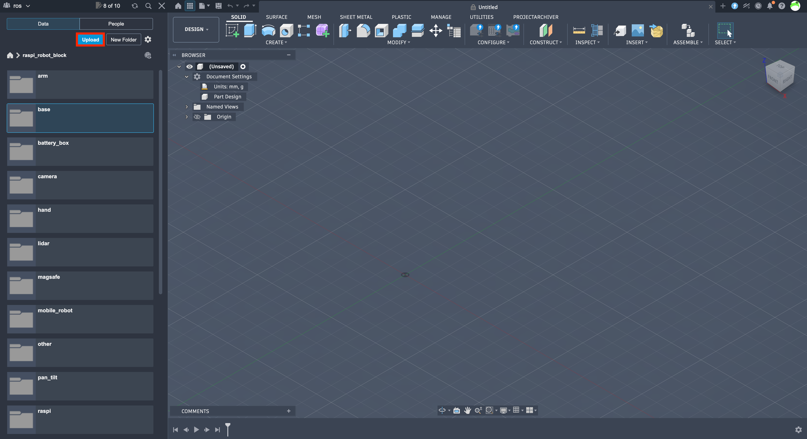

     

    「Select Files」をクリックします。
    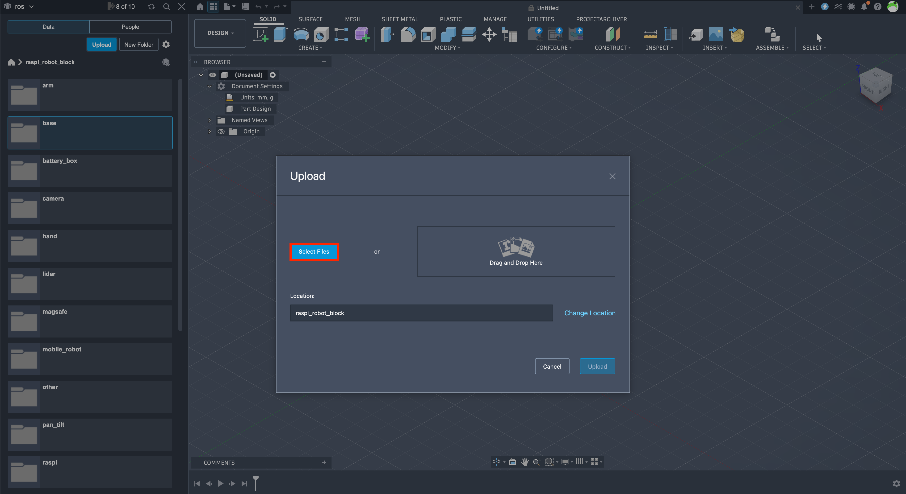

     

    「smartphone_long_width_75_height_11.step」を選択します。
    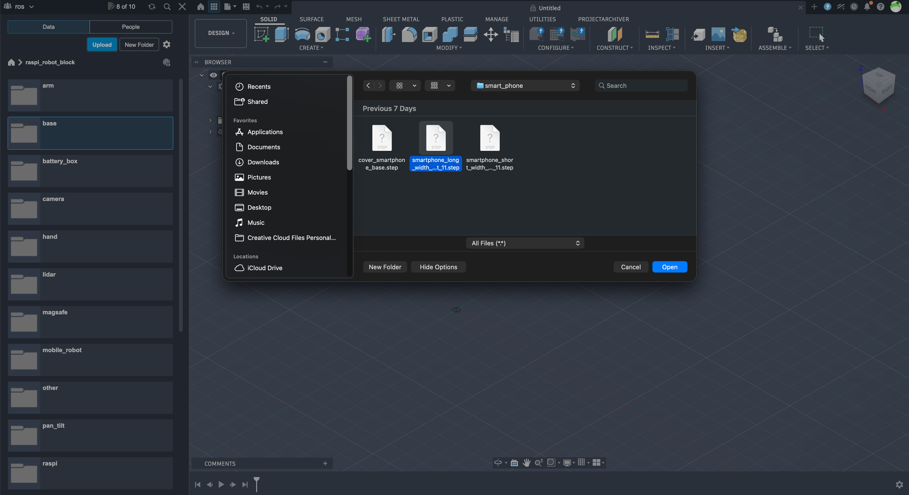

     

    インポートが完了したら、smartphone_long_width_75_height_11を開きます。

     

    外側面を選択した状態で「Extrude」をクリックします。
    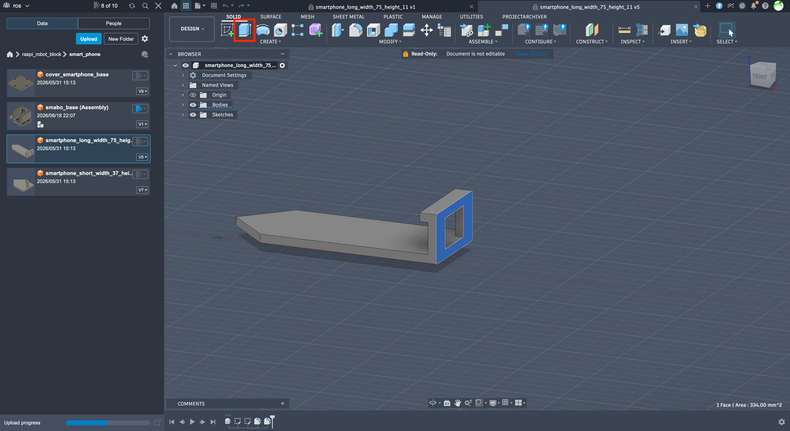

     

    長さを「スマホの長手方向/2」 + 3 + 1 に設定します。
    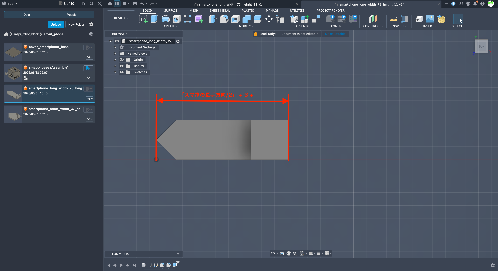

     

    同様に内側面を選択した状態で「Extrude」をクリックします。
    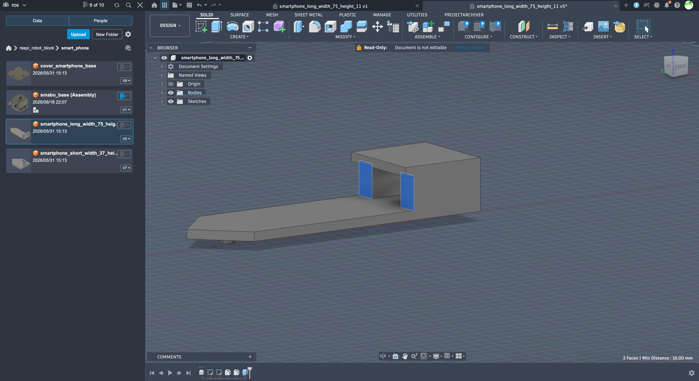

     

    長さを「スマホの長手方向/2」 +  1 に設定します。
    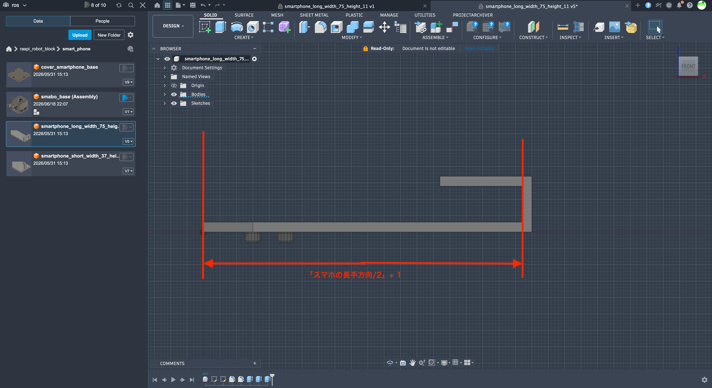

 

 

また、「固定部の上側面〜下側面」までの長さは
- 「スマホの厚み」+ 1mm

になるように調整します。

!!! note fusion360の場合の具体的な手順
    上面を選択し、「Extrude」をクリックします。
    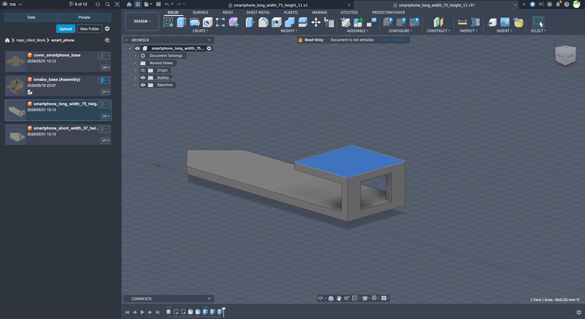

     

    長さを「スマホの厚さ」+ 1 + 3 に設定します。
    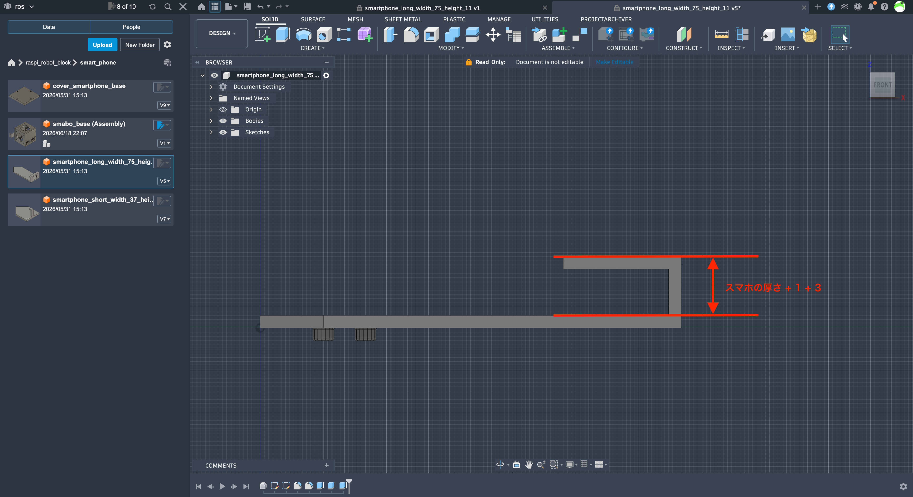

     

    下面を選択し、「Extrude」をクリックします。
    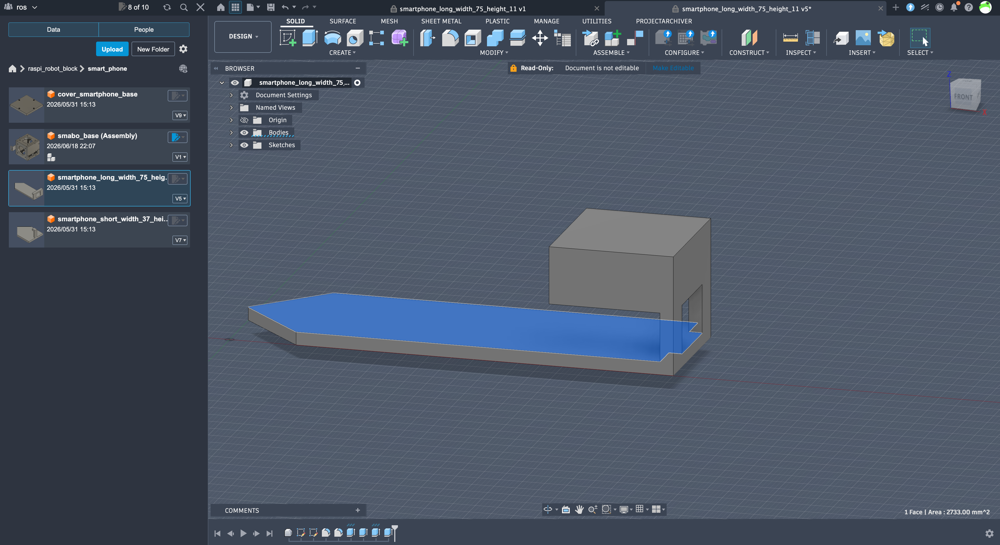

     

    長さを「スマホの厚さ」+ 1 に設定します。
    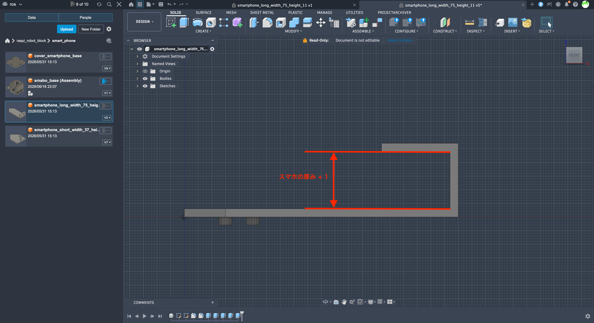

### 上下固定用パーツ

「smabo-hardware/step/smart_phone/smartphone_short_width_37_height_11.step」をインポートし、「パーツの先端〜内側面」までの長さが
- 「スマホの短手方向/2」+ 1mm

になるように調整します。

!!! note fusion360の場合の具体的な手順
    「左右固定パーツ」の時と同様の手順で、「スマホの短手方向」を基準にサイズを調整します。

 

 

また、「固定部の上側面〜下側面」までの長さは
- 「スマホの厚み」+ 1mm

になるように調整します。

!!! note fusion360の場合の具体的な手順
    「左右固定パーツ」の時と同様の手順でサイズを調整します。

## パーツのエクスポート

パーツのサイズ調整が完了したら、stlファイルとしてエクスポートします。

!!! note fusion360の場合の具体的な手順
    左上から「File」->「Export」を選択します。
    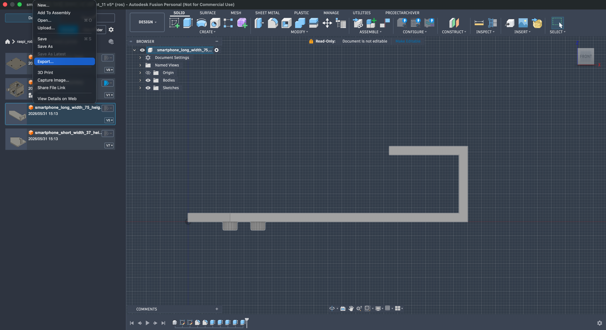

     

    それぞれ、以下のように設定し「Export」を選択し、ファイルをエクスポートします。
    - Name：任意の名称
    - Type：stl
    - Location：任意の場所

    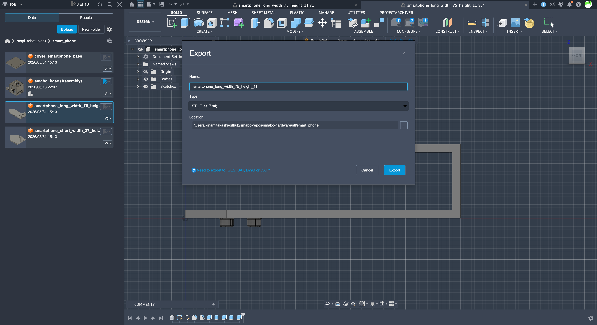

# パーツの印刷

今回、新たに追加されるパーツを3Dプリンタで印刷します。

!!! note
    3Dプリンタは機種によって「印刷する際に使用するソフト」が異なるため、ここでは具体的な設定手順ではなく、ポイントのみを記載します。

 

 

以下のパーツを図の向きに設定して、印刷してください。

!!! note  印刷の際の注意点
    - パーツのつけ外しの際に、根本から折れにくくするため、凸部は横向きにして印刷
    - サポート材は必ずONにした状態で印刷

- smabo-hardware/stl/base/base.stl
    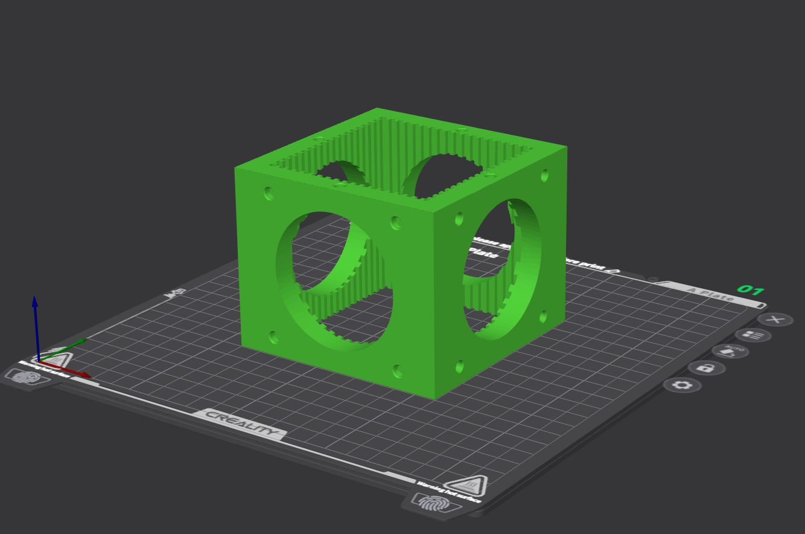

 

- smabo-hardware/stl/base/cover_back_bread_board.stl
    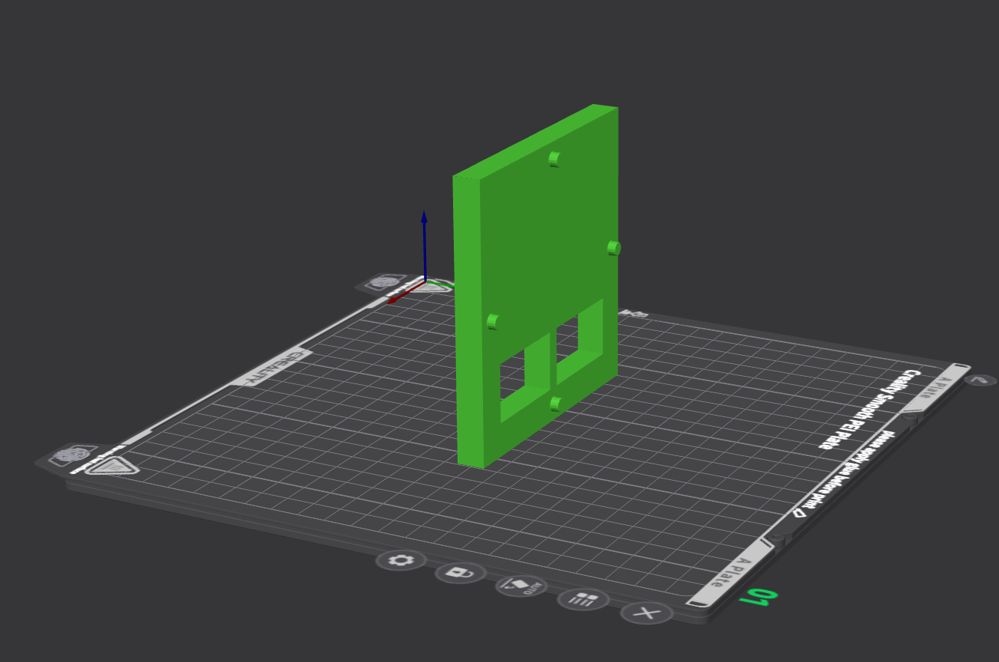

 

- smabo-hardware/stl/smart_phone/cover_smartphone_base.stl
    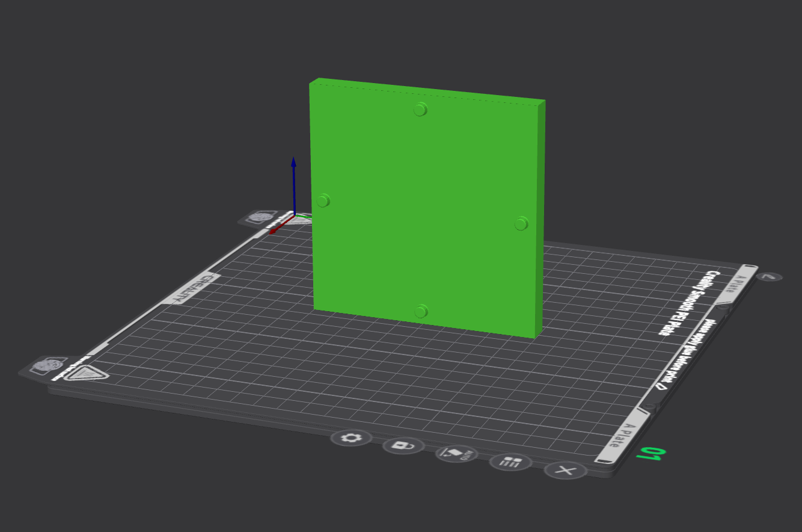

 

- smabo-hardware/stl/smart_phone/smartphone_long_width_75_height_11.stl（元サイズからお持ちのスマホ用に調整したもの） × 2
  - 左右で同じパーツを使用するため2つ印刷します
    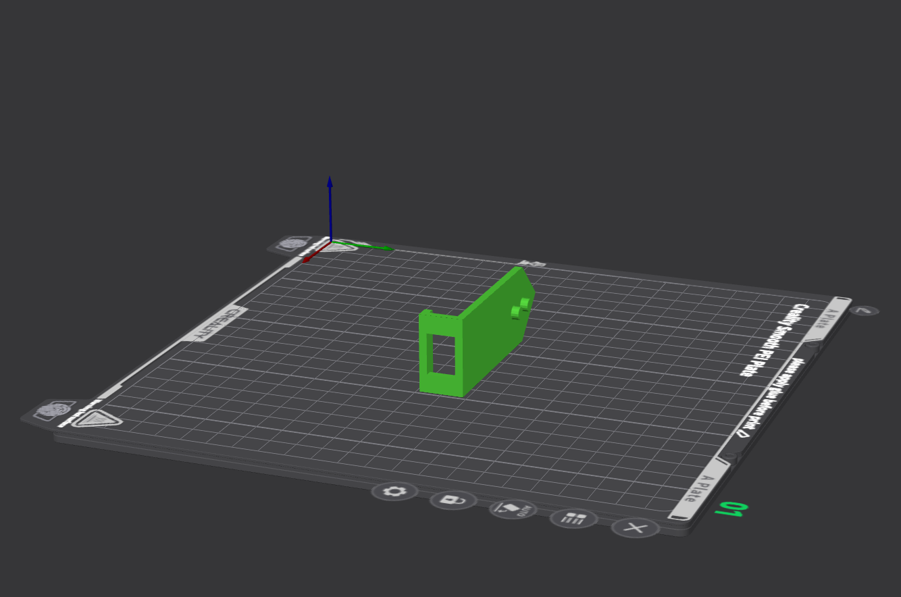

 

- smabo-hardware/stl/smart_phone/smartphone_short_width_37_height_11.stl（元サイズからお持ちのスマホ用に調整したもの）× 2
  - 上下で同じパーツを使用するため2つ印刷します
    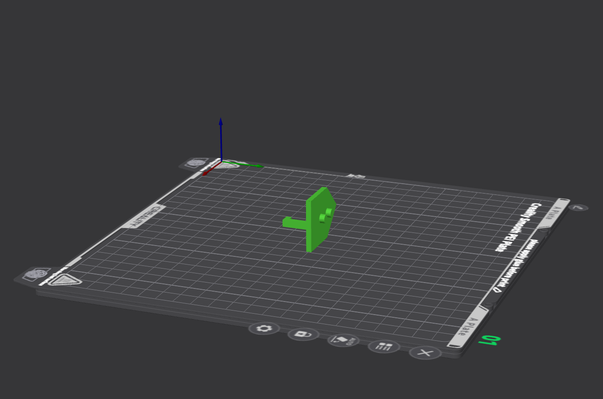

# 組み立て手順

## 各種パーツの取り付け

以下動画のように、必要パーツを組み立てます。

※ 動画には、前回までに印刷したパーツも含まれます

<!--ここに「docs/assembly_movie/base.html」の組み立て動画を埋め込む
-->

!!! note 組み立ての際のポイント
    上下のパーツに関しては、頻繁に取り外しをする想定ならば
    - 下のパーツだけ取り付けて、スマホはスライドしてつけ外しする
    
    ような形にしてもOKです。
    （この場合、もちろん上下逆さまにひっくり返すとスマホが落ちるので注意してください）。

## スマホの取り付け

スマホがちゃんと取り付けられるか確認しましょう。

# 完成系

今回作成したロボットの完成系は下図のようになります。
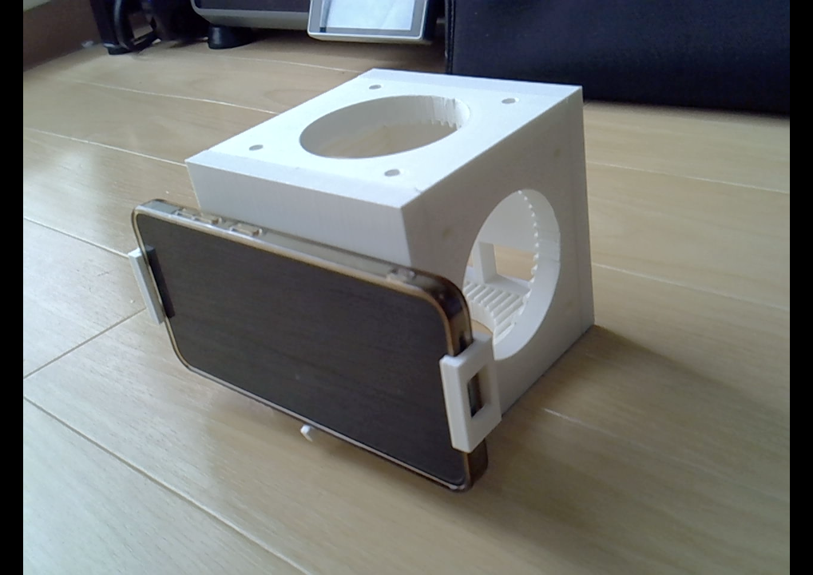

# 次回

次回は、以下ロードマップの

- [smabo-brain](./smabo-brain.md)

について解説します。

<!--
htmlに変換する際は、以下のsvgファイルの代わりに、roadmap.htmlに記載してあるロードマップを添付すること。ただし、次回につながるノードをハイライトした状態にすること。また、roadmap.htmlに記載のロードマップの0.5倍のサイズとすること。
-->

