<!--
以下は、md -> html 生成の際の指示（html生成時に直接出力する箇所ではない。以降、コメントアウトしてある箇所は、html生成時の注意事項が記載してあるものとする）

- markdownにて記載した文章は、誤字・脱字を除き、一切省略せずに、全く同じ文章でhtmlに反映すること（改行のタイミングなども含む）
    - 追記、修正した方がいい文章があった場合は、必ずユーザーに確認した上で、了承を得られた場合のみmarkdown, htmlともに修正すること
- 誤字、脱字があった場合は、markdown,html両方とも修正すること
- 表記揺れがあった場合は、どちらに統一するかユーザー側に確認したのちに、markdown, htmlともに、指定された表記に統一されるように修正すること
- 処理内容などに言及する部分に関しては、間違いがないか（コードが存在する場合は）コードの内容と照らし合わせて確認すること。その際、不整合があった場合は、ユーザー側に確認した上で了承が得られたら、markdown,htmlともに修正すること
- その他不正確な内容が含まれている場合は、ユーザー側に確認した上で了承が得られたら、markdown,htmlともに修正すること
-->

# 目次 <!-- omit in toc -->

- [ロードマップ](#ロードマップ)
- [概要](#概要)
- [必要パーツ](#必要パーツ)
- [パーツの印刷](#パーツの印刷)
- [組み立て手順](#組み立て手順)
- [配線](#配線)
- [完成系](#完成系)
- [動作手順](#動作手順)
  - [起動手順](#起動手順)
  - [サーボ設定](#サーボ設定)
  - [コントローラー制御](#コントローラー制御)
  - [ランダム制御](#ランダム制御)
- [次回](#次回)

# ロードマップ

本ページは、以下ロードマップ「ハンド」のガイドページです。

また、本ページは「[smabo-esp32](./smabo-esp32.md)」のガイドを実施している前提で話を進めます。

<!--
htmlに変換する際は、以下のsvgファイルの代わりに、roadmap.jsに記載してあるロードマップを添付すること。ただし、本ページのノードをハイライトした状態にすること。また、roadmap.jsに記載のロードマップの0.5倍のサイズとすること。
-->

# 概要

本ページでは「ハンド機能」について解説します。

 

具体的には、以下の内容を実施します。
- ハンドのコントローラー制御
- ハンドのランダム制御

<!-- 以下の、smabo_sysytem_architecture.drawio.svgの代わりに、sysmap.jsをもとに作成したアーキテクチャ図を配置する。-->

<!-- 以下例のように記述するので、ハイライトするノードと矢印、およびラベルに記述する内容を確認し、アーキテクチャ図を作成してください -->
<!-- 例）コンポーネント1 -[websocket]-> コンポーネント2：データ種類1, データ種類2 -->
<!-- 上記の場合、-->
<!-- 1. コンポーネント1、コンポーネント2をハイライト>
<!-- 2. コンポーネント1 -> コンポーネント2方向の、websocketにあたる矢印をハイライト-->
<!-- 3. 矢印には、「データ種類1、データ種類2」とラベルを記述。ここで、読点ごとに改行すること（読点はラベルには含まない）>
<!-- 4. ラベルの行数が増えると、ラベルがノードや矢印通しで重なる可能性があるので、重なっていないことを確認すること-->

<!-- 今回の、具体的な構成は以下になります。 -->
<!-- smabo-web-[websocket]->smabo-brain：サーボ制御値 -->
<!-- smabo-brain-[websocket]->smabo-esp32：サーボ制御値 -->
<!-- smabo-web-[REST API]->smabo-esp32：esp32設定変更 -->

# 必要パーツ

本機能の実装に必要なパーツを以下に記載します。

| 部品名                                    | 商品URL                                                                                                                                                                                                                                                                                                                                                                                                                                                                                                                                                                                                                                                                                                                                                                     | 備考                                                                                                                                                           |
| ----------------------------------------- | --------------------------------------------------------------------------------------------------------------------------------------------------------------------------------------------------------------------------------------------------------------------------------------------------------------------------------------------------------------------------------------------------------------------------------------------------------------------------------------------------------------------------------------------------------------------------------------------------------------------------------------------------------------------------------------------------------------------------------------------------------------------------- | -------------------------------------------------------------------------------------------------------------------------------------------------------------- |
| ESP32-DevKitC                             | [link](https://www.amazon.co.jp/ESP32-DevKitC-Bluetooth-機能マイクロコントローラー-TYPE-C-デュアルコアボード/dp/B0GTY64KDC/ref=asc_df_B0GTY64KDC?mcid=350a4550c70e3d30953041512ffe110a&tag=jpgo-22&linkCode=df0&hvadid=792079627413&hvpos=&hvnetw=g&hvrand=17366440597157412973&hvpone=&hvptwo=&hvqmt=&hvdev=c&hvdvcmdl=&hvlocint=&hvlocphy=9199153&hvtargid=pla-2484301629565&hvocijid=17366440597157412973-B0GTY64KDC-&hvexpln=0&th=1)                                                                                                                                                                                                                                                                                                                                    | 互換品でも可                                                                                                                                                   |
| ブレッドボード（SAD101）               | [link](https://www.amazon.co.jp/サンハヤト-ニューブレッドボード-SAD-101/dp/B00DSKCS68?th=1)                                                                                                                                                                                                                                                                                                                                                                                                                                                                                                                                                                                                                                                                                 | 一般的なブレッドボードは5穴ですが、こちらは6穴になっています。 6穴でないとESP32のサイズ的に横幅が足りないので注意してください                               |
| ジャンプワイヤー                          | [link](https://www.amazon.co.jp/ELEGOO-120pcs%E5%A4%9A%E8%89%B2%E3%83%87%E3%83%A5%E3%83%9D%E3%83%B3%E3%83%AF%E3%82%A4%E3%83%A4%E3%83%BC%E3%80%81arduino%E7%94%A8%E3%83%AF%E3%82%A4%E3%83%A4%E2%80%94%E3%82%B2%E2%80%94%E3%82%B828AWG-%E3%82%AA%E3%82%B9-%E3%83%A1%E3%82%B9-%E3%82%AA%E3%82%B9-%E3%82%AA%E3%82%B9-%E2%80%93%E3%83%A1%E3%82%B9-%E3%83%96%E3%83%AC%E3%83%83%E3%83%89%E3%83%9C%E3%83%BC%E3%83%89%E3%82%B8%E3%83%A3%E3%83%B3%E3%83%91%E3%83%BC%E3%83%AF%E3%82%A4%E3%83%A4%E3%83%BC/dp/B06Y48V9DL?ref_=Oct_d_obs_d_3332721051_0&pd_rd_w=uPj7Z&content-id=amzn1.sym.017d4a3b-167e-4891-9b01-9ac16ba095fb&pf_rd_p=017d4a3b-167e-4891-9b01-9ac16ba095fb&pf_rd_r=D57C194X1NH6BZACFEPS&pd_rd_wg=FydDx&pd_rd_r=327745d6-16b1-418c-b484-4cea112fb00b&pd_rd_i=B06Y48V9DL) | -                                                                                                                                                              |
| 電池ボックス（単3×4本、電池スナップ対応） | [link](https://www.amazon.co.jp/dp/B011IJQ4DI?ref_=ppx_hzsearch_conn_dt_b_fed_asin_title_3)                                                                                                                                                                                                                                                                                                                                                                                                                                                                                                                                                                                                                                                                                 | 電池スナップ対応の方が、取り回しが良いのでお勧めです。                                                                                                         |
| 電池スナップ（電池ボックス用）            | [link](https://www.monotaro.com/p/6866/1105/?cq_med=pla&cq_plt=gp&utm_medium=cpc&utm_source=google&utm_campaign=246-833-4061_23030379799_shopping&utm_content=&utm_term=__x_&utm_id=68661105&gad_source=1&gad_campaignid=23030381413&gbraid=0AAAAADNqOHDvKsE6jsbG6KMsfUBQKF9m5&gclid=Cj0KCQjw2_TQBhCnARIsAF3-XhxFdH-a3GLjp_a8Hy-Uc7kuFklTykWT1kFLZzA1D76_B6tY7Rw4P34aAsPaEALw_wcB)                                                                                                                                                                                                                                                                                                                                                                                          | コネクタピン付きの方が、ブレッドボードに差しやすくて、抜けにくいのでお勧めです。                                                                               |
| 充電式単三電池 × 4                        | [link](https://www.amazon.co.jp/Amazon%E3%83%99%E3%83%BC%E3%82%B7%E3%83%83%E3%82%AF-AmazonBasics-HR-3UTG-AMZN-%E5%85%85%E9%9B%BB%E5%BC%8F%E3%83%8B%E3%83%83%E3%82%B1%E3%83%AB%E6%B0%B4%E7%B4%A0%E9%9B%BB%E6%B1%A0-%E6%9C%80%E5%B0%8F%E5%AE%B9%E9%87%8F1900mAh%E3%80%81%E7%B4%841000%E5%9B%9E%E4%BD%BF%E7%94%A8%E5%8F%AF%E8%83%BD/dp/B00CWNMV4G/ref=sr_1_5?qid=1700364346&refinements=p_n_feature_thirteen_browse-bin%3A2314244051&s=electronics&sr=1-5&th=1)                                                                                                                                                                                                                                                                                                                | 充電式の方がおすすめです。                                                                                                                                     |
| 電池充電器                                | [link](https://www.amazon.co.jp/%E3%80%90Amazon-co-jp%E9%99%90%E5%AE%9A%E3%80%91%E3%83%91%E3%83%8A%E3%82%BD%E3%83%8B%E3%83%83%E3%82%AF-%E6%80%A5%E9%80%9F%E5%85%85%E9%9B%BB%E5%99%A8-%E5%8D%983%E5%BD%A2%E3%83%BB%E5%8D%984%E5%BD%A2-%E9%BB%92-BQ-CC73AM-K/dp/B07FQJJ58Z/ref=sr_1_5?keywords=%E9%9B%BB%E6%B1%A0+%E5%85%85%E9%9B%BB%E5%99%A8&qid=1700402201&sr=8-5)                                                                                                                                                                                                                                                                                                                                                                                                          | -                                                                                                                                                              |
| サーボモータドライバ PCA9685              | [link](https://www.amazon.co.jp/HiLetgo-PCA9685-16%E3%83%81%E3%83%A3%E3%83%B3%E3%83%8D%E3%83%AB-12-%E3%83%93%E3%83%83%E3%83%88-Arduino%E3%81%AB%E5%AF%BE%E5%BF%9C/dp/B01D1D0CX2/ref=asc_df_B01D1D0CX2/?tag=jpgo-22&linkCode=df0&hvadid=218134682078&hvpos=&hvnetw=g&hvrand=18016470498878566809&hvpone=&hvptwo=&hvqmt=&hvdev=c&hvdvcmdl=&hvlocint=&hvlocphy=1009487&hvtargid=pla-439629573722&psc=1&mcid=d238c727398c34ec915ad739f9f6f977)                                                                                                                                                                                                                                                                                                                                  | 互換品でも可                                                                                                                                                   |
| SG90 × 2                                  | [link](https://akizukidenshi.com/catalog/g/gM-08761/)                                                                                                                                                                                                                                                                                                                                                                                                                                                                                                                                                                                                                                                                                                                       | 互換品でも良いですが、ホーンのサイズが純正と異なる場合は、パーツにうまくはまりません。 そのため、ホーンを削るか、3Dモデルの修正が発生する可能性があります。 |

# パーツの印刷

今回、新たに追加されるパーツを3Dプリンタで印刷します。

!!! note
    3Dプリンタは機種によって「印刷する際に使用するソフト」が異なるため、ここでは具体的な設定手順ではなく、ポイントのみを記載します。

 

以下のパーツを図の向きに設定して、印刷してください。

!!! note  印刷の際の注意点
    - パーツのつけ外しの際に、根本から折れにくくするため、凸部は横向きにして印刷
    - サポート材は必ずONにした状態で印刷

- smabo-hardware/stl/hand/sg90/sg90_plate_1.stl × 2
    左右で同じパーツを使用するため、2つ印刷します
    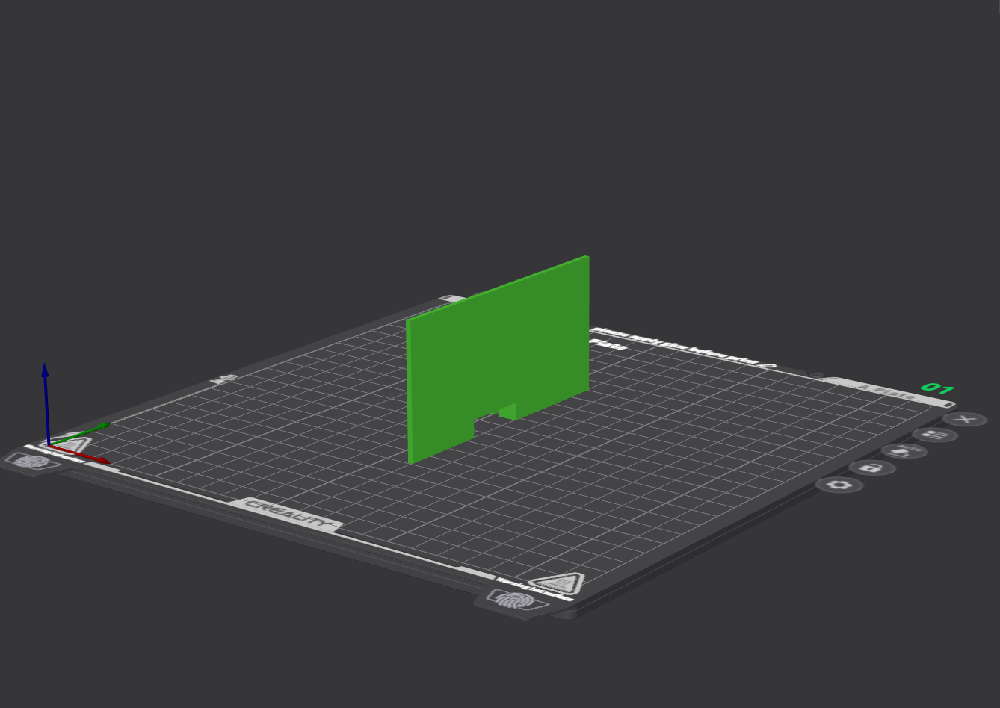

 

- smabo-hardware/stl/hand/sg90/sg90_plate_2.stl × 2
    左右で同じパーツを使用するため、2つ印刷します
    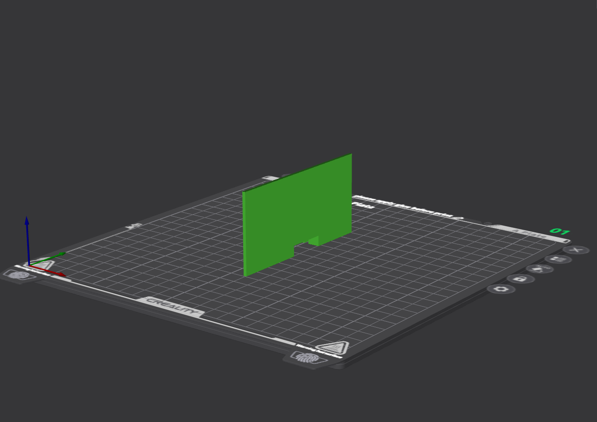

 

- smabo-hardware/stl/hand/sg90/sg90_base.stl × 2
    左右で同じパーツを使用するため、2つ印刷します
    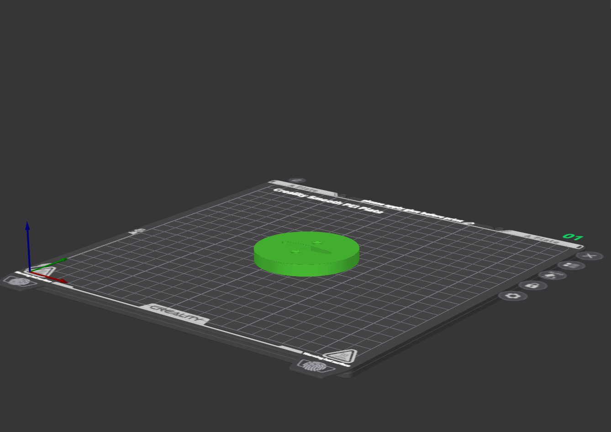

 

- smabo-hardware/stl/hand/sg90/arm_hand.stl × 2
    左右で同じパーツを使用するため、2つ印刷します
    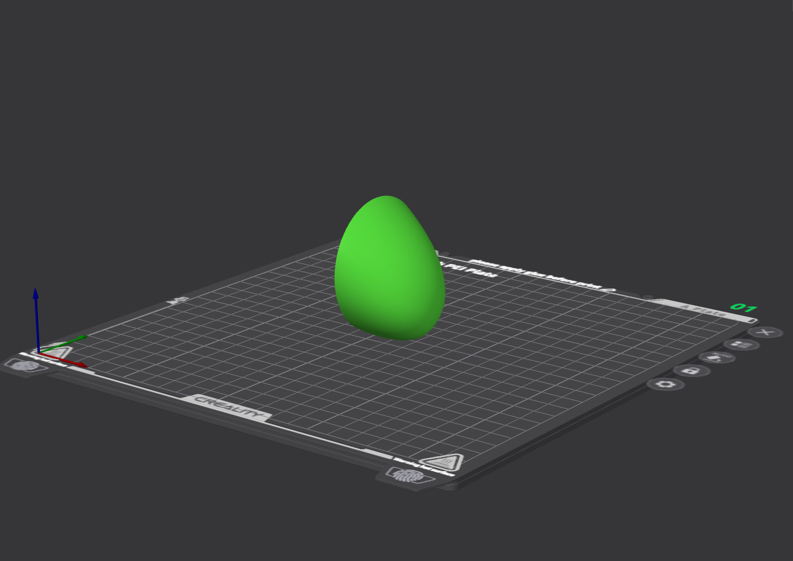

# 組み立て手順

以下動画のように、必要パーツを組み立てます。

※ 動画には、前回までに印刷したパーツも含まれます

<!--ここに、smabo-smartphone-robot.github.io/docs/assembly_movie/hand.htmlの組み立て動画を置いてください-->

!!! note 組み立ての際のポイント
    組み立て動画では、SG90の取り付け手順は分からないため、以下に記載します。
     

    最初に、下図のように「sg90_plate_1」と「sg90_plate_2」でsg90を固定し、ボディに取り付けます。
    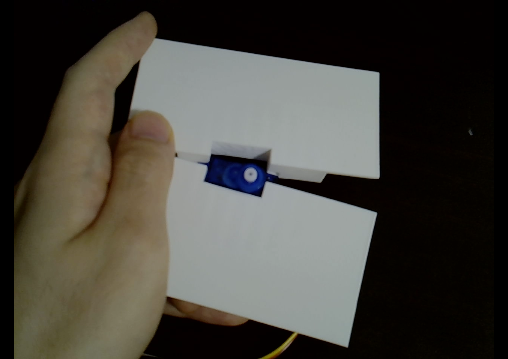
    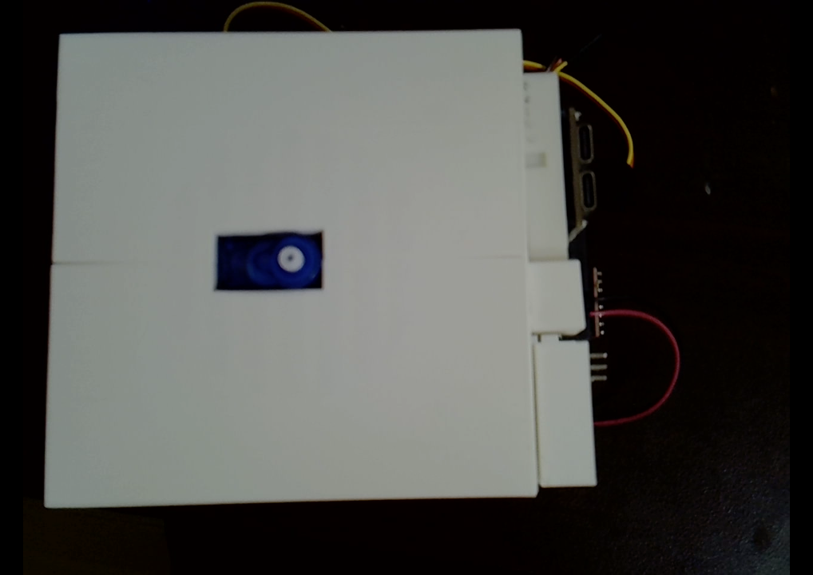

     

    そして、sg90_baseを上から被せてホーンをはめ込みます（工具不要でも組み立て可能ですが、SG90に付属のネジでホーンとサーボを固定してもOKです）。
    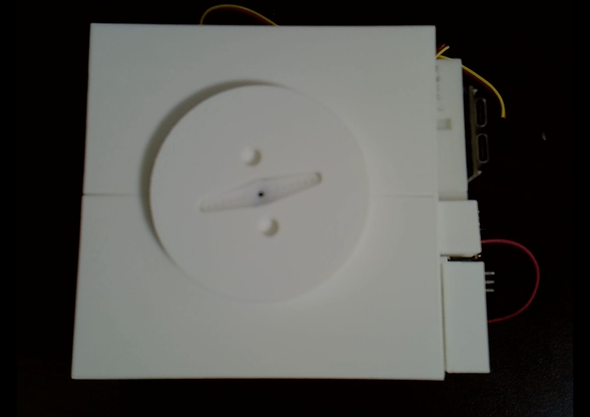

     

    最後に、arm_handを取り付ければ完成です。
    
    

# 配線

下記表の内容に従って、配線します。

※ 下記表において、「接続先1」と「接続先2」は、両者が回路的に直接繋がっていることを指します。

| 接続先1                       | 接続先2                                                          | 補足                                 |
| ----------------------------- | ---------------------------------------------------------------- | ------------------------------------ |
| 乾電池バッテリーボックスの+極 | ブレッドボードの+極の**右側**<!--太字はhtmlにする際は赤色に-->   | 以降、右側を6V電圧として扱うため注意 |
| 乾電池バッテリーボックスの-極 | ブレッドボードの-極                                              | -                                    |
| ESP32の5V電源                 | ブレッドボードの+極の**左側**<!--太字はhtmlにする際は赤文字に--> | 以降、左側を5V電圧として扱うため注意 |
| ESP32のGND                    | ブレッドボードの-極                                              | -                                    |
| PCA9685のV++                  | ブレッドボードの＋極の**右側**                                   | -                                    |
| PCA9685のVCC                  | ブレッドボードの＋極の**左側**                                   | -                                    |
| PCA9685のSDA                  | config.jsonの`i2c/sda`に設定されているピン                       | -                                    |
| PCA9685のSCL                  | config.jsonの`i2c/scl`に設定されているピン                       | -                                    |
| PCA9685のGND                  | ブレッドボードの-極                                              | -                                    |

 

ESP32-DevKitCの場合の配線図は、以下になります。

※ デフォルト設定の場合、左腕のサーボをchannel=0, 右腕のサーボをchannel=1に接続してください。

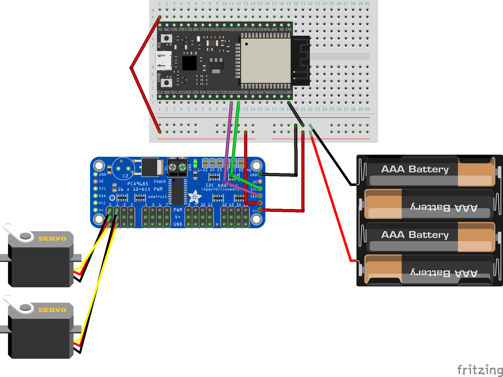

!!! note 配線の際のポイント
    SG90のケーブルは、smabo背面右下の隙間から通す形でPCA9685に接続してください

# 完成系

今回作成したロボットの完成系は下図のようになります。

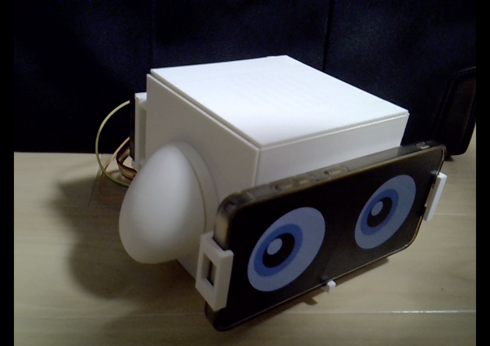

# 動作手順

## 起動手順

<!--
起動・接続手順は共通ページ「startup.md（startup.html）」に集約しているため、各ページでは直書きせず、必要な手順は html 側のリンクの data-steps 属性で指定する（ページにより項目を増減する）。
htmlに変換する際、「起動手順」へのリンク（startup.html）はクリックでポップアップ（モーダル）表示される。docs.js が a[href$="startup.html"] を捕捉して startup.html の .doc-content をモーダルに描画する。
ポップアップでは、リンクの data-steps 属性（startup.html の各 h2 の id をカンマ区切りで列挙）に挙げた手順だけを表示する。表示対象（data-steps）はこのコメントに記載し、html 側のリンクに同じ値を付与すること。例:
<a href="startup.html" data-steps="smabo-brainの起動,smabo-webの起動">こちらの起動手順</a>
（JS 無効時は data-steps が無視され、通常のページ遷移になる）
-->

<!--今回、起動手順に必要なのは以下のステップになるため、そのステップのみを含むようにしてください。-->
<!-- smabo-brainの起動 -->
<!-- smabo-webの起動 -->
<!-- smabo-brain <-> smabo-webの接続 -->
<!-- smabo-brain <-> esp32の接続 -->
<!-- smabo-web <-> esp32の接続 -->

「[こちらの起動手順](./startup.md)」の内容を実行してください。

## サーボ設定

smabo-webの「Config」タブのModes/servosにて、各サーボの設定を変更可能です。

最初に、「ハンドの左右のサーボモータは反対方向についている」ため、回転方向を合わせるために、right_handのみinverseを有効にします。

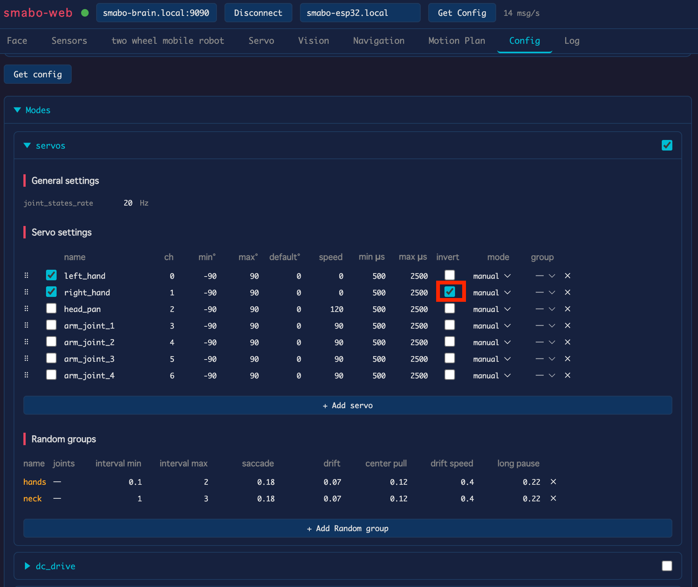

 

次に、left_hand, right_handを有効化します。

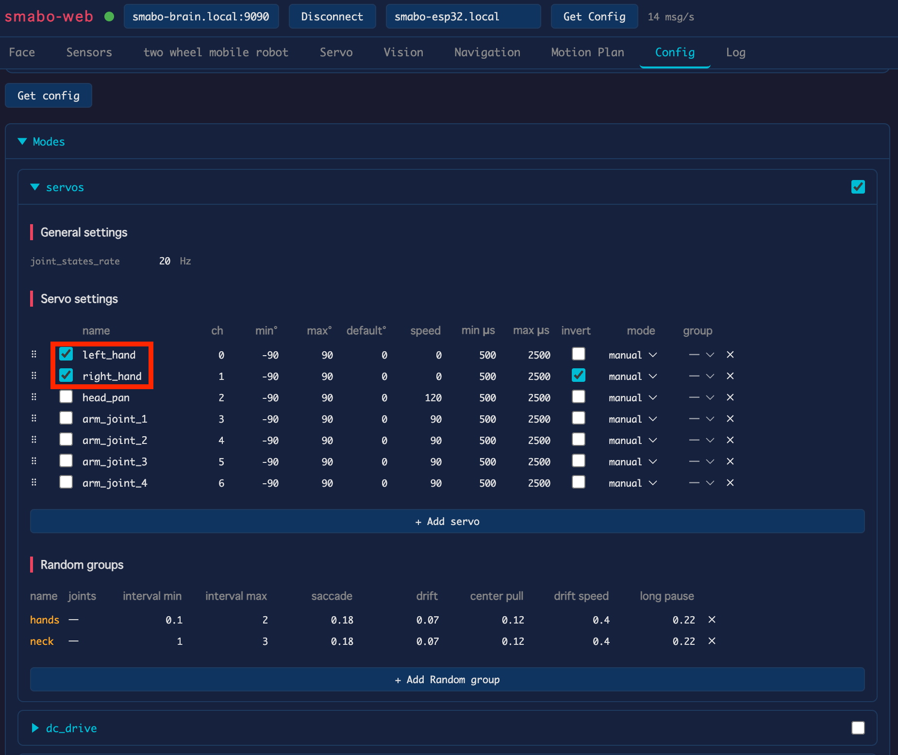

## コントローラー制御

コントローラー制御の手順を説明します。

modeを「manual」に設定してください。

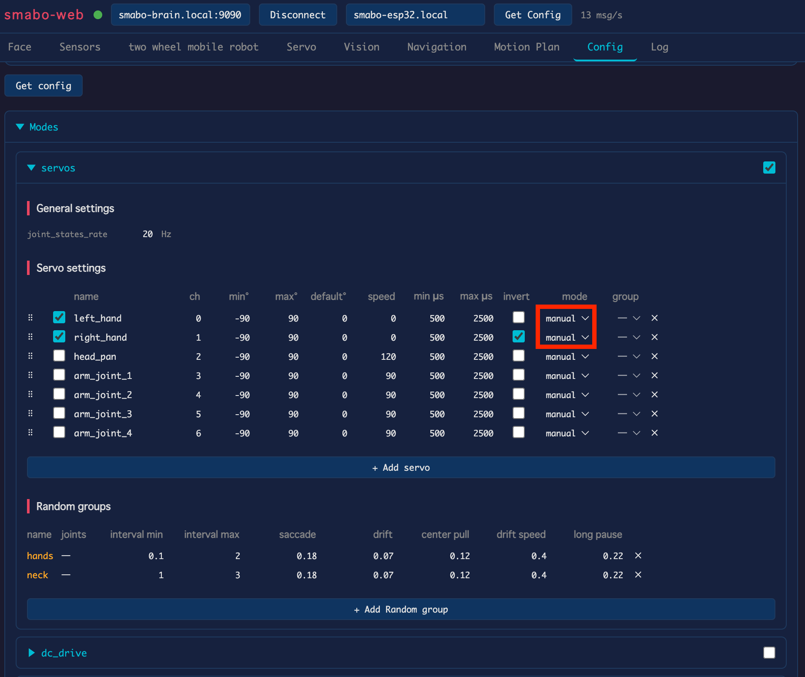

 

「Servo」タブで各サーボの角度を変更すると、それに合わせて左右の腕が動作します。

## ランダム制御

ランダム制御の手順を説明します。

modeを「random」、groupを「hands」に設定してください。 

!!! note random_group
    同じrandom_groupに設定されたサーボモーターは、同じタイミングでランダムに動作します。

     

    逆に、左右のハンドを異なるタイミングでランダムに動かしたい場合は、left_hand, right_handそれぞれが別のrandom_groupに属するように設定してください。

     

    なお、新規のrandom_groupは「Add random Group」をクリックすると、追加できます。

    

 

しばらく待つと、ランダムなタイミングで左右のハンドが動作することが確認できます。

# 次回

本ページは、ロードマップの終端の1つです。

 

smaboには、他にも様々な機能があります。  

他にも試したい機能がある場合は、ロードマップからお好きなページをご覧ください。

<!--
htmlに変換する際は、以下のsvgファイルの代わりに、roadmap.jsに記載してあるロードマップを添付すること。ただし、次回につながるノードをハイライトした状態にすること。また、roadmap.jsに記載のロードマップの0.5倍のサイズとすること。
-->

