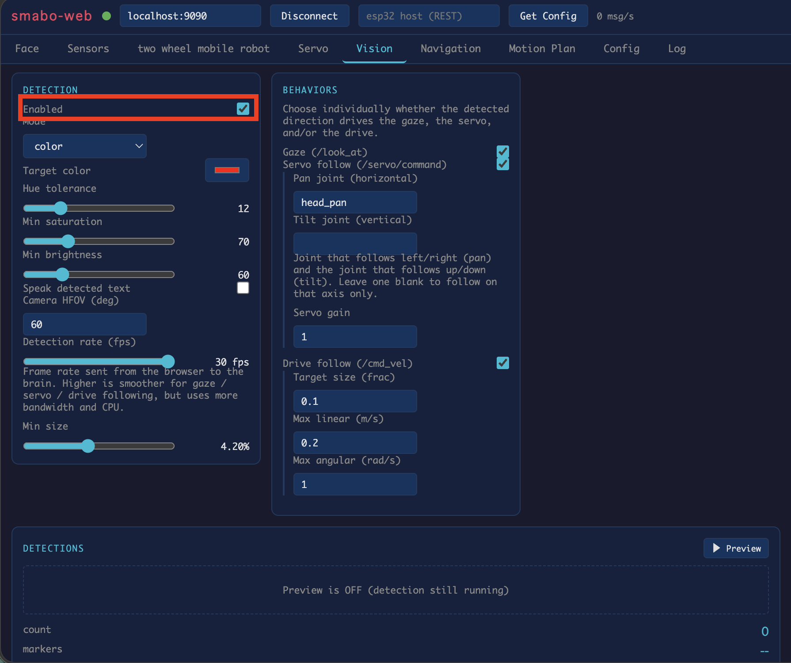
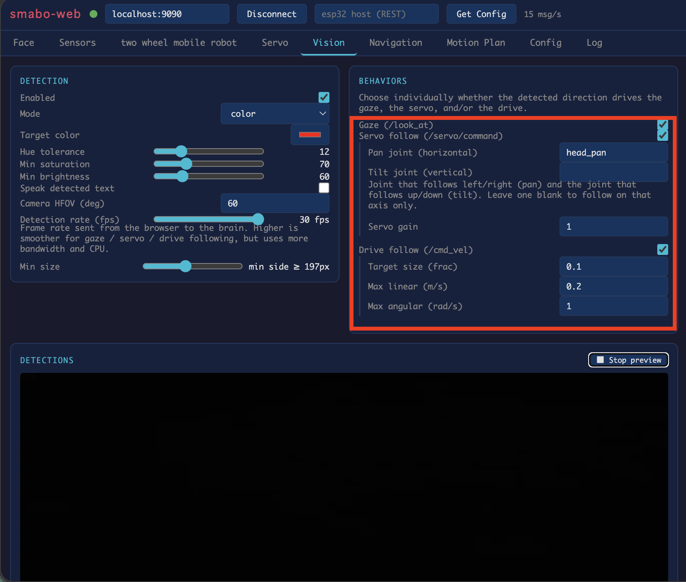

<!--
以下は、md -> html 生成の際の指示（html生成時に直接出力する箇所ではない。以降、コメントアウトしてある箇所は、html生成時の注意事項が記載してあるものとする）

- markdownにて記載した文章は、誤字・脱字を除き、一切省略せずに、全く同じ文章でhtmlに反映すること（改行のタイミングなども含む）
    - 追記、修正した方がいい文章があった場合は、必ずユーザーに確認した上で、了承を得られた場合のみmarkdown, htmlともに修正すること
- 誤字、脱字があった場合は、markdown,html両方とも修正すること
- 表記揺れがあった場合は、どちらに統一するかユーザー側に確認したのちに、markdown, htmlともに、指定された表記に統一されるように修正すること
- 処理内容などに言及する部分に関しては、間違いがないか（コードが存在する場合は）コードの内容と照らし合わせて確認すること。その際、不整合があった場合は、ユーザー側に確認した上で了承が得られたら、markdown,htmlともに修正すること
- その他不正確な内容が含まれている場合は、ユーザー側に確認した上で了承が得られたら、markdown,htmlともに修正すること
-->

# 目次 <!-- omit in toc -->

- [ロードマップ](#ロードマップ)
- [できること](#できること)
- [動作手順](#動作手順)
  - [起動手順](#起動手順)
  - [画像認識](#画像認識)
  - [物体認識をもとに制御](#物体認識をもとに制御)
- [次回](#次回)

# ロードマップ

本ページは、以下ロードマップ「画像処理」のガイドページです。

また、本ページは「[smabo-brain](./smabo-brain.md)」と「[smabo-app](./smabo-app.md)」のガイドを実施している前提で話を進めます。

<!--
htmlに変換する際は、以下のsvgファイルの代わりに、roadmap.htmlに記載してあるロードマップを添付すること。ただし、本ページのノードをハイライトした状態にすること。また、roadmap.htmlに記載のロードマップの0.5倍のサイズとすること。
-->

# できること

本ページでは「画像処理」機能の実装について解説します。

 

具体的には、以下の内容を実施します。

- 画像処理
  - ARマーカー認識
  - 顔認識
  - 色認識
  - QRコード認識
- 画像処理結果をもとに制御

# 動作手順

## 起動手順

<!--htmlに変換する際は、startup.md の中で、「smabo-brainの起動」「smabo-webの起動」「smabo-brain <-> smabo-webの接続」「smabo-appの接続」のみをフィルタしたものを表示すること-->

<!--
htmlに変換する際、「起動手順」へのリンク（startup.html）はクリックでポップアップ（モーダル）表示される。docs.js が a[href$="startup.html"] を捕捉して startup.html の .doc-content をモーダルに描画する。
ポップアップでは、リンクの data-steps 属性（startup.html の各 h2 の id をカンマ区切りで列挙）に挙げた手順だけを表示する。表示対象（data-steps）はこのページでは以下:
<a href="startup.html" data-steps="smabo-brainの起動,smabo-webの起動,smabo-brain---smabo-webの接続,smabo-appの接続">こちらの起動手順</a>
（JS 無効時は data-steps が無視され、通常のページ遷移になる）
-->

「[こちらの起動手順](./startup.md)」の内容を実行してください。

## 画像認識

smabo-webの「Vision」タブにて画像認識に関する設定が可能で、「Detection」の「enabled」を有効化することで、画像認識機能を有効化できます。

 

画像認識はいくつかの種類が用意してあり、「Mode」を変更することで、以下の物体を認識可能です。
- ARマーカー
- 指定した色の物体
- 顔認識
- QRコード

 

なお、Min sizeを設定することで
- 画像内で認識対象とする物体の最小サイズ（このサイズ以上の物体は認識対象とする）

を設定可能です（プレビューを有効化すると、右下に最小サイズの枠が表示されます）。

 
## 物体認識をもとに制御

「BEHAVIORS」にて、認識結果をもとにした制御も可能です。

具体的には、
- 認識した中で、「一番大きい物体」の座標や画像サイズをもとに制御

します。

 

制御の種類としては、以下になります。
- 目の制御
  - 認識した物体を追従するようにsmaboの目が動作
- サーボの制御
  - 認識した物体に追従するようにサーボが動作
  - 左右方向、上下方向それぞれにサーボを設定可能
  - 詳細は「[顔振り](./neck.md)」にて解説
- 二輪駆動ロボットの制御
  - 認識した物体を追従するようにロボットを制御
  - 物体のサイズが、target sizeに設定されたサイズを維持するように、ロボットが前進、後退
  - 詳細は、「[移動ロボット](./mobile.md)」にて解説

 

例えば、「目の制御」の場合、
- smabo-appの顔のモードを「Follow」にした状態

で、認識対象の物体をカメラの前に持ってくると、smaboの目が追従することが確認できます。

# 次回

次回は、以下ロードマップの

- [ベースパーツの作成](./base.md)

について解説します。

