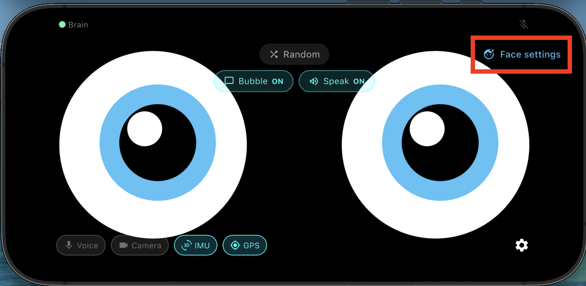
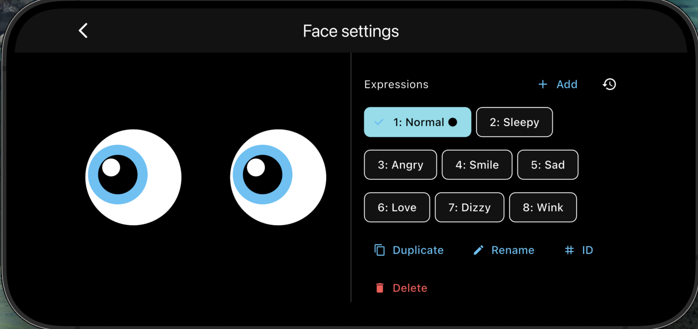
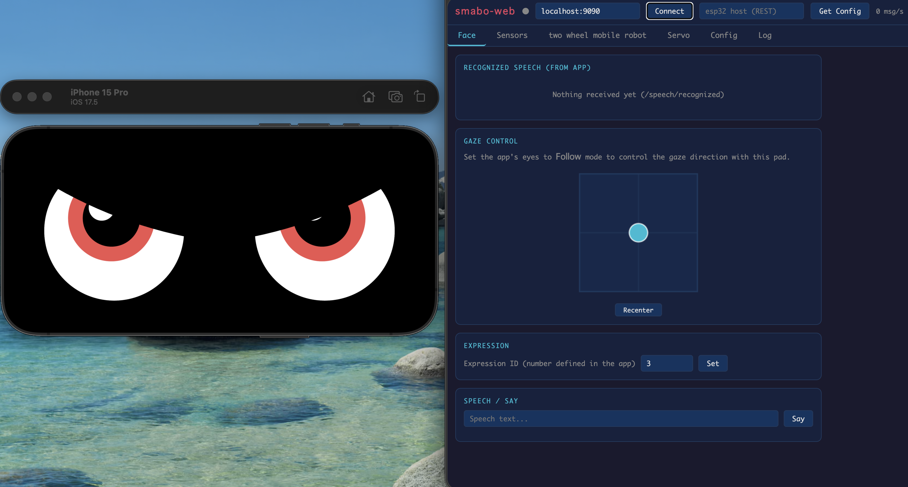
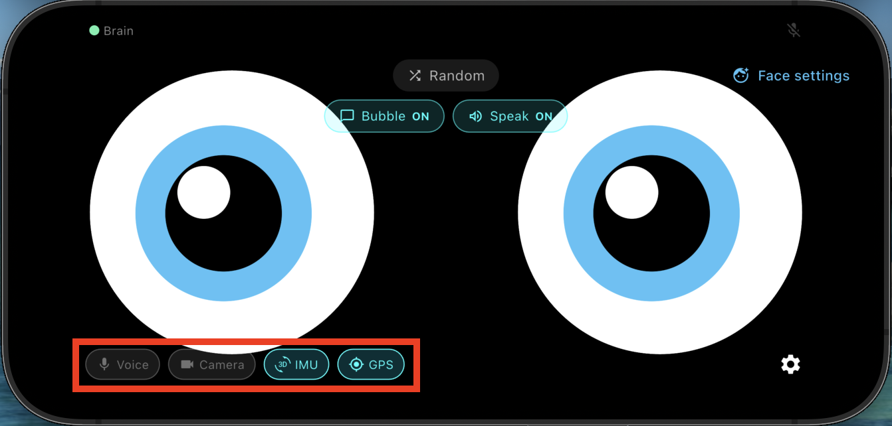
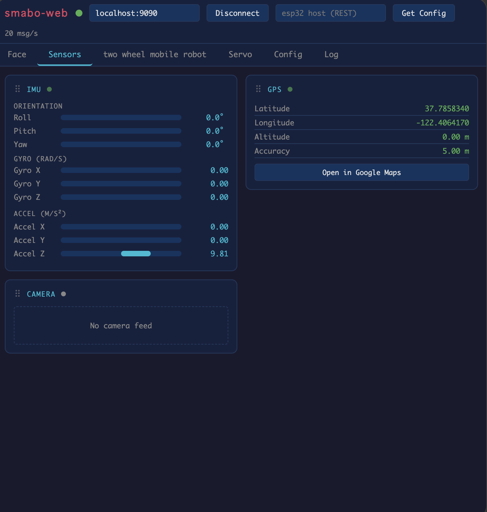
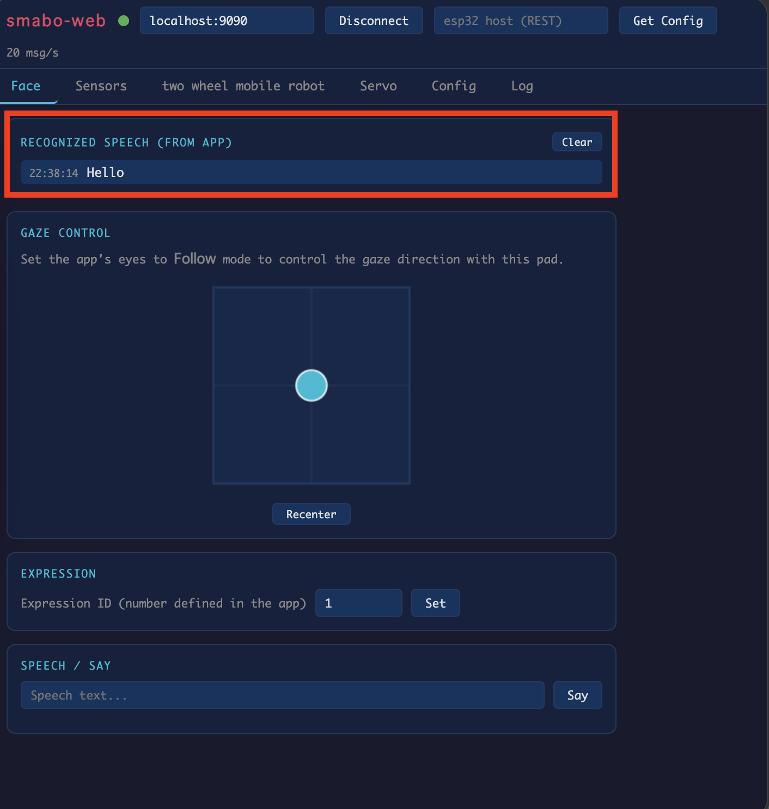
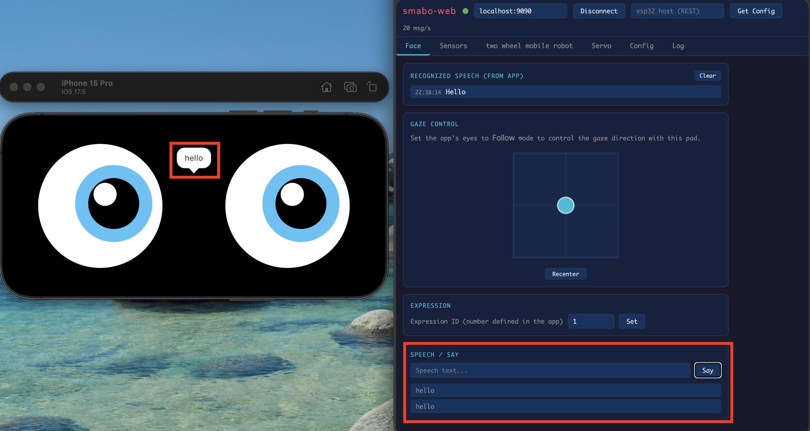
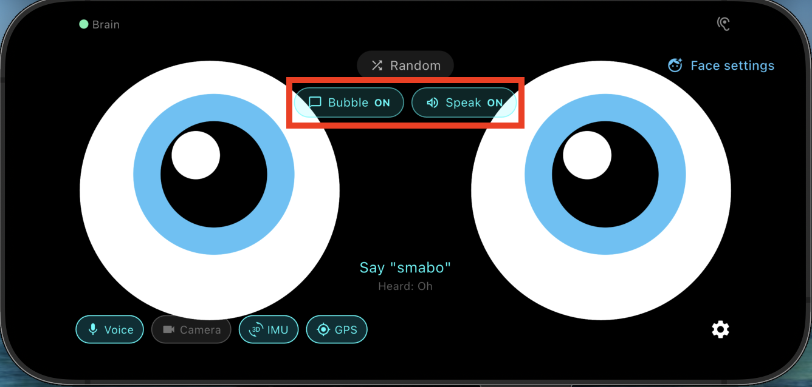
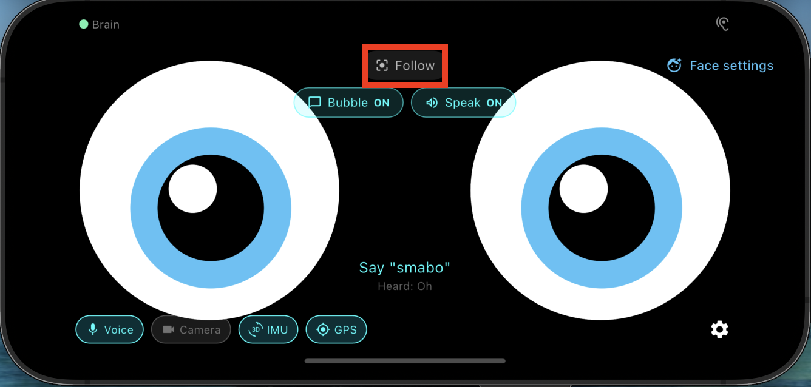
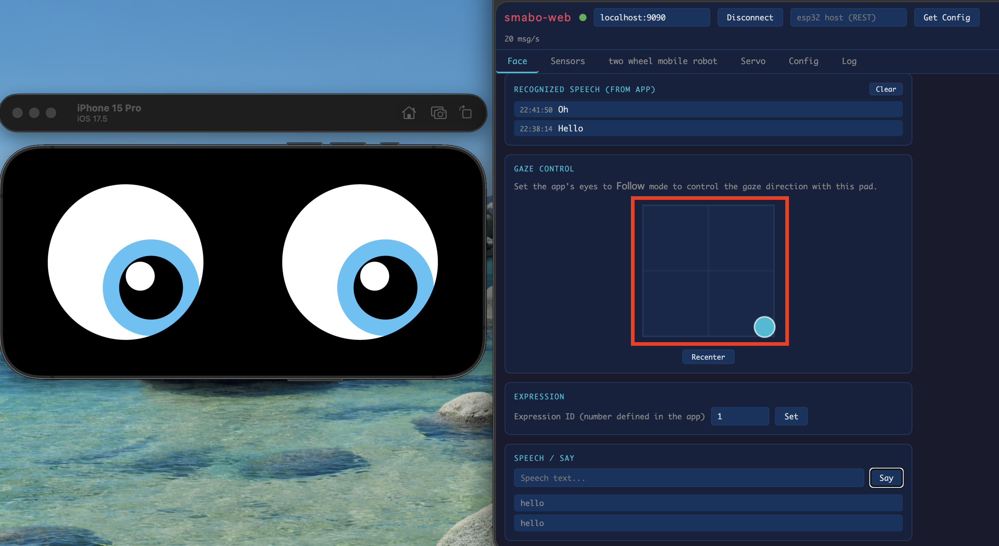

<!--
以下は、md -> html 生成の際の指示（html生成時に直接出力する箇所ではない。以降、コメントアウトしてある箇所は、html生成時の注意事項が記載してあるものとする）

- markdownにて記載した文章は、誤字・脱字を除き、一切省略せずに、全く同じ文章でhtmlに反映すること（改行のタイミングなども含む）
    - 追記、修正した方がいい文章があった場合は、必ずユーザーに確認した上で、了承を得られた場合のみmarkdown, htmlともに修正すること
- 誤字、脱字があった場合は、markdown,html両方とも修正すること
- 表記揺れがあった場合は、どちらに統一するかユーザー側に確認したのちに、markdown, htmlともに、指定された表記に統一されるように修正すること
- 処理内容などに言及する部分に関しては、間違いがないか（コードが存在する場合は）コードの内容と照らし合わせて確認すること。その際、不整合があった場合は、ユーザー側に確認した上で了承が得られたら、markdown,htmlともに修正すること
- その他不正確な内容が含まれている場合は、ユーザー側に確認した上で了承が得られたら、markdown,htmlともに修正すること
-->

# 目次 <!-- omit in toc -->

- [ロードマップ](#ロードマップ)
- [できること](#できること)
- [必要パーツ](#必要パーツ)
- [smabo-appとは](#smabo-appとは)
  - [smabo-appのインストール](#smabo-appのインストール)
- [動作手順](#動作手順)
  - [起動手順](#起動手順)
  - [smaboの顔の設定](#smaboの顔の設定)
  - [smaboの目を変更する](#smaboの目を変更する)
  - [各種センサーの状態を可視化](#各種センサーの状態を可視化)
  - [音声認識](#音声認識)
  - [smaboに発話させる](#smaboに発話させる)
  - [smaboの目を動かす](#smaboの目を動かす)
- [次回](#次回)

# ロードマップ

本ページは、以下ロードマップ「smabo-app」のガイドページです。

また、本ページは「[smabo-web](./smabo-web.md)」のガイドを実施している前提で話を進めます。

<!--
htmlに変換する際は、以下のsvgファイルの代わりに、roadmap.htmlに記載してあるロードマップを添付すること。ただし、本ページのノードをハイライトした状態にすること。また、roadmap.htmlに記載のロードマップの0.5倍のサイズとすること。
-->

# できること

本ページでは「smabo-app」のセットアップ手順について解説します。

 

具体的には、以下の内容を実施します。

- smabo-appのセットアップ
- smabo-appの使い方の解説
  - 顔の設定
  - スマホのセンサ情報の可視化
  - 音声認識
  - 音声発話
  - 目の操作

# 必要パーツ

本機能の実装に必要なパーツを以下に記載します。

| 部品名 | 商品URL | 備考 |
| --- | --- | --- |
| スマートフォン | - | お手持ちのスマートフォン |

# smabo-appとは

smabo-appはsmaboの中で

- smaboの顔
- smaboのセンサー（スマホのセンサーを使用）

の役割を担います。

## smabo-appのインストール

スマホにsmabo-appをインストールします。

なお、ここではandroidの手順のみを記載します。

!!! note
    IOSの場合、flutterのインストールなどが必要になり、少し手順が多くなるため、詳しくは[smabo-appのリポジトリ](https://github.com/smabo-smartphone-robot/smabo-app)のREADMEを確認してください。

    また、IOSの場合、アプリのインストールに、mac OSのPCが必要です。

    

スマホから[smabo-appのReleaseページ](https://github.com/smabo-smartphone-robot/smabo-app/releases)にアクセスします。

いくつかあるバージョンの中で、一番最新バージョンのapkファイルをダウンロードしてください。

ダウンロードしたapkファイルを実行するとsmabo-appがインストールされます。

# 動作手順

## 起動手順

<!--
htmlに変換する際、「起動手順」へのリンク（startup.html）はクリックでポップアップ（モーダル）表示される。docs.js が a[href$="startup.html"] を捕捉して startup.html の .doc-content をモーダルに描画するため、html 側は通常のリンク（<a href="startup.html">起動手順</a>）のままでよい（JS 無効時は通常のページ遷移）。
-->

「[起動手順](./startup.md)」の

- smabo-brainの起動
- smabo-webの起動
- smabo-brain <-> smabo-webの接続
- smabo-appの接続

を実行してください。

 

各種プログラムの起動、通信が確認できればOKです。

## smaboの顔の設定

smaboの顔は、「Face Settings」から設定を変更できます。

 

設定では「目の大きさ」「目の種類」「背景色の変更」などができます。

## smaboの目を変更する

smabo-webの「Face」タブの「Expression」に「Expression ID（smabo-app内のFace settingsで設定した表情のID）」を変更し、「Set」をクリックすると、smaboの目の種類が変化します。

## 各種センサーの状態を可視化

smaboの各種センサのON/OFFは左下のボタンで設定できます。

 

センサをONにした状態で、smabo-webで「Sensors」タブを確認すると、各種センサの情報を可視化できます。

## 音声認識

smaboに対して「smabo」と話しかけると、smaboの目が虹色に光ります。

目が虹色の状態で何か言葉を話すと、音声認識が開始されます（認識する言語は、smabo-appの設定画面から変更できます）。

 

目の色が戻った後に、smabo-webの「Face」タブの「Recognized speech」を確認すると、先ほど話した言葉が表示されます。

## smaboに発話させる

smabo-webの「Face」タブの「SPEECH / SAY」で、任意の文章を入力し、「SAY」ボタンをクリックすると入力された音声がスマホから発話されます（発話する言語は、smabo-appの設定画面から変更できます）。

 

なお、「Bubble ON」「Speak ON」ボタンにて発話のON/OFF、吹き出しの有無を設定可能です。

## smaboの目を動かす

smaboの目はデフォルトでは、ランダムに動きますが、モードを「Follow」に変更すると、外部からの通信により自由に動かすことができます。

 

smabo-webの「Face」タブの「Gaze control」でコントローラを操作すると、それに合わせて目が動くことが確認できます。

# 次回

次回は、以下ロードマップの

- [画像処理](./imgproc.md)
- [ベースパーツの作成](./base.md)

について解説します。

<!--
htmlに変換する際は、以下のsvgファイルの代わりに、roadmap.htmlに記載してあるロードマップを添付すること。ただし、次回につながるノードをハイライトした状態にすること。また、roadmap.htmlに記載のロードマップの0.5倍のサイズとすること。
-->

