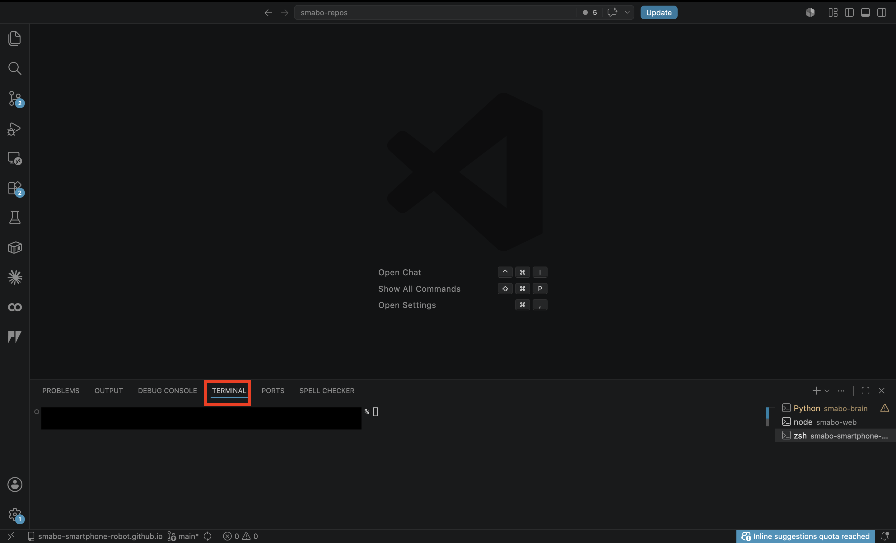
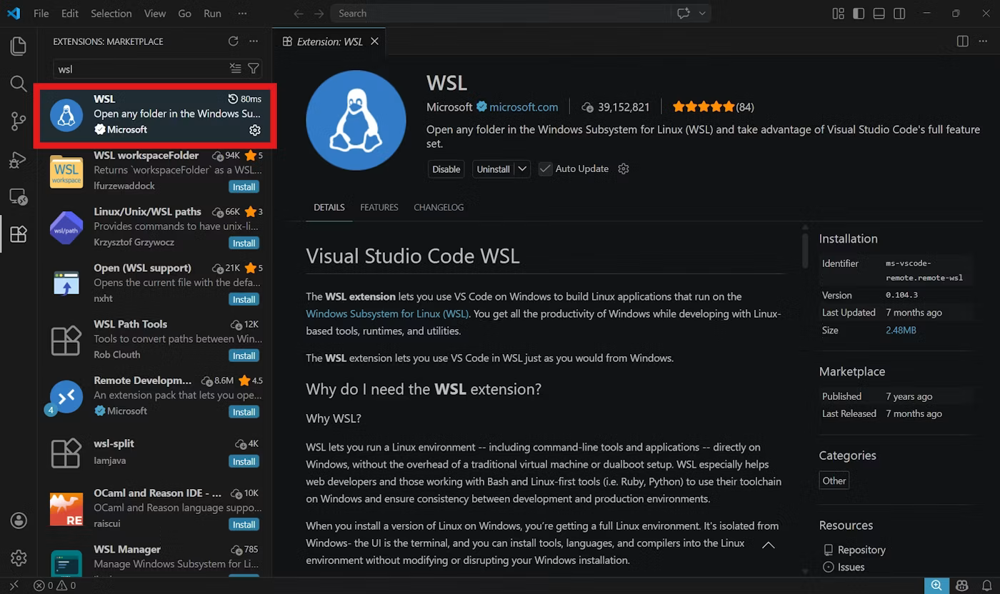
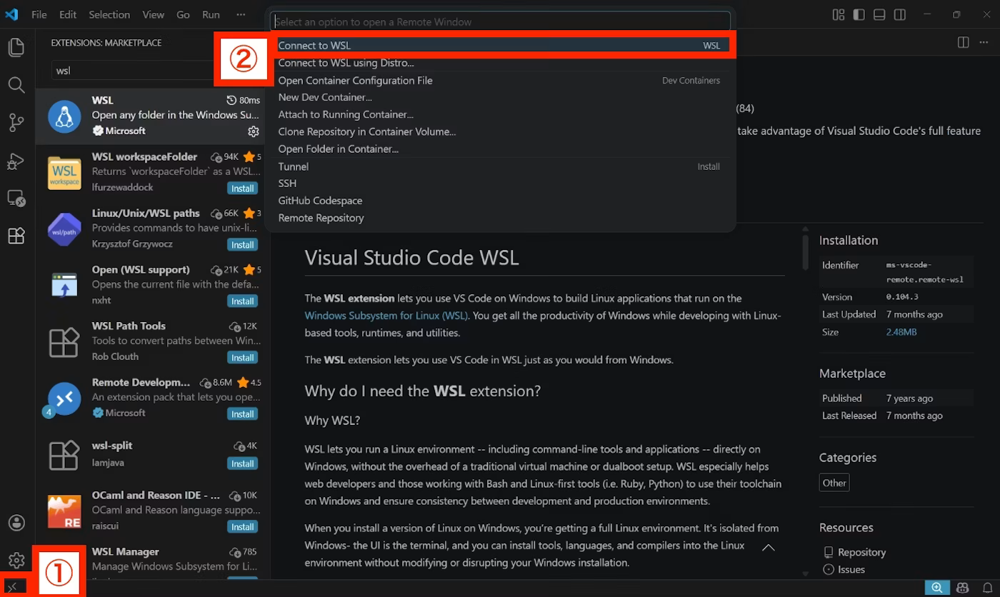
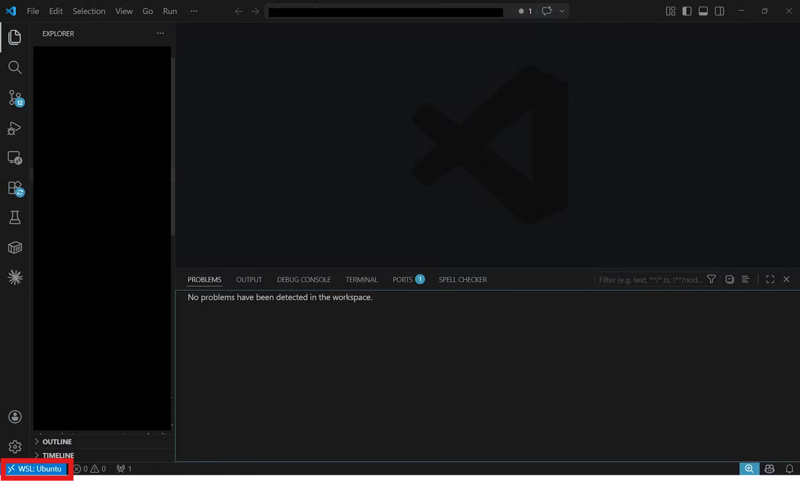

<!--
以下は、md -> html 生成の際の指示（html生成時に直接出力する箇所ではない。以降、コメントアウトしてある箇所は、html生成時の注意事項が記載してあるものとする）

- markdownにて記載した文章は、誤字・脱字を除き、一切省略せずに、全く同じ文章でhtmlに反映すること（改行のタイミングなども含む）
    - 追記、修正した方がいい文章があった場合は、必ずユーザーに確認した上で、了承を得られた場合のみmarkdown, htmlともに修正すること
- 誤字、脱字があった場合は、markdown,html両方とも修正すること
- 表記揺れがあった場合は、どちらに統一するかユーザー側に確認したのちに、markdown, htmlともに、指定された表記に統一されるように修正すること
- 処理内容などに言及する部分に関しては、間違いがないか（コードが存在する場合は）コードの内容と照らし合わせて確認すること。その際、不整合があった場合は、ユーザー側に確認した上で了承が得られたら、markdown,htmlともに修正すること
- その他不正確な内容が含まれている場合は、ユーザー側に確認した上で了承が得られたら、markdown,htmlともに修正すること
-->

# 目次 <!-- omit in toc -->

- [ロードマップ](#ロードマップ)
- [できること](#できること)
- [smabo-brainとは](#smabo-brainとは)
- [セットアップ先（PC or SBC）](#セットアップ先pc-or-sbc)
- [必要パーツ](#必要パーツ)
- [smabo-brainのセットアップ](#smabo-brainのセットアップ)
  - [VSCodeのインストール](#vscodeのインストール)
  - [ターミナルの使い方（Linux, macの場合）](#ターミナルの使い方linux-macの場合)
  - [ターミナルの使い方（Windows）](#ターミナルの使い方windows)
    - [WSLのインストール](#wslのインストール)
    - [拡張機能のインストール](#拡張機能のインストール)
    - [WSLの中に入る](#wslの中に入る)
  - [smabo-brainのクローン](#smabo-brainのクローン)
  - [パッケージのインストール](#パッケージのインストール)
- [動作手順](#動作手順)
- [SBC=ラズパイ（4 or 5）の場合](#sbcラズパイ4-or-5の場合)
  - [パーツの印刷](#パーツの印刷)
  - [組み立て手順](#組み立て手順)
- [次回](#次回)

# ロードマップ

本ページは、以下ロードマップ「smabo-brain」のガイドページです。

また、本ページは「[ベースパーツの作成](./base.md)」のガイドを実施している前提で話を進めます。

<!--
htmlに変換する際は、以下のsvgファイルの代わりに、roadmap.htmlに記載してあるロードマップを添付すること。ただし、本ページのノードをハイライトした状態にすること。また、roadmap.htmlに記載のロードマップの0.5倍のサイズとすること。
-->


# できること

本ページでは「smabo-brain」のセットアップ手順について解説します。

<br>

具体的には、以下の内容を実施します。

- smabo-brainのセットアップ
- （SBC使用の場合のみ）SBC固定パーツの印刷、組み立て

# smabo-brainとは

smabo-brainはsmaboの中で

- 各コンポーネントを中継するハブ
- 画像処理やAIなどの高度な処理の実行

の役割を担います。


# セットアップ先（PC or SBC）

smabo-brainのセットアップ先には、以下の2パターンがあります。
- 外部PC
  - 「smaboとは別に用意されたPC」にsmabo-brainをセットアップ
- SBC(Single Board Computer)
  - smaboにSBCを取り付け、そのSBCにsmabo-brainをセットアップ

<br>

smabo-brain自体のセットアップ手順は同じですが、SBCの場合は
- SBC取り付け用パーツの印刷
- SBCのsmaboへの取り付け

が追加で必要になります。

そのため、最初は「外部PCへのセットアップ」をおすすめします。

!!! note 対応SBCについて
    現状、「取り付けパーツ」が用意されているSBCは以下になります。
    - ラズパイ（4 or 5）
    
    上記以外のSBCを取り付けたい場合は「取り付けパーツの3Dモデル」をCADなどで自作する必要があります。


<br>

以降では、「外部PC、SBCで共通の手順」について解説した後、「SBC固有の手順」を解説します。

# 必要パーツ

本機能の実装に必要なパーツを以下に記載します。

| 部品名 | 商品URL | 備考 |
| --- | --- | --- |
| 【任意】Raspberry Pi4 or 5 | - | SBCを使用する場合のみ |

# smabo-brainのセットアップ

ここからは、smabo-brainのセットアップ手順について解説します。

なお、ここからは「ターミナル」を使ったコマンド入力が発生します。

!!! note ターミナル
    ターミナルとは、キーボードによる入力だけでパソコンを操作する画面（CUI）のことを言います。

    一般に、システム開発ではターミナルを使って、コマンドなどを実行することが多いです。

## VSCodeのインストール


最初に、ターミナルを使用する環境を構築します。

<br>

今回は、Visual Studio Code（VSCode）を使用します（VSCodeはコードエディタの一つです）。

<br>

以下サイトから、ご自身のPCのOSにあったインストーラをダウンロードしてください。

https://code.visualstudio.com

<br>

ダウンロードが完了したら、VSCodeをインストール、起動します。

## ターミナルの使い方（Linux, macの場合）

画面下部の「TREMINAL」というタブがターミナルになります。




以降、コマンドの記載がある際は、こちらにのタブにて、コマンドを入力してください。

## ターミナルの使い方（Windows）

Windows PCを使用する場合は、WSLをインストールしてください。

<br>

WSL(Windows for Linux)は、
- WindowsでLinuxの環境を使用できるシステム

です。

ロボット開発ではLinuxを使用できた方が後々便利なことが多いので、以降はWSL上で作業を進めます。

<br>

### WSLのインストール

WSLのインストール手順については、以下の記事を参考にしてください。

[WSL2 のインストールとアンインストール](https://qiita.com/zakoken/items/61141df6aeae9e3f8e36)


### 拡張機能のインストール

WSLのインストールが完了したら、VScodeにて以下の拡張機能をインストールしてください。
- WSL




### WSLの中に入る

拡張機能のインストールが完了したら、

1. 「><」マークをクリック
2. 「Connected to WSL」をクリックしてください。




<br>

画面左下に「WSL：Ubuntu」と表示されていればOKです。ここで、画面下部の「TERMINAL」というタブがターミナルになります。




以降、コマンドの記載がある際は、こちらにコマンドを入力してください。

## smabo-brainのクローン

以下コマンドでsmabo-brainリポジトリをクローンします。

```bash
# ホームディレクトリへ移動
cd ~ 
```

```bash
# smabo-brainリポジトリのクローン
git clone https://github.com/smabo-smartphone-robot/smabo-brain
```

## パッケージのインストール

各種プログラムの実行に必要なパッケージをインストールします。

```bash
cd ~/smabo-brain
```

```bash
pip3 install -r requirements.txt
```

# 動作手順

以下手順で、動作の確認を行います。

<br>

smabo-brainを起動します。

```bash
cd ~/smabo-brain
```
```bash
python3 -m brain
```

上記コマンド実行後、エラーが発生せずに、起動が完了すればOKです。


<br>

ここまでで、「SBC、PCで共通の設定」は完了です。
また、PCにセットアップした方は本ページの実施内容は以上になります。

<br>

以降は、「SBCをsmabo本体に取り付ける」手順について解説します。

# SBC=ラズパイ（4 or 5）の場合

SBCにラズパイを使用する場合の、パーツの印刷、取り付け手順を解説します。

## パーツの印刷

今回、新たに追加されるパーツを3Dプリンタで印刷します。

!!! note
    3Dプリンタは機種によって「印刷する際に使用するソフト」が異なるため、ここでは具体的な設定手順ではなく、ポイントのみを記載します。

<br>

以下のパーツを図の向きに設定して、印刷してください。

!!! note  印刷の際の注意点
    - パーツのつけ外しの際に、根本から折れにくくするため、凸部は横向きにして印刷
    - サポート材は必ずONにした状態で印刷

- ***.stl
    ここに画像

<br>

- ***.stl
    ここに画像


## 組み立て手順

以下動画のように、必要パーツを組み立てます。

※ 動画には、前回までに印刷したパーツも含まれます

<!--ここに、oooooの組み立て動画を置いてください-->

!!! note 組み立ての際のポイント
    oooo


# 次回

次回は、以下ロードマップの

- [smabo-web](./smabo-web.md)

について解説します。


<!--
htmlに変換する際は、以下のsvgファイルの代わりに、roadmap.htmlに記載してあるロードマップを添付すること。ただし、次回につながるノードをハイライトした状態にすること。また、roadmap.htmlに記載のロードマップの0.5倍のサイズとすること。
-->


