<!--
以下は、md -> html 生成の際の指示（html生成時に直接出力する箇所ではない。以降、コメントアウトしてある箇所は、html生成時の注意事項が記載してあるものとする）

- markdownにて記載した文章は、誤字・脱字を除き、一切省略せずに、全く同じ文章でhtmlに反映すること（改行のタイミングなども含む）
    - 追記、修正した方がいい文章があった場合は、必ずユーザーに確認した上で、了承を得られた場合のみmarkdown, htmlともに修正すること
- 誤字、脱字があった場合は、markdown,html両方とも修正すること
- 表記揺れがあった場合は、どちらに統一するかユーザー側に確認したのちに、markdown, htmlともに、指定された表記に統一されるように修正すること
- 処理内容などに言及する部分に関しては、間違いがないか（コードが存在する場合は）コードの内容と照らし合わせて確認すること。その際、不整合があった場合は、ユーザー側に確認した上で了承が得られたら、markdown,htmlともに修正すること
- その他不正確な内容が含まれている場合は、ユーザー側に確認した上で了承が得られたら、markdown,htmlともに修正すること
-->

# 目次 <!-- omit in toc -->

- [ロードマップ](#ロードマップ)
- [概要](#概要)
- [必要パーツ](#必要パーツ)
- [smabo-esp32のセットアップ](#smabo-esp32のセットアップ)
  - [Thonny（書き込みソフト）のインストール](#thonny書き込みソフトのインストール)
    - [ソースコードの書き込み](#ソースコードの書き込み)
    - [設定ファイルの書き込み](#設定ファイルの書き込み)
- [パーツの印刷](#パーツの印刷)
- [ブレッドボードについて](#ブレッドボードについて)
- [組み立て手順](#組み立て手順)
- [配線](#配線)
- [動作手順](#動作手順)
  - [起動手順](#起動手順)
- [次回](#次回)

# ロードマップ

本ページは、以下ロードマップ「smabo-esp32」のガイドページです。

また、本ページは「[ベースパーツの作成](./base.md)」のガイドを実施している前提で話を進めます。

<!--
htmlに変換する際は、以下のsvgファイルの代わりに、roadmap.htmlに記載してあるロードマップを添付すること。ただし、本ページのノードをハイライトした状態にすること。また、roadmap.htmlに記載のロードマップの0.5倍のサイズとすること。
-->

# 概要

本ページでは「smabo-esp32」のセットアップ手順について解説します。

smabo-esp32は
- esp32に繋いだセンサやアクチュエータの制御

の役割を担います。

<!-- 以下の、smabo_sysytem_architecture.drawio.svgの代わりに、sysmap.jsをもとに作成したアーキテクチャ図を配置する。-->
<!-- 以下例のように記述するので、ハイライトするノードと矢印、およびラベルに記述する内容を確認し、アーキテクチャ図を作成してください -->
<!-- 例）コンポーネント1 -[websocket]-> コンポーネント2：データ種類1, データ種類2 -->
<!-- 上記の場合、-->
<!-- 1. コンポーネント1、コンポーネント2をハイライト>
<!-- 2. コンポーネント1 -> コンポーネント2方向の、websocketにあたる矢印をハイライト-->
<!-- 3. 矢印には、「データ種類1、データ種類2」とラベルを記述。ここで、読点ごとに改行すること（読点はラベルには含まない）>
<!-- 4. ラベルの行数が増えると、ラベルがノードや矢印通しで重なる可能性があるので、重なっていないことを確認すること-->

<!-- 今回の、具体的な構成は以下になります。 -->
<!-- セットアップだけなので、smabo-esp32をハイライトするだけ -->

# 必要パーツ

本機能の実装に必要なパーツを以下に記載します。

| 部品名 | 商品URL | 備考 |
| --- | --- | --- |
| ESP32-DevKitC | [link](https://www.amazon.co.jp/ESP32-DevKitC-Bluetooth-機能マイクロコントローラー-TYPE-C-デュアルコアボード/dp/B0GTY64KDC/ref=asc_df_B0GTY64KDC?mcid=350a4550c70e3d30953041512ffe110a&tag=jpgo-22&linkCode=df0&hvadid=792079627413&hvpos=&hvnetw=g&hvrand=17366440597157412973&hvpone=&hvptwo=&hvqmt=&hvdev=c&hvdvcmdl=&hvlocint=&hvlocphy=9199153&hvtargid=pla-2484301629565&hvocijid=17366440597157412973-B0GTY64KDC-&hvexpln=0&th=1)| 互換品でも可 |
| ブレッドボード（SAD101）  | [link](https://www.amazon.co.jp/サンハヤト-ニューブレッドボード-SAD-101/dp/B00DSKCS68?th=1)| 一般的なブレッドボードは5穴ですが、こちらは6穴になっています。 6穴でないとESP32のサイズ的に横幅が足りないので注意してください |
| ジャンプワイヤー | [link](https://www.amazon.co.jp/ELEGOO-120pcs%E5%A4%9A%E8%89%B2%E3%83%87%E3%83%A5%E3%83%9D%E3%83%B3%E3%83%AF%E3%82%A4%E3%83%A4%E3%83%BC%E3%80%81arduino%E7%94%A8%E3%83%AF%E3%82%A4%E3%83%A4%E2%80%94%E3%82%B2%E2%80%94%E3%82%B828AWG-%E3%82%AA%E3%82%B9-%E3%83%A1%E3%82%B9-%E3%82%AA%E3%82%B9-%E3%82%AA%E3%82%B9-%E2%80%93%E3%83%A1%E3%82%B9-%E3%83%96%E3%83%AC%E3%83%83%E3%83%89%E3%83%9C%E3%83%BC%E3%83%89%E3%82%B8%E3%83%A3%E3%83%B3%E3%83%91%E3%83%BC%E3%83%AF%E3%82%A4%E3%83%A4%E3%83%BC/dp/B06Y48V9DL?ref_=Oct_d_obs_d_3332721051_0&pd_rd_w=uPj7Z&content-id=amzn1.sym.017d4a3b-167e-4891-9b01-9ac16ba095fb&pf_rd_p=017d4a3b-167e-4891-9b01-9ac16ba095fb&pf_rd_r=D57C194X1NH6BZACFEPS&pd_rd_wg=FydDx&pd_rd_r=327745d6-16b1-418c-b484-4cea112fb00b&pd_rd_i=B06Y48V9DL) | - |
|電池ボックス（単3×4本、電池スナップ対応）|[link](https://www.amazon.co.jp/dp/B011IJQ4DI?ref_=ppx_hzsearch_conn_dt_b_fed_asin_title_3)| 電池スナップ対応の方が、取り回しが良いのでお勧めです。 |
|電池スナップ（電池ボックス用）|[link](https://www.monotaro.com/p/6866/1105/?cq_med=pla&cq_plt=gp&utm_medium=cpc&utm_source=google&utm_campaign=246-833-4061_23030379799_shopping&utm_content=&utm_term=__x_&utm_id=68661105&gad_source=1&gad_campaignid=23030381413&gbraid=0AAAAADNqOHDvKsE6jsbG6KMsfUBQKF9m5&gclid=Cj0KCQjw2_TQBhCnARIsAF3-XhxFdH-a3GLjp_a8Hy-Uc7kuFklTykWT1kFLZzA1D76_B6tY7Rw4P34aAsPaEALw_wcB)| コネクタピン付きの方が、ブレッドボードに差しやすくて、抜けにくいのでお勧めです。 |
| 充電式単三電池 × 4 | [link](https://www.amazon.co.jp/Amazon%E3%83%99%E3%83%BC%E3%82%B7%E3%83%83%E3%82%AF-AmazonBasics-HR-3UTG-AMZN-%E5%85%85%E9%9B%BB%E5%BC%8F%E3%83%8B%E3%83%83%E3%82%B1%E3%83%AB%E6%B0%B4%E7%B4%A0%E9%9B%BB%E6%B1%A0-%E6%9C%80%E5%B0%8F%E5%AE%B9%E9%87%8F1900mAh%E3%80%81%E7%B4%841000%E5%9B%9E%E4%BD%BF%E7%94%A8%E5%8F%AF%E8%83%BD/dp/B00CWNMV4G/ref=sr_1_5?qid=1700364346&refinements=p_n_feature_thirteen_browse-bin%3A2314244051&s=electronics&sr=1-5&th=1) | 充電式の方がおすすめです。 |
| 電池充電器 | [link](https://www.amazon.co.jp/%E3%80%90Amazon-co-jp%E9%99%90%E5%AE%9A%E3%80%91%E3%83%91%E3%83%8A%E3%82%BD%E3%83%8B%E3%83%83%E3%82%AF-%E6%80%A5%E9%80%9F%E5%85%85%E9%9B%BB%E5%99%A8-%E5%8D%983%E5%BD%A2%E3%83%BB%E5%8D%984%E5%BD%A2-%E9%BB%92-BQ-CC73AM-K/dp/B07FQJJ58Z/ref=sr_1_5?keywords=%E9%9B%BB%E6%B1%A0+%E5%85%85%E9%9B%BB%E5%99%A8&qid=1700402201&sr=8-5) | - |
| サーボモータドライバ PCA9685 | [link](https://www.amazon.co.jp/HiLetgo-PCA9685-16%E3%83%81%E3%83%A3%E3%83%B3%E3%83%8D%E3%83%AB-12-%E3%83%93%E3%83%83%E3%83%88-Arduino%E3%81%AB%E5%AF%BE%E5%BF%9C/dp/B01D1D0CX2/ref=asc_df_B01D1D0CX2/?tag=jpgo-22&linkCode=df0&hvadid=218134682078&hvpos=&hvnetw=g&hvrand=18016470498878566809&hvpone=&hvptwo=&hvqmt=&hvdev=c&hvdvcmdl=&hvlocint=&hvlocphy=1009487&hvtargid=pla-439629573722&psc=1&mcid=d238c727398c34ec915ad739f9f6f977) | 互換品でも可  「ハンド」「首振り」「ロボットアーム」のページの内容を実装する際に必要です。 これらの内容を実施しない場合は不要 |
|ミニブレッドボード|[link](https://www.amazon.co.jp/Rasbee-SYB-170-%E3%83%9F%E3%83%8B%E3%83%96%E3%83%AC%E3%83%83%E3%83%89%E3%83%9C%E3%83%BC%E3%83%89-%E3%83%9B%E3%83%AF%E3%82%A4%E3%83%881%E5%80%8B-%E4%B8%A6%E8%A1%8C%E8%BC%B8%E5%85%A5%E5%93%81/dp/B01KRAS4NC/ref=asc_df_B01KRAS4NC?mcid=320216956bbd38fd8ecf662666249eee&tag=jpgo-22&linkCode=df0&hvadid=707442675525&hvpos=&hvnetw=g&hvrand=452252090448367071&hvpone=&hvptwo=&hvqmt=&hvdev=c&hvdvcmdl=&hvlocint=&hvlocphy=9199153&hvtargid=pla-1457964925645&psc=1&hvocijid=452252090448367071-B01KRAS4NC-&hvexpln=0)|裏面が粘着テープになっているもの|
| TB6612FNG搭載 デュアルモータードライバ | [link](https://www.amazon.co.jp/TB6612FNG%E6%90%AD%E8%BC%89-%E3%83%87%E3%83%A5%E3%82%A2%E3%83%AB%E3%83%A2%E3%83%BC%E3%82%BF%E3%83%BC%E3%83%89%E3%83%A9%E3%82%A4%E3%83%90-%E3%83%94%E3%83%B3%E3%83%98%E3%83%83%E3%83%80%E4%BB%98%E3%81%8D-%E5%AE%9F%E8%A3%85%E6%B8%88%E3%81%A7%E3%81%99%E3%81%90%E4%BD%BF%E3%81%88%E3%81%BE%E3%81%99-1-2A%C3%972%E5%87%BA%E5%8A%9B/dp/B09C5MSYCC/ref=asc_df_B09C5MSYCC?mcid=de7a458999ca33708a5f7f016232bffc&tag=jpgo-22&linkCode=df0&hvadid=707474905432&hvpos=&hvnetw=g&hvrand=18243089933930576889&hvpone=&hvptwo=&hvqmt=&hvdev=c&hvdvcmdl=&hvlocint=&hvlocphy=9199153&hvtargid=pla-1422675660387&psc=1&hvocijid=18243089933930576889-B09C5MSYCC-&hvexpln=0) | 互換品でも可（ただし、ピンヘッダ付きでないものは自分ではんだ付けする必要があります）  「移動ロボット」「エンコーダ付き移動ロボット」のページの内容を実装する際に必要です。 これらの内容を実施しない場合は不要 |

# smabo-esp32のセットアップ

## Thonny（書き込みソフト）のインストール

以下サイトから、PCのOSにあったThonnyのインストーラーのDL、インストールを行います。

https://thonny.org/

 

インストールが完了したら、Thonnyを起動してください。

### ソースコードの書き込み

ESP32とパソコンをUSBケーブルで接続した状態で、右下のボタンをクリックし「MicroPython(ESP32)」を選択します。

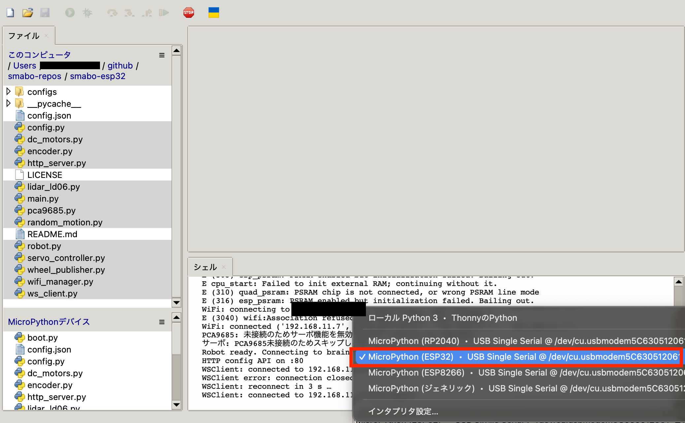

 

その後、「smabo-esp32」内のpythonファイルを全て選択した状態で右クリックし、「/にアップロード」を選択すると、esp32に書き込まれます。

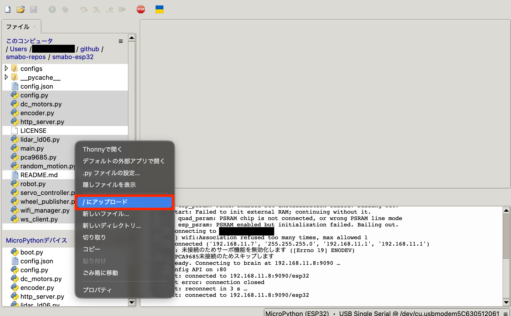

### 設定ファイルの書き込み

次に、設定ファイルを書き込みます。

configディレクトリからお手持ちのesp32の種類にあったjsonファイルを選択し、「config.json」という名前でコピーを作成します。

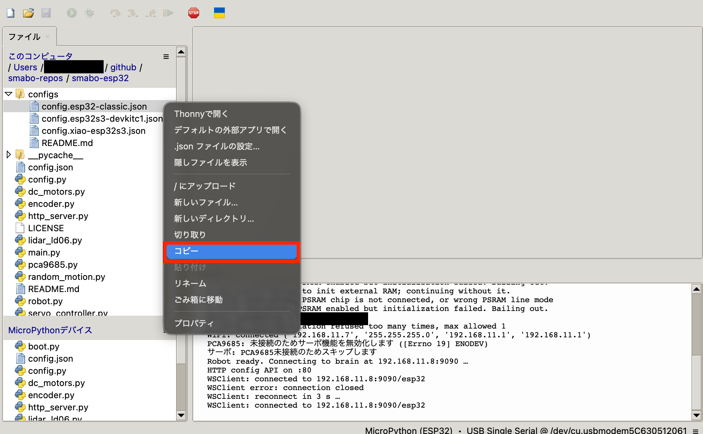

 

以下項目を、環境に応じて記載してください。
- `wifi/ssid`：接続ネットワークのSSID
- `wifi/password`：接続ネットワークのpassword
- `brain/host`：smabo-brainのIPアドレス
- `brain/port`：smabo-brainのweb socketポート

!!! note 接続先WiFiの周波数について

    WiFiの周波数には2.4GHzと、5GHzの2種類がありますが、
    - esp32は、2.4GHzにしか対応していない
    
    ため注意してください。
    
     

    一般に、
    - Buffalo-F-ooooのようにSSIDに「G」がついている場合は、2.4GHz
    - Buffalo-A-ooooのようにSSIDに「A」がついている場合は、5GHz

    となるため、ここで指定するSSIDは「G」がついている方にしてください。
  

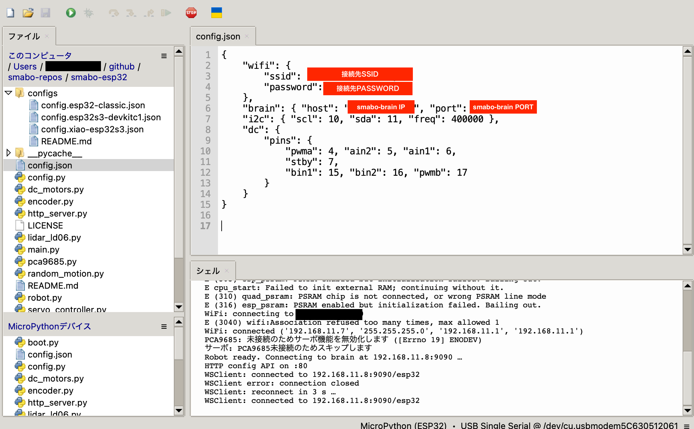

 

設定の記入が完了したら、ソースコードの時と同様に、config.jsonをesp32へ書き込みます。

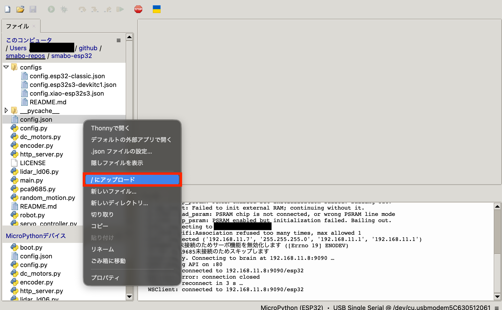

# パーツの印刷

今回、新たに追加されるパーツを3Dプリンタで印刷します。

!!! note
    3Dプリンタは機種によって「印刷する際に使用するソフト」が異なるため、ここでは具体的な設定手順ではなく、ポイントのみを記載します。

以下のパーツを図の向きに設定して、印刷してください。

!!! note  印刷の際の注意点
    - パーツのつけ外しの際に、根本から折れにくくするため、凸部は横向きにして印刷
    - サポート材は必ずONにした状態で印刷

- smabo-hardware/stl/base/bread_board_stopper_bottom_l.stl
    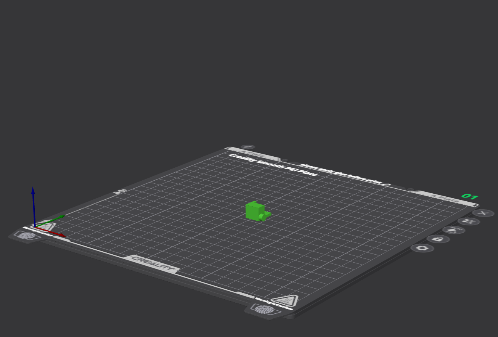

 

- smabo-hardware/stl/base/bread_board_stopper_bottom_r.stl
    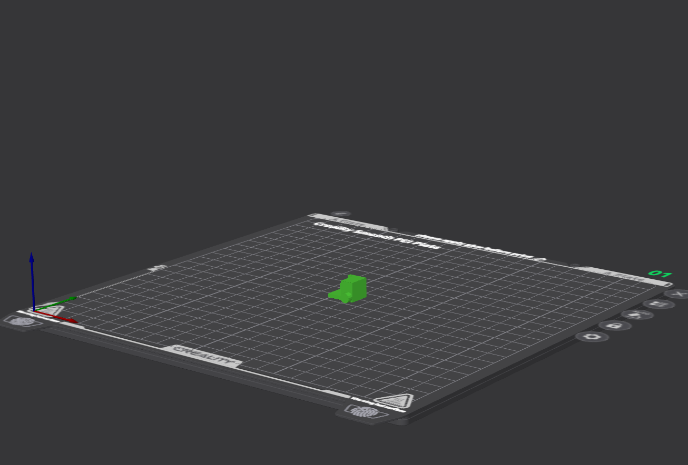

 

- smabo-hardware/stl/base/bread_board_stopper.stl
    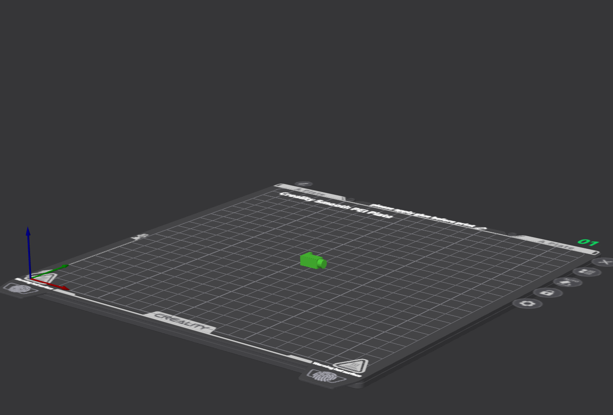

 

- smabo-hardware/stl/base/mini_bread_boad_stand.stl
    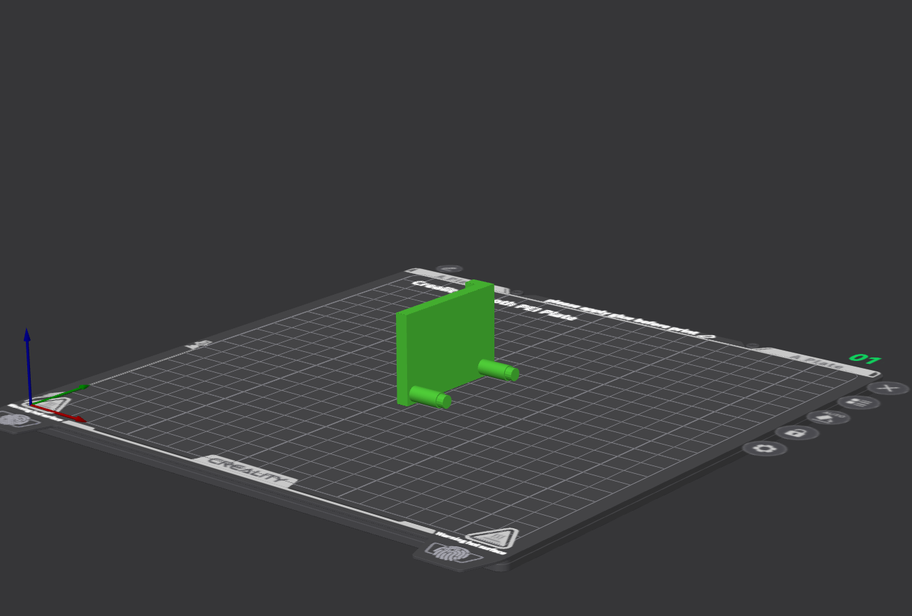

 

- smabo-hardware/stl/base/pca9685_stopper_l.stl
    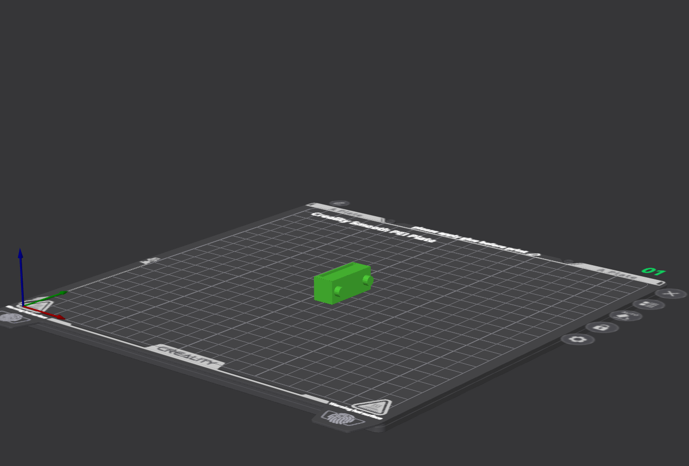

 

- smabo-hardware/stl/base/pca9685_stopper_r_bottom.stl
    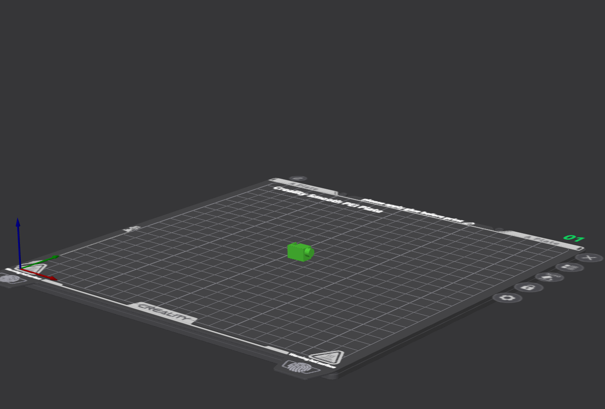

 

- smabo-hardware/stl/base/pca9685_stopper_r_top.stl
    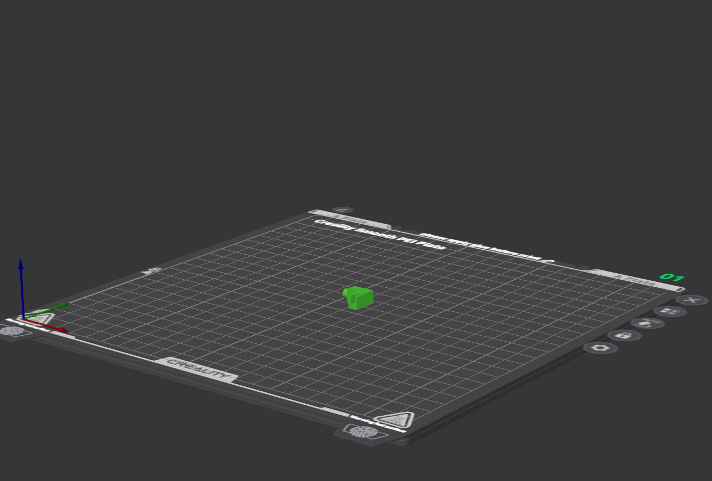

 

- 【オプション】smabo-hardware/stl/base/in_base_plate_wire_hole.stl
    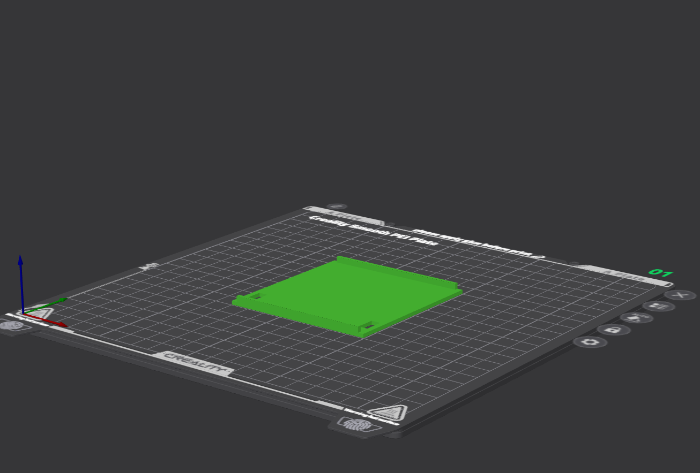
    - 本パーツは、「smabo内の仕切り」として使用できます。
    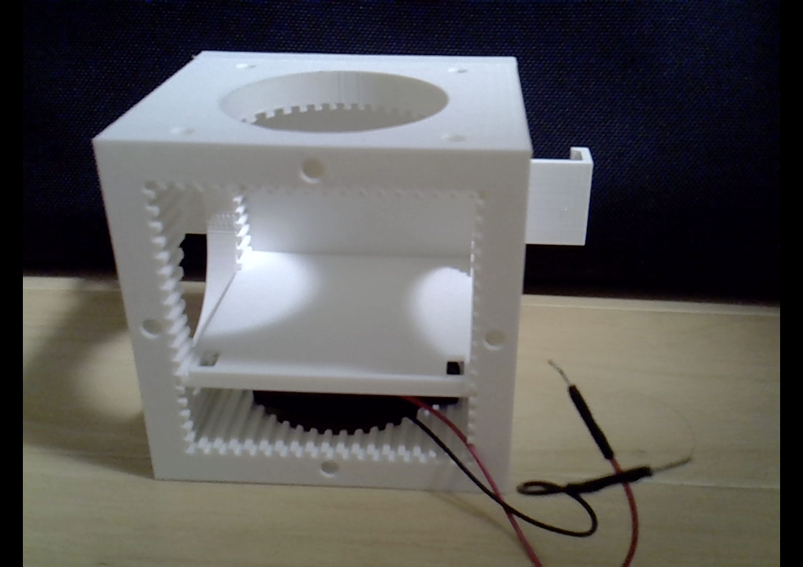

# ブレッドボードについて

SAD101は購入時の状態では、＋極の真ん中にジャンプワイヤーが挿さっています。

smaboでは、
- +極の「**右側**」を6V電源（乾電池×4）用
- +極の「**左側**」を5V電源（ESP32からの出力）用

として使用します。

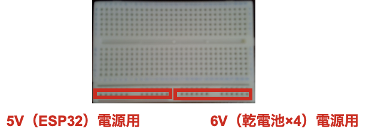

 

そのため、真ん中のジャンプワイヤーは外してください。

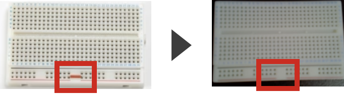

!!! note ブレッドボードの中身について
    ブレッドボードの裏面を見てみると、金属の棒が固定してあることがわかります。

    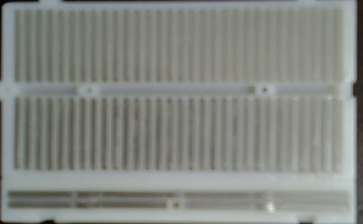

     
     

    そのため、「同じ棒と繋がっている穴」に、複数のジャンプワイヤーを刺した場合、それらは回路的に繋がることになります。

    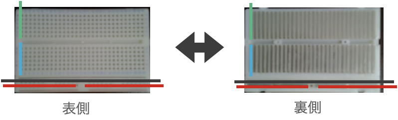

     

    特に、SAD101の場合
    - +極のみ真ん中で途切れていて左右に分かれている

    ため、ジャンプワイヤーは、「+極を1直線に繋ぐために付いていた」ということになります。

    ※ 今回は、先述の通り左右で違う電源を使用するため、外しています

# 組み立て手順

以下動画のように、必要パーツを組み立てます。

※ 動画には、前回までに印刷したパーツも含まれます

<!--ここに、docs/assembly_movie/base_bread_board.htmlの組み立て動画を置いてください-->

!!! note 組み立ての際のポイント
    各パーツを使って、ブレッドボード、PCA9685、ミニブレッドボードを取り付けてください。

    なお、特に以下の点には注意してください。
    - ESP32はブレッドボードの左端に差し込んでください
    - ミニブレッドボードは、背面の粘着テープを使って貼り付けてください
    - バッテリーボックスはsmaboの中に配置し、ジャンプワイヤーのみを外側に出して、ブレッドボードに挿す形で配線してください
      - 配線位置については、「配線」の章にて説明します
  
    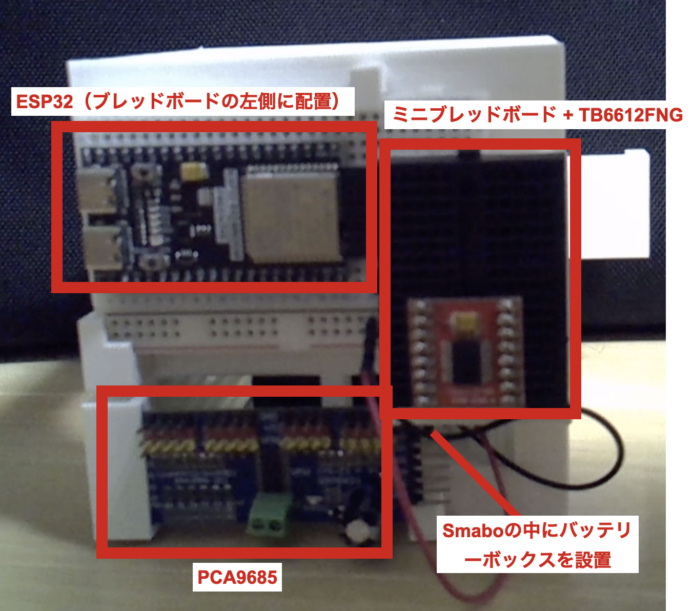

# 配線

!!! note ブレッドボードの+極について <!--重要なので、このNoteは特に目立つように-->
    SAD101購入時についていた、**+極のジャンプワイヤーは必ず外してください**。
    ついたままだと、**ESP32, アクチュエータが破損する**可能性があります。<!--太字を赤字にする-->
    

 

今回は、アクチュエータなどは動かさないため、以降の準備として「乾電池バッテリーの配線」のみを行います。

※ 下記表において、「接続先1」と「接続先2」は、両者が回路的に直接繋がっていることを指します。

| 接続先1 | 接続先2 | 補足 |
| --- | --- | --- |
| 乾電池バッテリーボックスの+極 |  ブレッドボードの+極の**右側**<!--太字はhtmlにする際は赤色に--> | 以降、右側を6V電圧として扱うため注意 | 
| 乾電池バッテリーボックスの-極 | ブレッドボードの-極  | - | 
| ESP32の5V電源 | ブレッドボードの+極の**左側**<!--太字はhtmlにする際は赤文字に--> | 以降、左側を5V電圧として扱うため注意 | 
| ESP32のGND | ブレッドボードの-極 | - | 

先述したように、+極は右側と左側で扱う電圧が異なるため
- 今後の配線で、**+極の片方に6V, 5V電源を混在させると、ESP32やアクチュエータが破損する原因になる**<!--htmlにする際は、ここの太字部分を赤字にしてください-->

ため、配線の際は十分に注意してください。

 

ESP32-DevKitCの場合の、具体的な配線図は、以下になります。

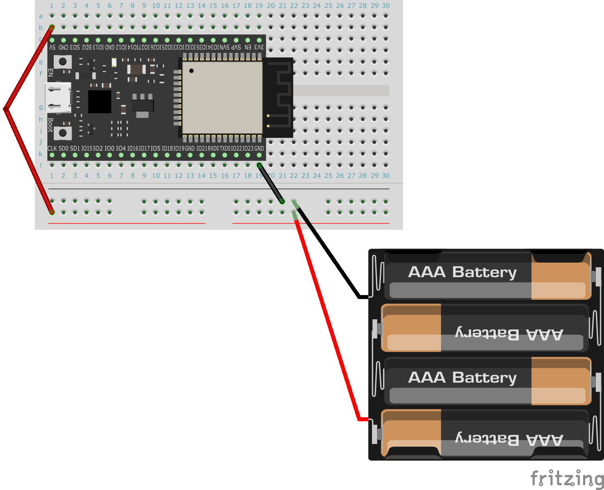

# 動作手順

## 起動手順

<!--htmlに変換する際は、startup.md の中で、「smabo-brainの起動」「smabo-webの起動」「smabo-brain <-> smabo-webの接続」「smabo-brain <-> esp32の接続」「smabo-web <-> esp32の接続」のみをフィルタしたものを表示すること-->

<!--
htmlに変換する際、「起動手順」へのリンク（startup.html）はクリックでポップアップ（モーダル）表示される。docs.js が a[href$="startup.html"] を捕捉して startup.html の .doc-content をモーダルに描画する。
ポップアップでは、リンクの data-steps 属性（startup.html の各 h2 の id をカンマ区切りで列挙）に挙げた手順だけを表示する。表示対象（data-steps）はこのページでは以下:
<a href="startup.html" data-steps="smabo-brainの起動,smabo-webの起動,smabo-brain---smabo-webの接続,smabo-brain---esp32の接続,smabo-web---esp32の接続">こちらの起動手順</a>
（JS 無効時は data-steps が無視され、通常のページ遷移になる）
-->

「[こちらの起動手順](./startup.md)」の内容を実行してください。

 

各種プログラムの起動、通信が確認できればOKです。

# 次回

次回は、以下ロードマップの

- [ハンド](./hand.md)
- [首振り](./neck.md)
- [移動ロボット](./mobile.md)
- [ロボットアーム](./arm.md)
- [smabo-brain-ros](./smabo-brain-ros.md)

について解説します。

<!--
htmlに変換する際は、以下のsvgファイルの代わりに、roadmap.htmlに記載してあるロードマップを添付すること。ただし、次回につながるノードをハイライトした状態にすること。また、roadmap.htmlに記載のロードマップの0.5倍のサイズとすること。
-->

