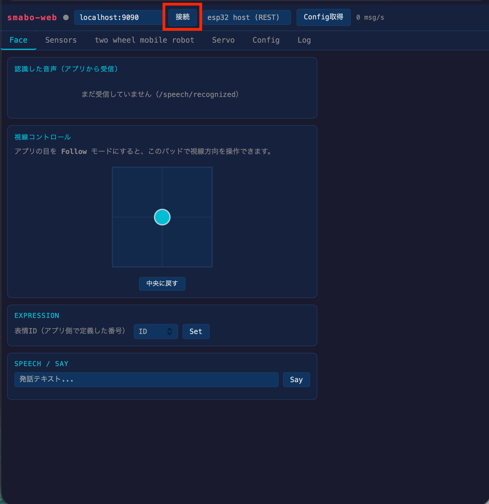
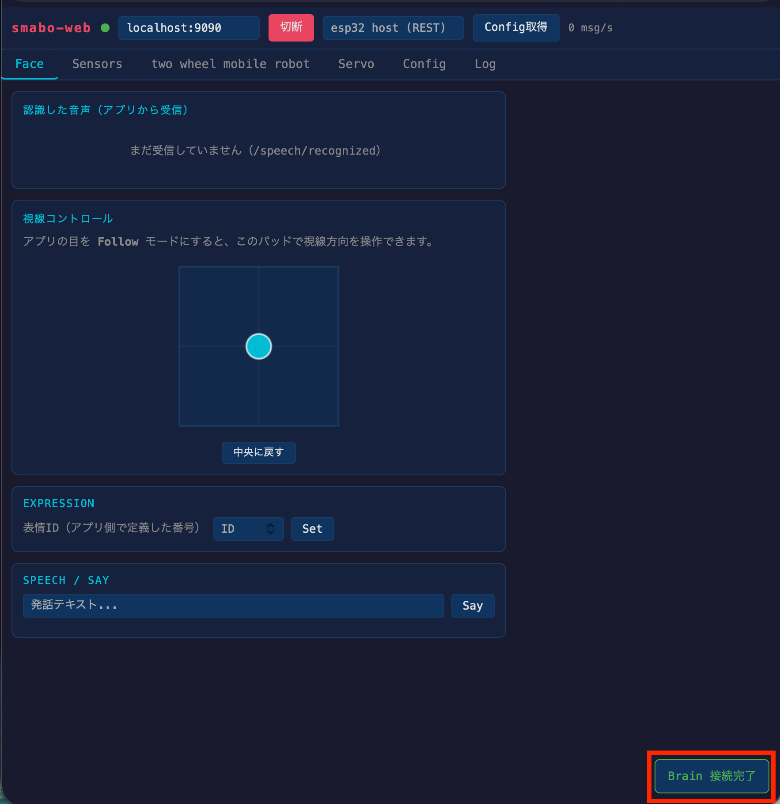
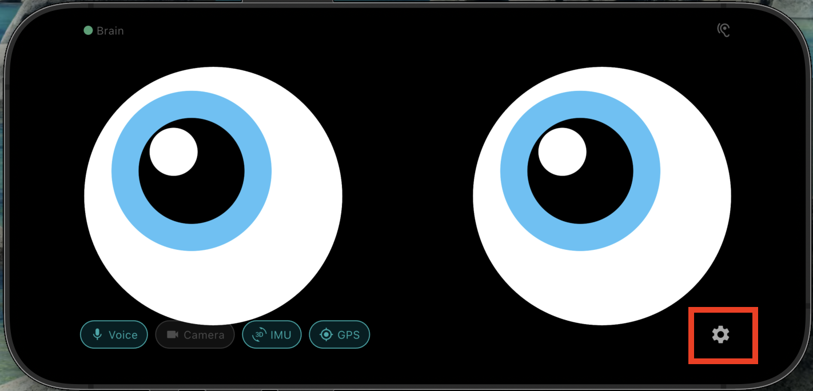
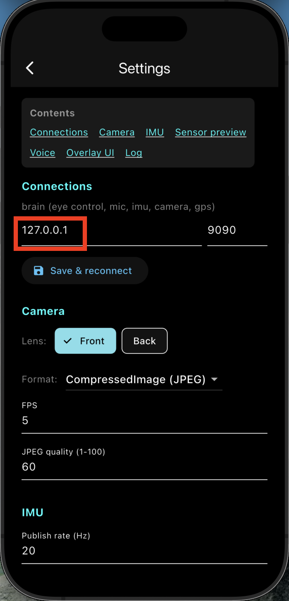
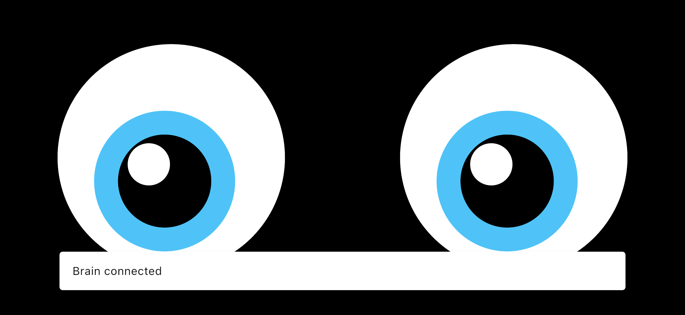
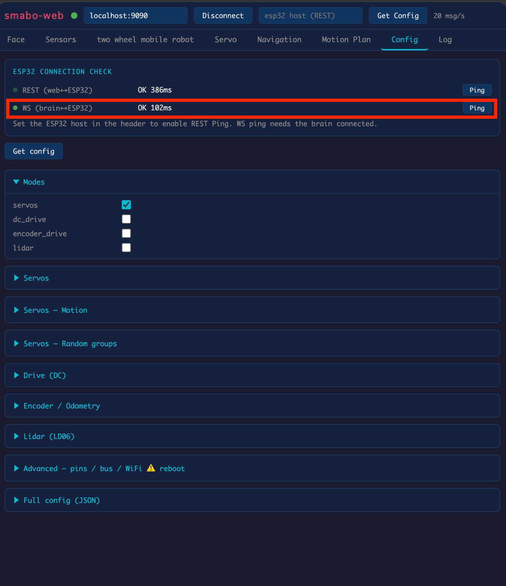
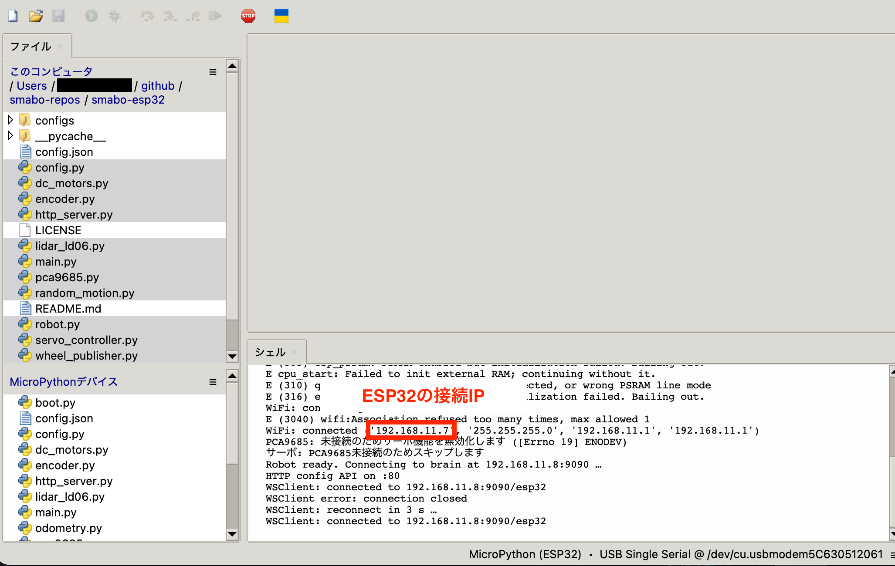
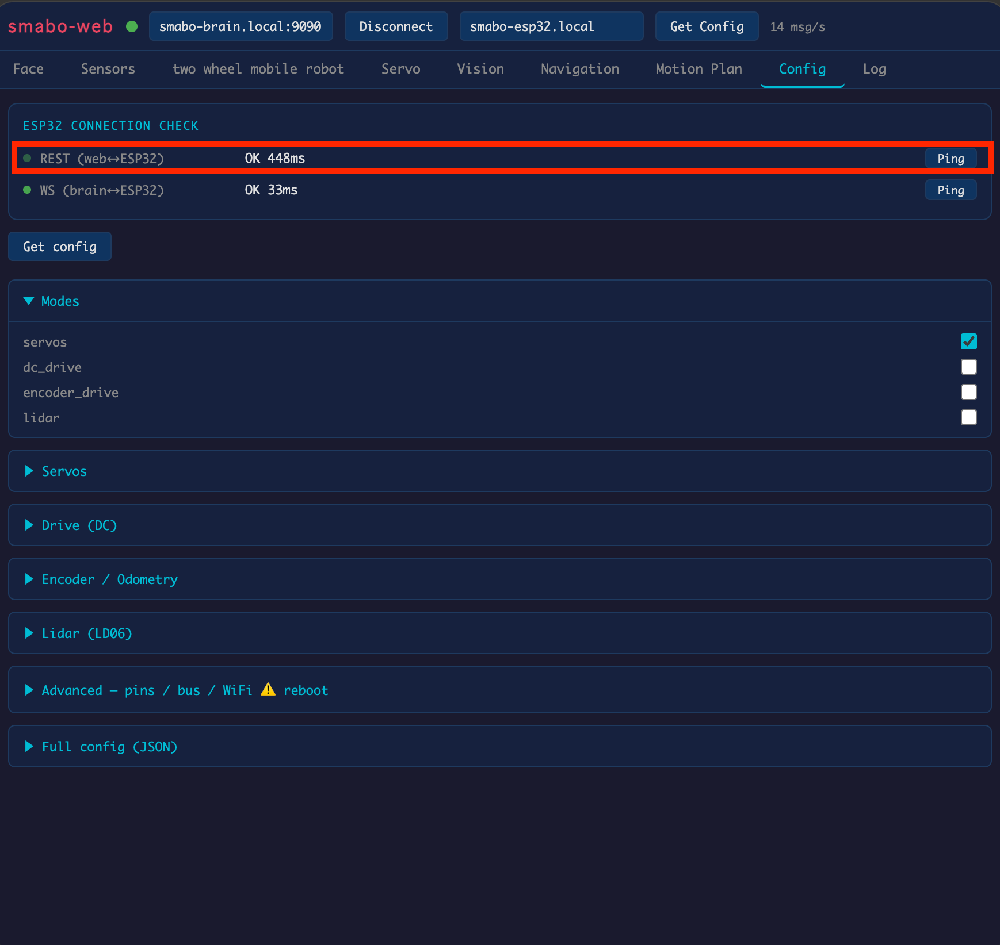

<!--
以下は、md -> html 生成の際の指示（html生成時に直接出力する箇所ではない。以降、コメントアウトしてある箇所は、html生成時の注意事項が記載してあるものとする）

- markdownにて記載した文章は、誤字・脱字を除き、一切省略せずに、全く同じ文章でhtmlに反映すること（改行のタイミングなども含む）
    - 追記、修正した方がいい文章があった場合は、必ずユーザーに確認した上で、了承を得られた場合のみmarkdown, htmlともに修正すること
- 誤字、脱字があった場合は、markdown,html両方とも修正すること
- 表記揺れがあった場合は、どちらに統一するかユーザー側に確認したのちに、markdown, htmlともに、指定された表記に統一されるように修正すること
- 処理内容などに言及する部分に関しては、間違いがないか（コードが存在する場合は）コードの内容と照らし合わせて確認すること。その際、不整合があった場合は、ユーザー側に確認した上で了承が得られたら、markdown,htmlともに修正すること
- その他不正確な内容が含まれている場合は、ユーザー側に確認した上で了承が得られたら、markdown,htmlともに修正すること
-->

# 目次 <!-- omit in toc -->

- [smabo-brainの起動](#smabo-brainの起動)
- [smabo-webの起動](#smabo-webの起動)
- [smabo-brain \<-\> smabo-webの接続](#smabo-brain---smabo-webの接続)
- [smabo-appの接続](#smabo-appの接続)
- [smabo-brain \<-\> esp32の接続](#smabo-brain---esp32の接続)
- [smabo-web \<-\> esp32の接続](#smabo-web---esp32の接続)

# はじめに

<!--
本ページ（startup.html）は単独ページとしても開けるが、各ガイドの「起動手順」リンクからはポップアップ（モーダル）でも表示される。docs.js が本ページの .doc-content だけを取り出してモーダルに描画するため、ヘッダ/フッタ等のページ外枠に依存しない自己完結した内容にしておくこと。
-->

本ページは、smabo の各コンポーネントの起動・接続手順をまとめた共通ページです。各ガイドの「動作手順」から参照されます。実施するのは、各ガイドの「動作手順」で指定された項目だけで構いません。

# smabo-brainの起動

最初に、PC/SBCからsmabo-brainを起動します。

```bash
cd ~/smabo-brain
```

```bash
python3 -m brain
```

# smabo-webの起動

次に、PCからsmabo-webを起動します。

```bash
cd ~/smabo-web
```
```bash
npm run dev
```

この状態で、ブラウザから`http://localhost:5173`にアクセスしてください。

# smabo-brain <-> smabo-webの接続

smabo-brainとsmabo-webの接続を行います。

smabo-webの「Connect」ボタンをクリックします。




<br>
右下に「Brain connected」と表示されればOKです。




# smabo-appの接続

!!! note
    以降で載せているスマホ画面のスクリーンショットはシミュレータを使用していますが、実際は物理的なスマホ内の画面になります。


smabo-appを起動し、画面をダブルタップすると表示される「歯車マーク」をタップし、設定画面を開きます。


<br>

IPの欄に「smabo-brainを起動しているPC/SBCのIPアドレス」を入力し、「Save & Reconnect」をタップします。



<br>


しばらくして「Brain connected」と表示されればOKです。



# smabo-brain <-> esp32の接続

smabo-brain <-> esp32間は、esp32の電源を入れた際に、`config.json`に設定された「IP(`brain/host`) / PORT(`brain/port`)」に自動接続されます。

<br>

通信接続されているかは、smabo-webの「Config」タブから確認できます。

「WS (brain <-> ESP32)」の右側にある「Ping」ボタンをクリックし、OKと表示されれば良いです。



!!! note 接続できなかった場合
    上記手順で通信の疎通が失敗した場合は、`config.json`のWiFiの設定を確認してください。もし、間違っている箇所があった場合、修正した後esp32に再書き込みしてください。

# smabo-web <-> esp32の接続

smabo-web <-> esp32の通信は、「Config」タブから確認できます。

<br>

最初に、ESP32とPCをUSB接続した状態で、Thonnyのシェルタブから「ESP32の接続IP」を確認します。



<br>

次に、smabo-webの「Get Config」の左側のテキストボックスに、確認した「ESP32の接続IP」を入力します。

最後に、「Config」タブの「REST(web <-> ESP32)」の右の「Ping」ボタンをクリックし、OKと表示されれば良いです。


